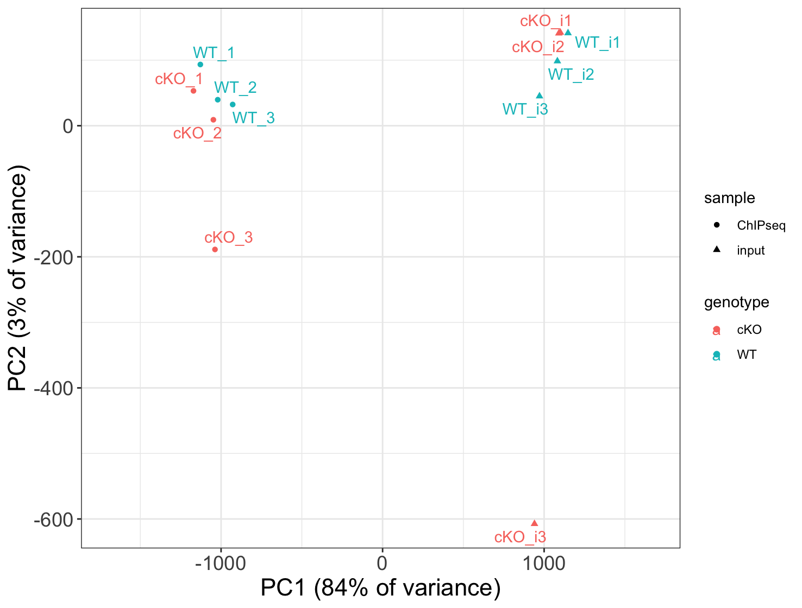
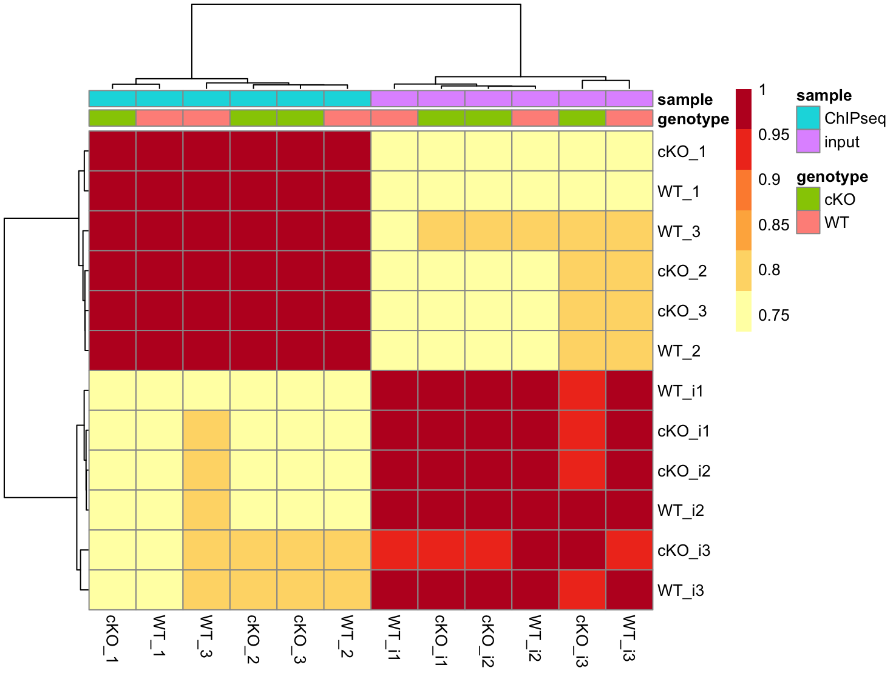

# Day 1 Answer key

## Assessing sample similarity and identifying potential outliers

**1. Read in the file `data/multiBAMsummary.tab` and save it to a variable.** This matrix contains counts for input samples as well.

```r
counts_input <- read.delim("data/multiBamSummary/multiBAMsummary.tab", sep = "\t")
```

**2. Transform the data using `vst()`.**

- Hint: You will need to follow a similar process as above to first clean the count matrix and create a dds object.
- Hint: You may find it useful to include input/ChIPseq as a metadata factor.

```r
# Remove genomic coordinate info
plot_counts_input <- data.frame(counts_input[, 4:ncol(counts_input)])

# Change column names
colnames(plot_counts_input) <- colnames(plot_counts_input) %>% 
  str_replace( "X.", "") %>% 
  str_remove( "\\.$")

# Create meta
meta_input <- data.frame(row.names = colnames(plot_counts_input), 
                         genotype = colnames(plot_counts_input) %>% str_remove("\\_.*"),
                         sample = ifelse(grepl("i", colnames(plot_counts_input)), "input", "ChIPseq"))

# Create DESeq2 object
dds_input <- DESeqDataSetFromMatrix(plot_counts_input, meta_input, design = ~sample + genotype)

# Run vst and extract transformed counts
vst_input <- vst(dds_input)
vst_input_counts <- assay(vst_input)
```

**3. Use the vst data to draw a PCA plot. How do samples separate on the plot? How much variance is explained by PC1 and PC2?**

```r
# Compute principal components
pc_input <- prcomp(t(vst_input_counts))
plot_pca_input <- data.frame(pc_input$x, meta_input)
summary(pc_input) # will tell you how much variance is explained by each PC

# Plot with sample names used as data points
ggplot(plot_pca_input, aes(PC1, PC2, color = genotype, shape = sample,
                           label = rownames(plot_pca_input)), size = 3) + 
  theme_bw() +
  geom_point() +
  geom_text_repel() +
  xlab('PC1 (84% of variance)') +
  ylab('PC2 (3% of variance)') +
  scale_x_continuous(expand = c(0.3, 0.3)) +
  theme(plot.title = element_text(size = rel(1.5)),
        axis.title = element_text(size = rel(1.5)),
        axis.text = element_text(size = rel(1.25)))
```

<p align="center">

</p>

Samples separate by input/ChIPseq on PC1 (84% of variance). PC2 explains only 3% of variance.

**4. Use the vst data to draw a correlation heatmap. How does this result compare to the PCA plot? Do we see defined block structure in the heatmap?**

```r
# Set annotation and colors
annotation <- meta_input
heat.colors <- brewer.pal(6, "YlOrRd")

# Plot ICA heatmap
pheatmap(cor(vst_input_counts), color = heat.colors, annotation = annotation)
```

<p align="center">

</p>

As seen in the PCA, samples separate cleanly by input/ChIPseq. Within each group, there is no clear separation by genotype.

## Concordance across replicates using peak overlaps

**1. Find the overlapping peaks across the cKO samples. Store the result to a variable called olaps_cko.**

```r
olaps_cko <- findOverlapsOfPeaks(cKO_H3K27ac_ChIPseq_REP1,
                                 cKO_H3K27ac_ChIPseq_REP2,
                                 cKO_H3K27ac_ChIPseq_REP3, connectedPeaks = "merge")
```

**2. Use the results from olaps_cko to draw a Venn Diagram. What number of peaks occur in all three replicates?**

```r
venstats <- makeVennDiagram(olaps_cko, connectedPeaks = "merge",
                            fill    = c("#CC79A7", "#56B4E9", "#F0E442"), # circle fill color
                            col     = c("#D55E00", "#0072B2", "#E69F00"), # circle border color
                            cat.col = c("#D55E00", "#0072B2", "#E69F00")) # category name color
```

There are ~53k peaks in all 3 replicates.

**3. Extract the required data from olaps_cko to create an UpSet plot. Draw the Upset plot. How many peaks are unique to each replicate?**

```r
# Prepare data for UpSetR
set_counts <- olaps_cko$venn_cnt[, colnames(olaps_cko$venn_cnt)] %>% 
  as.data.frame() %>% 
  mutate(group_number = row_number()) %>%
  pivot_longer(!Counts & !group_number, names_to = 'sample', values_to = 'member') %>%
  filter(member > 0) %>%
  group_by(Counts, group_number) %>% 
  summarize(group = paste(sample, collapse = '&'))

# Set required variables 
set_counts_upset <- set_counts$Counts
names(set_counts_upset) <- set_counts$group

# Plot the UpSet plot
upset(fromExpression(set_counts_upset), order.by = "freq", text.scale = 1.5)
```

Replicate 1 has 12,000 unique peaks; replicate 2 has 10,815, and replicate 3 has 13,046.
