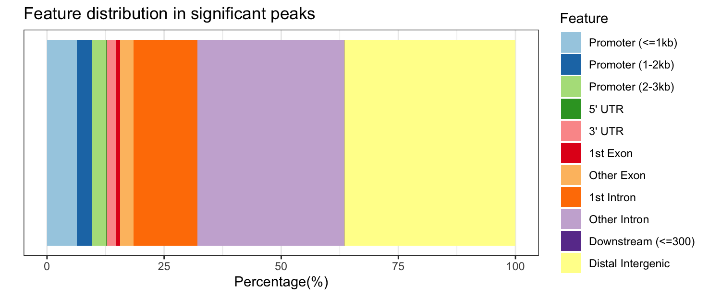
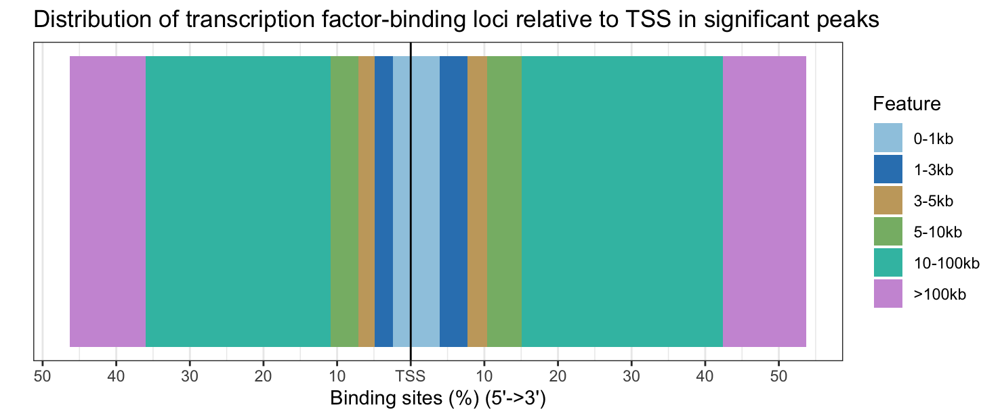
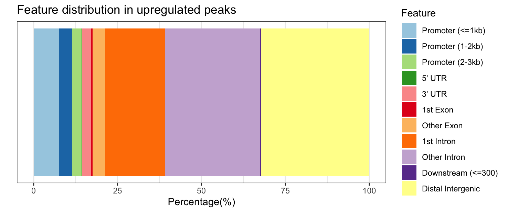
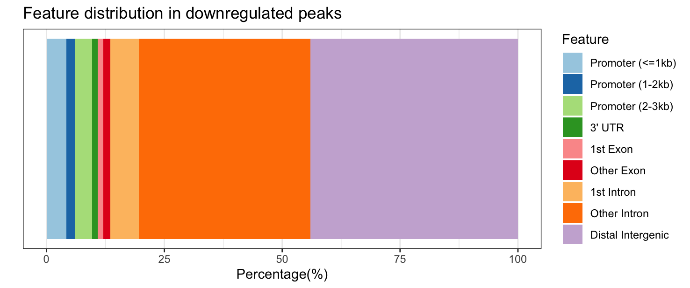
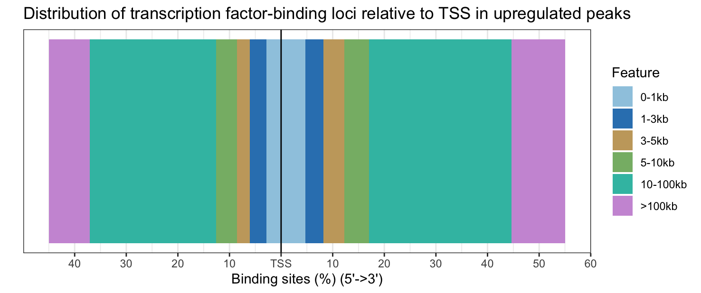
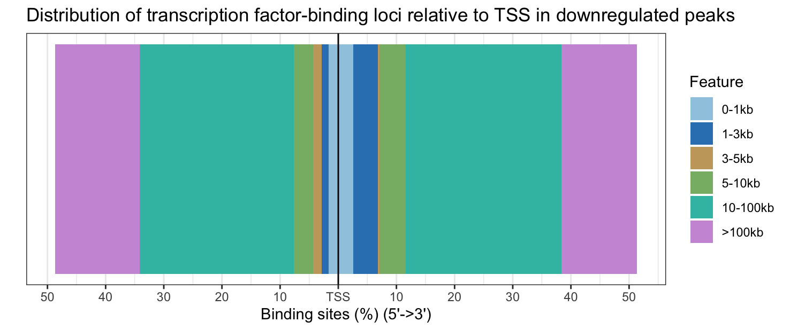

# Day 2 Answer key

## Peak visualization using IGV

There are no coding questions for this lesson.

## Annotation and functional analysis of DE regions

**1. Subset the annot_res_all to keep only the results with FDR < 0.05 and save it to a variable called annot_sig_all. Now create the same annotation plots. Do you observe any difference?**

```{r}
annot_sig_all <- subset(annot_res_all, FDR < 0.05)
plotAnnoBar(annot_sig_all, title = "Feature distribution in significant peaks")
plotDistToTSS(annot_sig_all, title = "Distribution of transcription factor-binding loci relative to TSS in significant peaks")
```

The original images for the full dataset will also be shown below for comparison purposes.

<p align="center">


</p>

Significantly DE peaks are more likely to be in "other intronic" and "distal intergenic" regions (purple and yellow sections of feature distribution) and less likely to be in "promoter" regions (light blue) compared to the full results. 

<p align="center">


</p>

Significantly DE peaks are also further from the TSS.

**2. Further subset the significant results by filtering on on fold change (Fold). Save the results into variables called annot_sig_up and annot_sig_down. Now create the same annotation plots. Do you observe any difference?**

```{r}
annot_sig_up   <- subset(annot_sig_all, Fold > 0)
annot_sig_down <- subset(annot_sig_all, Fold < 0)
plotAnnoBar(annot_sig_up, title = "Feature distribution in upregulated peaks")
plotAnnoBar(annot_sig_down, title = "Feature distribution in downregulated peaks")
plotDistToTSS(annot_sig_up, title = "Distribution of transcription factor-binding loci relative to TSS in upregulated peaks")
plotDistToTSS(annot_sig_down, title = "Distribution of transcription factor-binding loci relative to TSS in downregulated peaks")
```

<p align="center">


</p>

Significantly upregulated peaks have a similar feature distribution to all significantly DE peaks; however, downregulated peaks are more likely to be in "other intronic" and "distal intergenic" regions and are never in the 5' UTR or downstream (which makes the colors change between the plots, look carefully at the legend!). 

<p align="center">


</p>

Upregulated peaks are slightly closer to the TSS, while downregulated peaks are slightly further from the TSS.
