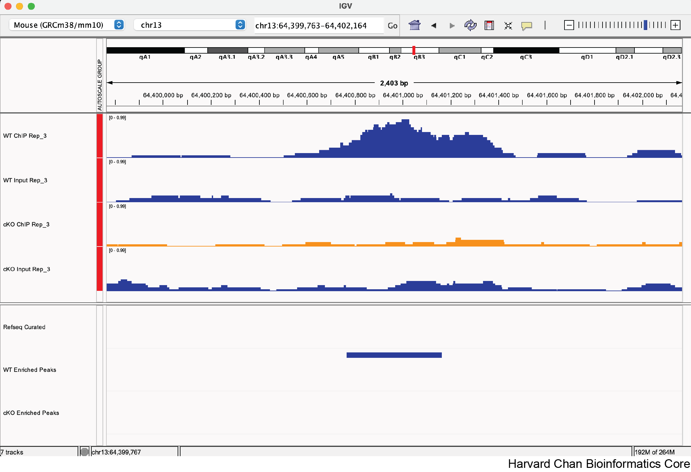
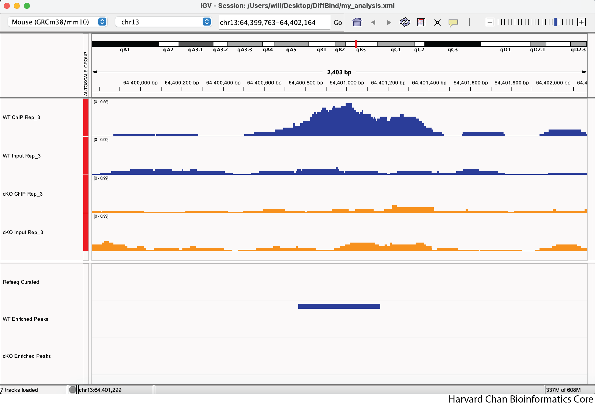
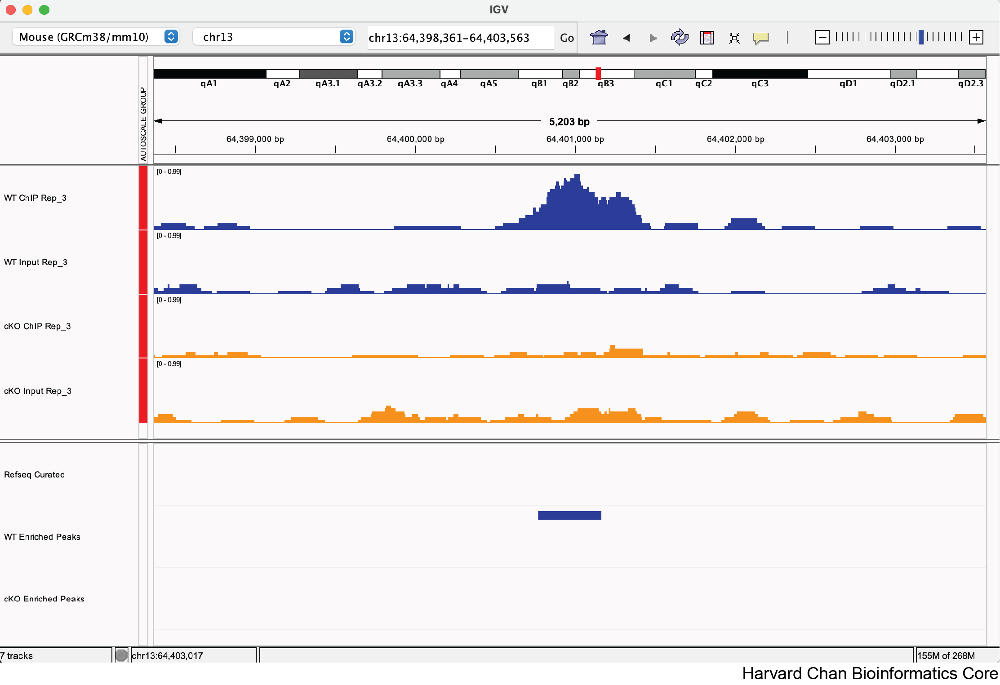
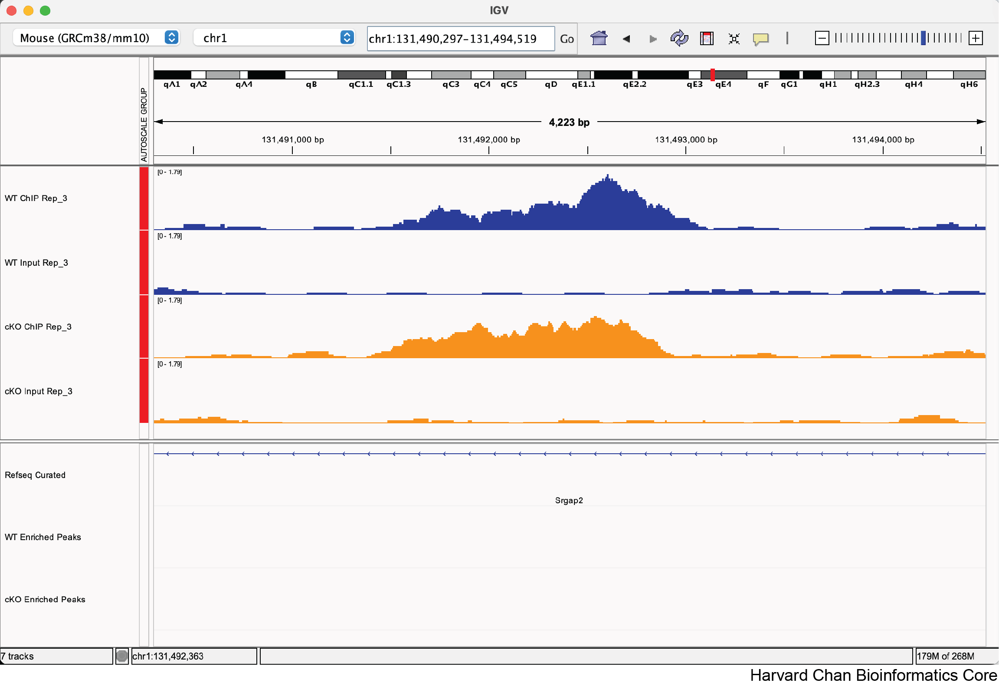
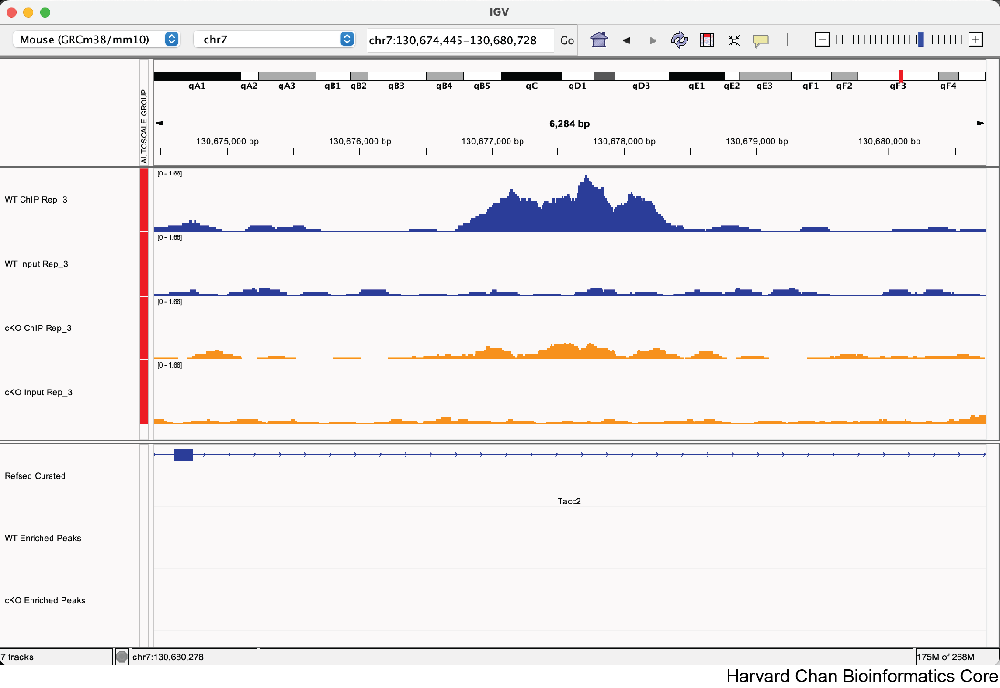
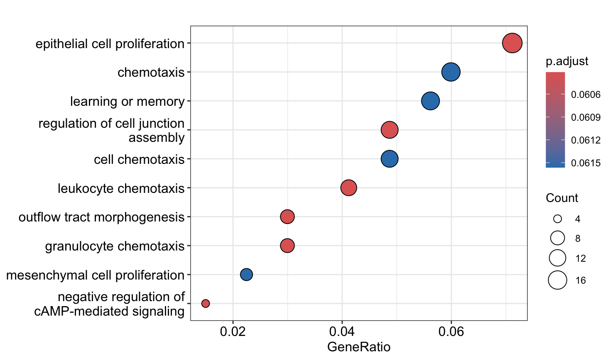
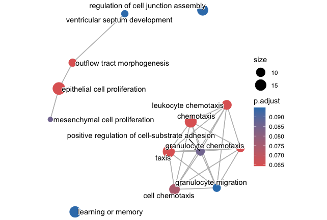

# Day 2 Answer key

## Peak visualization using IGV

**1. Load the three additional BigWig files you were provided within the "BigWig" directory along with the two BED files within the "DiffBind" directory. Were the BED files loaded in the same area in IGV as the BigWig tracks? If not, where did they load?**

<p align="center">

</p>
Note: The order of the tracks is dependent on the order that you loaded the tracks in, so your track order <i>may</i> be different than in the image above

No, they were loaded in the bottom part of the IGV window.

**2. Re-order the tracks so that the WT tracks are above the cKO tracks and the IP samples are above the input samples for their respective experimental condition.**

<p align="center">

</p> 

**3. Now that we've explored some of the functionality from IGV let's format our IGV browser and qualitatively assess some regions in the genome.**

&emsp;&emsp;a. Rename "cKO_H3K27ac_input_REP3.bigWig" to "cKO Input Rep_3"

&emsp;&emsp;b. Rename "WT_H3K27ac_ChIPseq_REP3.bigWig" to "WT ChIP Rep_3"

&emsp;&emsp;c. Rename "WT_H3K27ac_input_REP3.bigWig" to "WT Input Rep_3"

&emsp;&emsp;d. Rename "WT_enriched.bed" to "WT Enriched Peaks"

&emsp;&emsp;e. Rename "cKO_enriched.bed" to "cKO Enriched Peaks"

<p align="center">

</p>

**4. Change the color of the "cKO Input Rep_3" and "cKO Enriched Peaks" tracks to orange**

<p align="center">

</p>


**3) Let's explore a few regions and see if we qualitatively agree with DiffBind's analysis. Do you agree with DiffBind's call or non-call differentially bound peak for the following genomic coordinates:**

&emsp;&emsp;a. chr13:64,400,764-64,401,164

<p align="center">

</p>

Yes, this looks like a correctly called differentially bound peak.

&emsp;&emsp;b. chr1:131,492,210-131,492,610

<p align="center">

</p>

Yes, this does not look like a correctly called non-differentially bound peak.

&emsp;&emsp;c. chr7:130,677,389-130,677,789 
<blockquote>&emsp;&emsp;Note: The FDR for this peak is 0.051</blockquote>

<p align="center">

</p>

Maybe, there is clearly some qualitative differences in whether this is differentially bound, but it just misses the significance threshold. The goal of this sub-question is to help participants see what the FDR 0.05 threshold looks like in real data. 


## Annotation and functional analysis of DE regions

**1. Subset the annot_res_all to keep only the results with FDR < 0.05 and save it to a variable called annot_sig_all. Now create the same annotation plots. Do you observe any difference?**

```{r}
annot_sig_all <- subset(annot_res_all, FDR < 0.05)

plotAnnoBar(annot_sig_all, title = "Feature distribution in significant peaks")
plotDistToTSS(annot_sig_all, title = "Distribution of transcription factor-binding loci relative to TSS in significant peaks")
```

The original images for the full dataset will also be shown below for comparison purposes.

<p align="center">


</p>

Significantly DE peaks are more likely to be in "other intronic" and "distal intergenic" regions (purple and yellow sections of feature distribution) and less likely to be in "promoter" regions (light blue) compared to the full results. 

<p align="center">


</p>

Significantly DE peaks are also further from the TSS.

**2. Further subset the significant results by filtering on on fold change (Fold). Save the results into variables called annot_sig_up and annot_sig_down. Now create the same annotation plots. Do you observe any difference?**

```{r}
annot_sig_up   <- subset(annot_sig_all, Fold > 0)
annot_sig_down <- subset(annot_sig_all, Fold < 0)

plotAnnoBar(annot_sig_up, title = "Feature distribution in upregulated peaks")
plotAnnoBar(annot_sig_down, title = "Feature distribution in downregulated peaks")
plotDistToTSS(annot_sig_up, title = "Distribution of transcription factor-binding loci relative to TSS in upregulated peaks")
plotDistToTSS(annot_sig_down, title = "Distribution of transcription factor-binding loci relative to TSS in downregulated peaks")
```

<p align="center">


</p>

Significantly upregulated peaks have a similar feature distribution to all significantly DE peaks; however, downregulated peaks are more likely to be in "other intronic" and "distal intergenic" regions and are never in the 5' UTR or downstream (which makes the colors change between the plots, look carefully at the legend!). 

<p align="center">


</p>

Upregulated peaks are slightly closer to the TSS, while downregulated peaks are slightly further from the TSS.

**3. Perform the ORA for the downregulated sites in cKO vs WT results. Do you find any significantly over-represented terms? If not, think about possible reasons, and try increasing the adjusted p-value cutoff to 0.1 to get an idea of what pathways may be downregulated in cKO samples even if they do not reach traditional statistical significance.**

```{r}
# Prepare gene set query for down-regulated genes
sigDown <- dplyr::filter(annot_res_all_df, FDR < 0.05, Fold < 0)
sigDown_genes <- as.character(sigDown$geneId)

# Run over-representation analysis
go_ORA_Down <- enrichGO(gene = sigDown_genes,
                        universe = background_set,
                        keyType = "ENTREZID",
                        OrgDb = org.Mm.eg.db,
                        ont = "ALL",
                        pAdjustMethod = "BH",
                        qvalueCutoff = 0.05,
                        readable = TRUE)

# Look at results
go_ORA_Down_df <- data.frame(go_ORA_Down)
View(go_ORA_Down_df)
```

There are no downregulated GO terms with a p-value cutoff of 0.05 (and a q-value cutoff of 0.05). There are fewer downregulated genes than upregulated genes, so maybe fewer pathways are affected, and to a lesser extent.

```{r}
# Run over-representation analysis again with a higher p-value cutoff
# Note that we have changed qvalueCutoff to pvalueCutoff!
go_ORA_Down <- enrichGO(gene = sigDown_genes,
                        universe = background_set,
                        keyType = "ENTREZID",
                        OrgDb = org.Mm.eg.db,
                        ont = "ALL",
                        pAdjustMethod = "BH",
                        pvalueCutoff = 0.1,
                        readable = TRUE)

# Look at results
go_ORA_Down_df <- data.frame(go_ORA_Down)
View(go_ORA_Down_df)
```

With the more lax p-value cutoff, we see a number of pathways related to proliferation and chemotaxis are downregulated.

**4. Create a dotplot and enrichplot from the ORA result generated earlier using the downregulated sites in cKO vs WT results. What overarching themes are observed from the enrichplot (if any)?**

```{r}
# Dotplot
dotplot(go_ORA_Down)
```

<p align="center">

</p>

```{r}
# Enrich plot
go_ORA_Down <- enrichplot::pairwise_termsim(go_ORA_Down)
emapplot(go_ORA_Down)
```

<p align="center">

</p>


