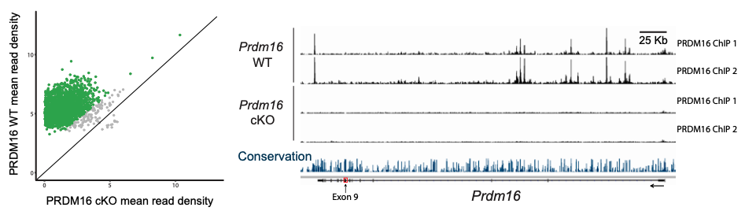
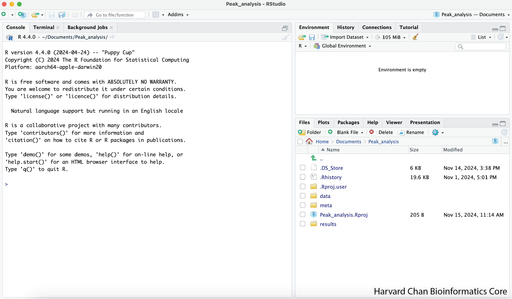
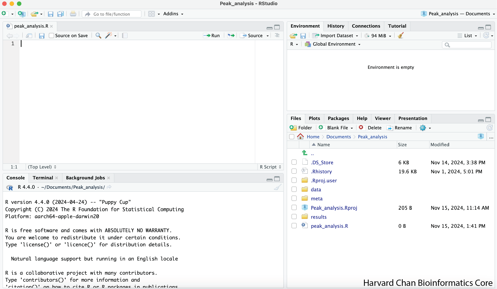
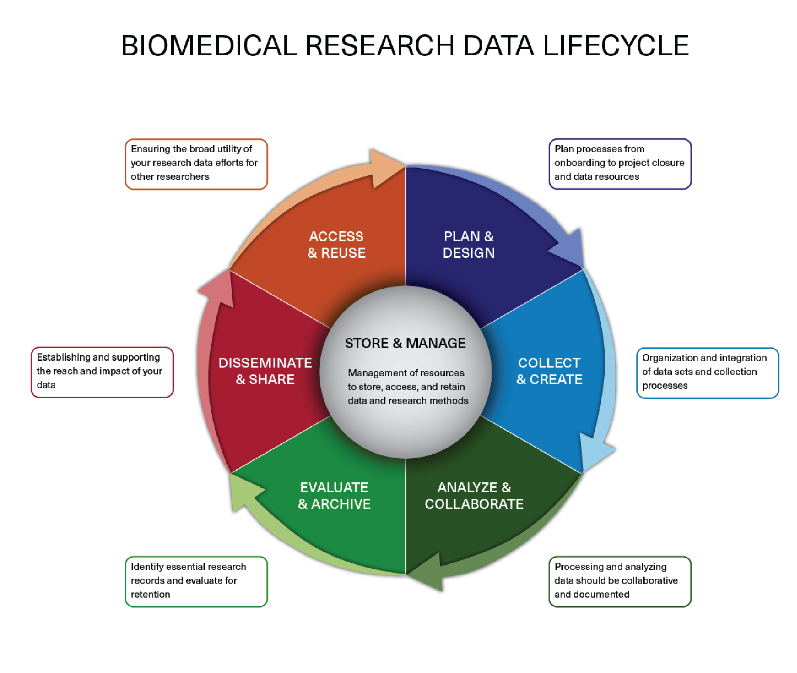
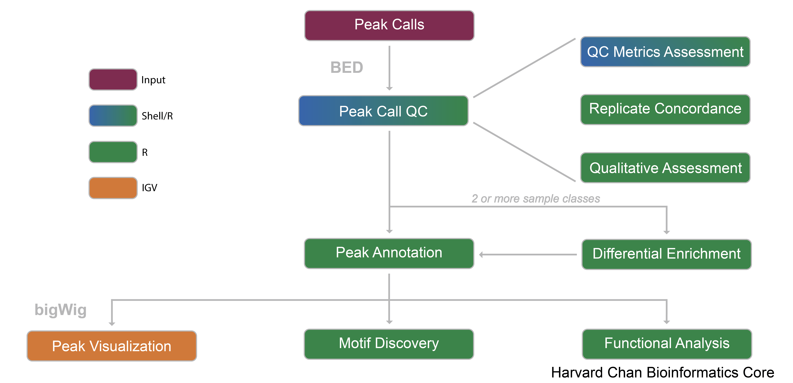

Contributors: Heather Wick, Upendra Bhattarai, Meeta Mistry, Will Gammerdinger

Approximate time: 40 minutes

## Learning Objectives

* Explain the dataset and the biological context
* Define peaks as genomic coordinate data
* Describe file formats for peak data

## Introduction to the dataset

For this workshop we will be working with ChIP-seq data from a publication in Neuron by *Baizabal et al., 2018* [1](https://pmc.ncbi.nlm.nih.gov/articles/PMC6667181/).

> Please note that even though we are utilizing a ChIP-seq dataset for histone mark in this workshop, some of these steps in the workflow can very similarly be used for other peak data such as ATAC-seq or CUT&RUN.

[*Baizabal et al.,*](https://pmc.ncbi.nlm.nih.gov/articles/PMC6667181/) sought to understand how chromatin-modifying enzymes function in neural stem cells to establish the epigenetic landscape that determines cell type and stage-specific gene expression. Chromatin-modifying enzymes are transcriptional regulators that control gene expression through covalent modification of DNA or histones. In particular they were interested in the role of a protain called PRDM16.

**PRDM16 is a chromatin-modifying enzyme** that belongs to the larger PRDM (Positive Regulatory Domain) protein family, that is structurally defined by the **presence of a conserved N-terminal histone methyltransferase PR domain** ([Hohenauer and Moore, 2012](https://journals.biologists.com/dev/article/139/13/2267/45169/The-Prdm-family-expanding-roles-in-stem-cells-and)).

In this paper, the authors use various techniques to identify and validate the targets and activities of PRDM16, including ChIP-seq, bulk RNA-seq, FACS, in-situ hybridization and immunofluorescent microscopy on brain samples from embryonic mice and a generation of PRDM16 conditional knockout mice. 
The goal of this study was to elucidate **how PRDM16 functions to regulate transcriptional programs in the developing cerebral cortex.**

<p align="center">

</p>

To identify the subset of genes that are transcriptional targets of PRDM16 and to understand how these genes are directly regulated, the authors **first performed chromatin immunoprecipitation followed by sequencing (ChIP-seq) at E15.5**, when upper layer neurons are being generated. They obtained set of a putative PRDM16 binding sites called in both replicates. To validate the specificity of these binding sites, ChIP-seq was then performed in two separate pools of E15.5 Prdm16 cKO cortices. The **majority of PRDM16 binding sites in WT cortex show a significantly higher read density than equivalent genomic regions in cKO cortex** (see figure below).

<p align="center">

</p>

To better understand the transcriptional mechanisms, the authors assessed histone methylation patterns within PRDM16 binding regions using the ENCODE project datasets. **PRDM16 binding regions overlapped extensively with embryonic H3K27ac and showed much less H3K27ac enrichment in the adult cerebral cortex**. Given that PRDM16 was mostly associated with distal genomic regions relative to promoters, the enrichment of H3K27ac indicates that PRDM16 primarily binds to active enhancers. This led the authors to some final experiments. 

**In this workshop** we will be using the the **ChIP-seq data** generated to determine genome-wide **differences in H3K27 acetylation between E15.5 WT and cKO cortex**. 

### Raw data

For this study, we use the ChIP-seq data [available in GEO](https://www.ncbi.nlm.nih.gov/geo/query/acc.cgi?acc=GSE111658). It is also publicly available in the [Sequence Read Archive (SRA)](https://www.ncbi.nlm.nih.gov/sra?term=SRP134735).

> **NOTE:** If you are interested in how to obtain publicly available sequence data from the SRA, we have training materials on this [topic](https://hbctraining.github.io/Accessing_public_genomic_data/lessons/downloading_from_SRA.html).

### Metadata
In addition to the raw sequence data, we also need to collect **information about the data**, also known as **metadata**. Some relevant metadata for our dataset is provided below:

* Whole brain lysates were obtained from **mice at E15.5** (when upper layer neurons are being generated)
* Approximately **20-40 million cortical cells** were isolated for each sample
* Before proceeding to library preparation, immunoprecipitation of H3K27ac was confirmed by ChlP-qPCR using primers designed to amplify genomic regions with high H3K27ac or H3K4me enrichment, according to the ENCODE datasets.
    * Additional sets of primers were designed to amplify genomic regions with low H3K27ac or H3K4me enrichment and used as negative controls. 
* Library **fragments in the range of 100-800 bp** were size-selected using agarose gel electrophoresis followed by DNA gel extraction
* Libraries were sequenced in an **Illumina HiSeq 2500** sequencer to a sequencing depth of **30-40 million reads per sample**.

> All of the above pertains to both WT and Prdm16 conditional knock-out mouse (Emx1Ires-Cre; Prdm16flox/flox). *For the rest of the workshop we will be referring to the conditional knockout samples as cKO*.

Our dataset consists of **three WT samples and three KO samples**. For each of the IP samples, we have a corresponding input sample as illustrated in the schematic below. 

**INSERT IMAGE -Can we create an image like this for our dataset?** https://github.com/hbctraining/Intro-to-ChIPseq-flipped/blob/main/img/expt_design_prdm16.png

> **NOTE:** We have taken the raw data from GEO and processed it through the workflow outlined in the [pre-reading lesson](00a_peak_calling_workflow_review.md). In this workshop, we begin with peak data generated for each of the samples, but sometimes will refer to statistics that depend on the alignment files (BAM files) as input. 

## Setting up 

> Prior to the workshop, we asked that you download and uncompress the R Project that we will be using during this workshop. If you haven't had a chance to do this, please right click [this link](https://www.dropbox.com/scl/fi/q65yhy60q41p0zpv7ffat/Peak_analysis.zip?rlkey=mfzg1bnbjkabox1zwxb7gn9od&st=4xxsrmkd&dl=1) and select **"Save Link As..."** in order to download the compressed R Project to your desired location. Next, double-click on the compressed ZIP file in order to uncompress it. 

1) Once you have uncompressed the R Project, you can double-click "Peak_analysis.Rproj" wihtin the "Peak_analysis" directory to open the R Project. It should look like:

<p align="center">

</p>

2) Open an R script by clicking **"File"**, then **"New File >"** and selecting **"R script"**.
3) Save the new R script, by clicking **"File"**, and selecting **"Save As..."**
4) Name the file **"peak_analysis.R"** and click **"Save"**

Now your R Studio should look like:

<p align="center">

</p>

### Data Management Best Practices

When working with next-generation sequencing data, it can be very enticing to race to investigating your data soon after receiving it. However, it is considered best practice to take a few minutes to set-up an environment that will help keep you and your data organized *before* you start your analysis. The downloaded project already has this done, but we will discuss what we did to help organize ourselves in this section. 

Importantly, data management practices should be applied *throughout* your analyses. Some other advantages to a commiting to strong data management practices are:

- Helping yourself and others if the data needs to be re-analyzed because it is well-organized
- Dessiminating data to collaborators and other researchers is easier
- Getting credit for the data you generated

You can visit the [Harvard's Biomedical Data Management Website](https://datamanagement.hms.harvard.edu/about/what-research-data-management) for more information on research data management suggestions and policies.

<p align="center">

</p>

_Image acquired from the [Harvard Biomedical Data Management Website](https://datamanagement.hms.harvard.edu/data-lifecycle)_

#### Project Organization

Before we analyze any data, let's orient ourselves with the project that we are working within first. Within this project we currently have 3 directories:

- **`data`** - This directory contains data that we have pre-processed
- **`meta`** - This directory is where we will be placing any metadata and also contains a summary file, *metrics.csv*
- **`results`** - This directory is where we will be placing our figures 

Directories such as these three are a great starting place for many types of analysis. As your data and analyses become more complex or get re-analyzed in different ways, don't be afraid to add new directories or subdirectories to these directories as needed. For example within the **data** directory, we can see there are subdirectories for each software tool used, rather than lumping all of the data together into a single **data** directory. 

#### Documentation

We will also need to add a header to the top of our R Script. This should let future you, as well as, collaborators know key pieces of information about the script:

- **What** is the name of the script
- **Who** wrote the script
- **When** the script was written
- **Why** the script was written
- **Usage** information that someone using the script should be aware of

Let's create this and add it to the top of our script:

```
# peak_analysis.R
# Written by the Harvard Chan Bioinformatics Core on November 15th, 2024
# This script was written as a demo for the Peak Analysis Workshop
# In order to use this script, the user will need to have downloaded and uncompress the R project from https://www.dropbox.com/scl/fi/q65yhy60q41p0zpv7ffat/Peak_analysis.zip?rlkey=mfzg1bnbjkabox1zwxb7gn9od&st=4xxsrmkd&dl=1
```

## What is a peak?
A peak represents a region of the genome which was found to be bound to the protein or histone modification of choice. Chromatin Immunoprecipitation followed by sequencing (ChIP-seq) is a central method in epigenomic research which allows us to query peaks. A typical ChIP-seq workflow is outlined in the image below. 

In ChIP-seq experiments, a transcription factor, cofactor, histone modification, or other chromatin protein of interest is enriched by immunoprecipitation from cross-linked cells, along with its associated DNA. The immunoprecipitated DNA fragments are then sequenced, followed by identification of enriched regions of DNA or peaks using peak-calling software, such as MACS2. These peak calls can then be used to make biological inferences by determining the associated genomic features and/or over-represented sequence motifs.

<p align="center">

</p>

_Image source: ["From DNA to a human: What the ENCODE and Roadmap Epigenome Projects can teach us about how we are who we are"](https://portlandpress.com/biochemist/article/37/5/24/773/From-DNA-to-a-human-What-the-ENCODE-and-Roadmap)_

For more detailed information on the process of going from sequenced reads to peaks, please see the [pre-reading lesson](00a_peak_calling_workflow_review.md). In this workshop, we will describe a range of different analyses that can be done using peaks.


## Peak file formats
In this lesson, we will introduce you to several important file formats that you will encounter when working with peak calls, which follow the **BED format** (**B**rowser **E**xtensible **D**ata). We will also describe the contents of the **narrowPeak** files (output from MACS2) and how it relates to BED. 


### BED

The BED file format is tab-delimited (columns separated by tabs) and contains information about the coordinates for particular genome features.

<p align="center">

</p>

**The coordinates in BED files are 0-based**. What does this mean? Among standard file formats, genomic coordinates can be represented in two different ways as shown in the image below. 

* **Zero-based** is shown at the top of the image. This is the preferred format for programmers.
* **One-based** is shown at the bottom. This is more intuitive and generally preferred by biologists. 

<p align="center">

</p>

Given the example above, **what coordinates would you use to define the sequence `ATG`?** 

* If you were using the the 1-based (bottom) method you would indicate **4 to 6**. 
* Using the 0-based method you would define the range as **3 to 6**. 

The benefits to having a **zero-based system** is the **ease of calculating distance or length** of sequences. We can easily determine the length of the `ATG` sequence using the zero-based coordinates by subtracting the start from the end, whereas for one-based coordinates we would need to add one after the subtraction. Therefore, many file formats used in computation, including **the BED file format**, use zero-based coordinates. 

BED files **require at least 3 fields** indicating the **genomic location of the feature**, including the chromosome along with the start and end coordinates. However, there are 9 additional fields that are optional, as shown in the image below.

<p align="center">

</p>

### narrowPeak

A narrowPeak (.narrowPeak) file is used by the ENCODE project to provide called peaks of signal enrichment based on pooled, normalized (interpreted) data. The narrowPeak file is a BED6+4 format, which means the first 6 columns of a standard BED file  with **4 additional fields**:

<p align="center">

</p>

Each row in the narrowPeak file represents a called peak. Below is an the example of a narrowPeak file, displaying the coordinate and statistical information for a handful of called peaks.

<p align="center">

</p>

### broadPeak

A broadPeak (.broadPeak) file is very similar to a narrowPeak file, but it is BED6+3 because it is missing one element that the narrowPeak format has: the final column, which is the point-source, or summit coordinate, for each peak. This is because broad peaks are large regions rather than sharp peaks; they are called in MACS2 by combining adjacent narrow peaks.

### gappedPeak

A gappedPeak (.gappedPeak) file is a BED12+3 file which contains broad peaks as well as narrow peaks within the broad peaks. You can learn more about this format (and the format of the other files) on the [Encode website](https://genome.ucsc.edu/FAQ/FAQformat.html#format14).

## Workflow

For this analysis, we are going to take our peak calls and demonstrate the workflow that is used to evaluate peaks and gain further insight. Below we have summarized this workflow with a schematic:

<p align="center">

</p>

Each step of this workflow is summmarized below:

- **Peak Calls** - Peak call data will be the input data for the analysis. More information on how this can be derived from raw sequence reads, can be found [here](https://hbctraining.github.io/Intro-to-ChIPseq-flipped/).
- **Peak QC** - Quality control that can be applied to the data:
  - *QC Metrics Assessment* - Evaluating some important QC metrics to evaluate signal and library complexity. We ensure that values are within [ENCODE guidelines](https://www.encodeproject.org/chip-seq/histone/).
  - *Replicate Concordance* - Evaluate simailarity of samples using both read density data and peak signal enrichment. We also look for peak overlaps.
  - *Qualitative Assessment* - Visualizing peak data using profile plots and heatmaps.
- **Peak Annotation** - Identify transcript models near called peaks.
- **Differential Enrichment** - Quantify peak calls which show diffential binding across conditions.
- **Peak Visualization** - Inspect the peak calls and differentially called peaks within an [IGV browser](https://igv.org/) to ensure that read density (pileups) they qualitatively appear accurate.
- **Motif Discovery** - Identify enriched sequence motifs within peaks.
- **Functional Analysis** - Investigate whether certain biological pathways are enriched for peaks or differential binding across conditions.

***

[Back to the Schedule](../schedule/README.md) 

[Next lesson >>](02a_peak_quality_metrics_assesment.md)

***

*This lesson has been developed by members of the teaching team at the [Harvard Chan Bioinformatics Core (HBC)](http://bioinformatics.sph.harvard.edu/). These are open access materials distributed under the terms of the [Creative Commons Attribution license](https://creativecommons.org/licenses/by/4.0/) (CC BY 4.0), which permits unrestricted use, distribution, and reproduction in any medium, provided the original author and source are credited.*
