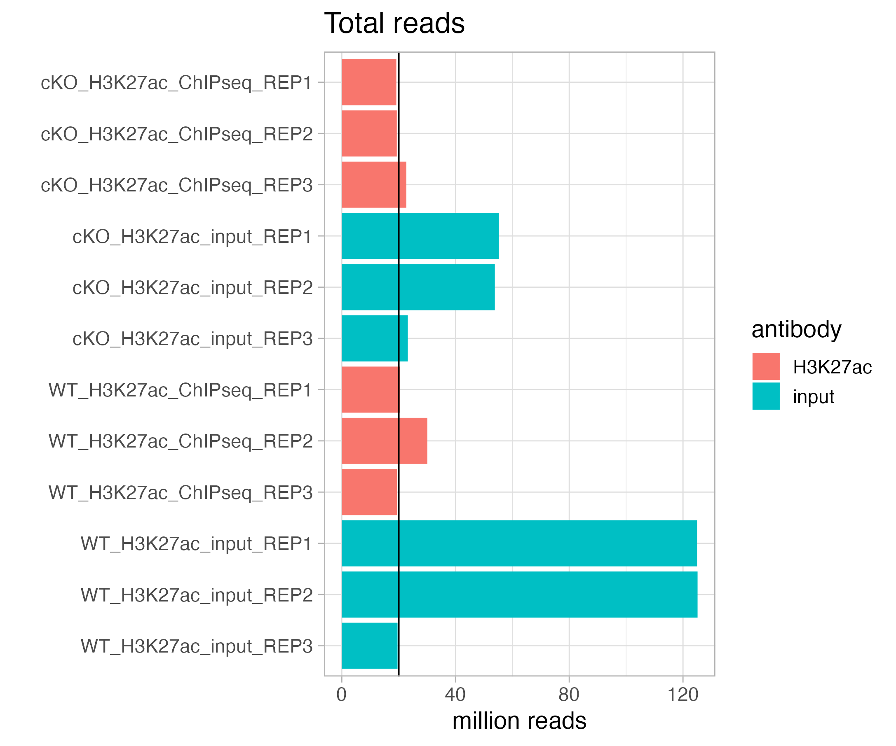
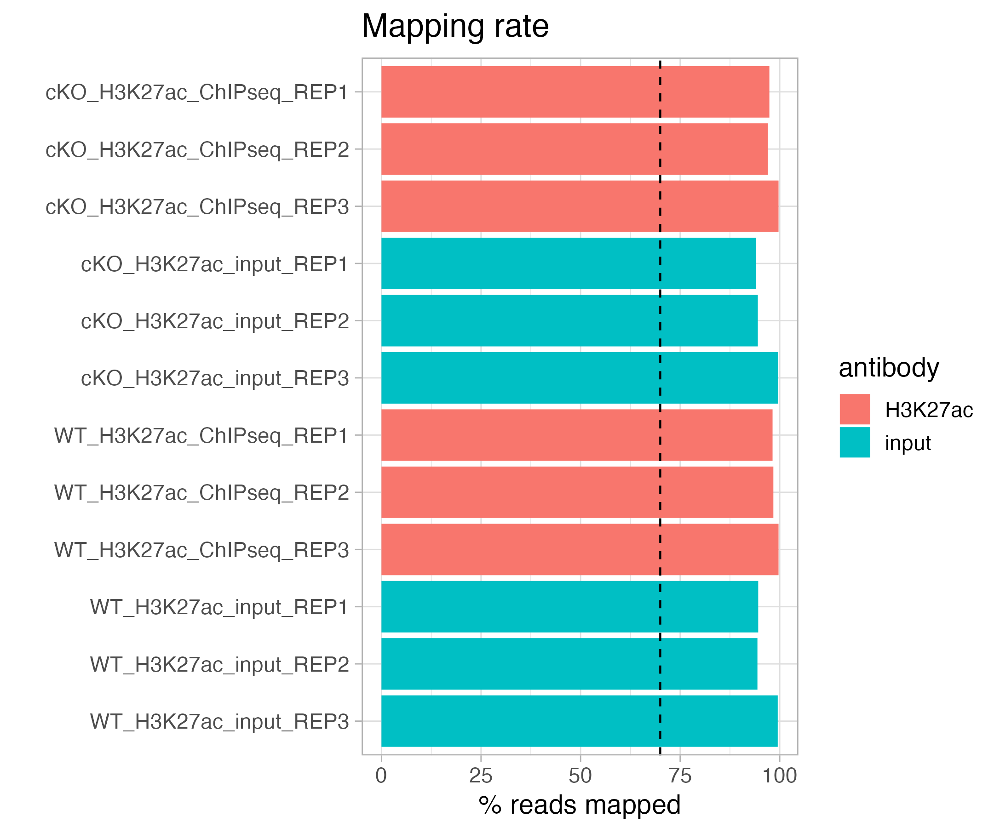
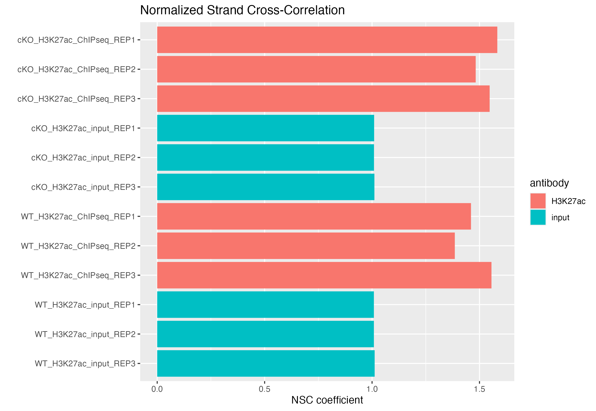
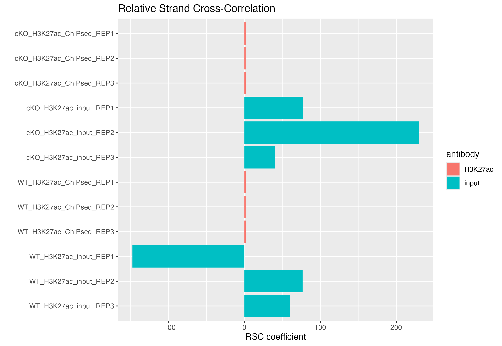
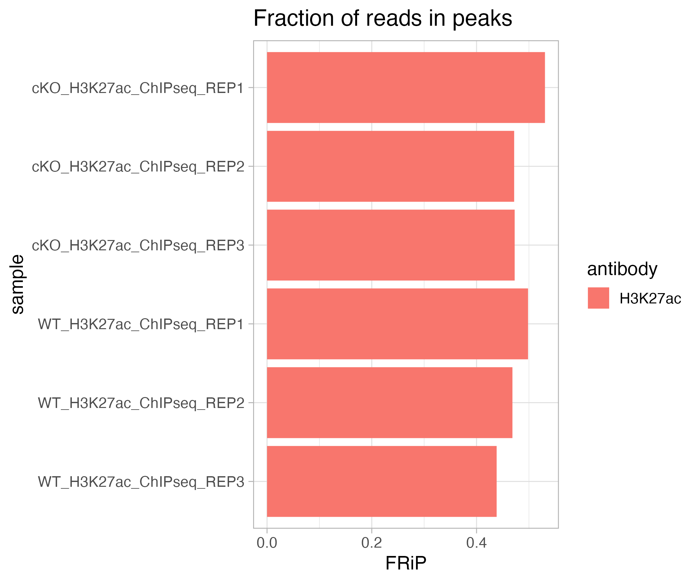
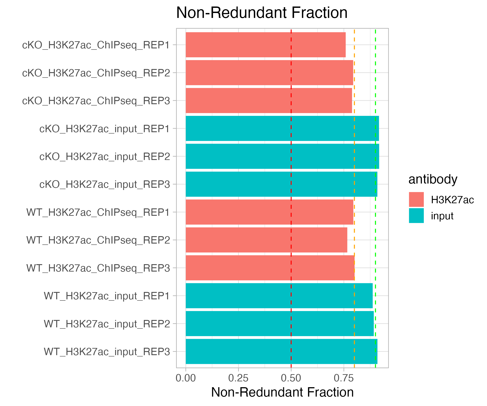

Contributors: Heather Wick, Upendra Bhattarai, Meeta Mistry

Approximate time: 

## Learning Objectives

* Describing peaks as genomic coordinate data
* Understand the BED format and related peak file formats (narrowPeak, broadPeak, gappedPeak)
* Metrics for assessing the quality of peaks called

## What is a peak?

A peak represents a region of the genome which was found to be bound to the protein or histone modification of choice. Chromatin Immunoprecipitation followed by sequencing (ChIP-seq) is a central method in epigenomic research which allows us to query peaks. A typical ChIPseq workflow is outlined in the images below: In ChIP experiments, a transcription factor, cofactor, histone modification, or other chromatin protein of interest is enriched by immunoprecipitation from cross-linked cells, along with its associated DNA. The immunoprecipitated DNA fragments are then sequenced, followed by identification of enriched regions of DNA or peaks using peak-calling software, such as Macs2. These peak calls can then be used to make biological inferences by determining the associated genomic features and/or over-represented sequence motifs.

<p align="center">

</p>

_Image source: ["From DNA to a human: What the ENCODE and Roadmap Epigenome Projects can teach us about how we are who we are"](https://portlandpress.com/biochemist/article/37/5/24/773/From-DNA-to-a-human-What-the-ENCODE-and-Roadmap)_

<p align="center">

</p>

In this lesson, we will introduce you to several important file format that you will encounter when working with peak calls called the **BED format** (**B**rowser **E**xtensible **D**ata). We will also describe the contents of the **narrowPeak** files (output from MACS2) and how it relates to BED. 

## BED file formats

### BED

The BED file format is tab-delimited (columns separated by tabs) and contains information about the coordinates for particular genome features.

<p align="center">

</p>

**The coordinates in BED files are 0-based**. What does this mean? Among standard file formats, genomic coordinates can be represented in two different ways as shown in the image below. 

* **Zero-based** is shown at the top of the image. This is the preferred format for programmers.
* **One-based** is shown at the bottom. This is more intuitive and generally preferred by biologists. 

<p align="center">

</p>

Given the example above, **what coordinates would you use to define the sequence `ATG`?** 

* If you were using the the 1-based (bottom) method you would indicate **4 to 6**. 
* Using the 0-based method you would define the range as **3 to 6**. 

The benefits to having a **zero-based system** is the **ease of calculating distance or length** of sequences. We can easily determine the length of the `ATG` sequence using the zero-based coordinates by subtracting the start from the end, whereas for one-based coordinates we would need to add one after the subtraction. Therefore, many file formats used in computation, including **the BED file format**, use zero-based coordinates. 

BED files **require at least 3 fields** indicating the **genomic location of the feature**, including the chromosome and the start and end coordinates. However, there are 9 additional fields that are optional, as shown in the image below.

<p align="center">

</p>

### narrowPeak

A narrowPeak (.narrowPeak) file is used by the ENCODE project to provide called peaks of signal enrichment based on pooled, normalized (interpreted) data. The narrowPeak file is a BED6+4 format, which means the first 6 columns of a standard BED file  with **4 additional fields**:

<p align="center">

</p>

Each row in the narrowPeak file represents a called peak. Below is an the example of a narrowPeak file, displaying the coordinate and statistical information for a handful of called peaks.

<p align="center">

</p>

### broadPeak

A broadPeak (.broadPeak) file is very similar to a narrowPeak file, but it is BED6+3 because it is missing one element that the narrowPeak format has: the final column, which is the point-source, or summit coordinate, for each peak. This is because broad peaks are large regions rather than sharp peaks; they are called in MACS2 by combining adjacent narrow peaks.

### gappedPeak

A gappedPeak (.gappedPeak) file is a BED12+3 file which contains broad peaks as well as narrow peaks within the broad peaks. You can learn more about this format (and the format of the other files) on the [Encode website](https://genome.ucsc.edu/FAQ/FAQformat.html#format14)

## Handling peak files and peak data

Once we have our peak files, we can do some downstream processing, such as peak filtering, find consensus peaks between samples, perform QC, and carry out other downstream analyses and visualization. The type of peak processing and filtering you might do, such as removing peaks from black-listed regions, depends on the specific pipeline you are following. Another useful step is to create **consensus peaks**. Some pipelines, like the one we used to generate the data used in this course, filter reads in black-listed regions before calling peaks, rather than peaks in those regions afterwards, but either method is acceptable. Our pipeline also conveniently has automatically provided consensus peaks for us, but this can also be calculated independently. For more information on this type of filtering and processing and the tools you might use to perform them, see the **bedtools** and **Filtering peaks overlapping with blacklist regions** sections from this similar lesson from our [Chromatin Biology workshop](https://github.com/hbctraining/Intro-to-ChIPseq-flipped/blob/main/lessons/07_handling_peaks_bedtools.md).

####HAVE CODE SNIPPET HERE ABOUT FINDING CONSENSUS PEAKS ON THEIR OWN

## Quality Control

Some peak quality control can be done directly on peak files, but there are many other metrics we can look at as well. The self-learning reading described a few steps for generating information about the quality of our data, including **fastqc** and **multiqc**, which conveniently summarizes that information for us. We can use the output from multiqc report, the consensus peaks generated by bedtools, and other metrics to further query the quality of our peak data. 

>**How to run fastqc and multiqc**
>
>If you need to run fastqc/multiqc on your data, you'll first need to make sure they are either installed on your computer (which can be done via `pip` or `conda`) or the High Performance Computing cluster on which you are working (a much faster option). After that, running fastqc and multiqc is quite simple. To run fastqc on a fastq.gz file and put the output in a folder called fastqc_output, for each fastq file you will need to run a command such as:
>
>```
> fastqc -o fastqc_output <fastq.gz>
>```
>
>Once you have generated all the fastqc reports for your files, you can run multiqc on that folder:
>
>```
> cd fastqc_output
> multiqc .
>```
***

####HAVE INSTRUCTIONS FOR MAKING METRICS.CSV???

You can download the pre-generated multiqc report HERE, and the consensus peak file HERE.

####DO WE NEED AN EXPLANATION OF THE DATA SET OR IS THAT PART OF THE PREREADING?

The data set we are going to look at consists of 3 wild type (WT) and 3 c knockout (cKO -- WHAT IS CKO) samples. The original authors were looking at H3K27ac in mice (WHY) with and without WHATEVER CKO GENE IS. Each replicate has its own input sample

### loading in data and setting up environment

First, we need to set up our environment by loading some useful packages to help us process our data. We also need to load our multiqc output file

```
library(tidyverse)

metrics <- read.csv("./metrics.csv")
```

### Total reads

One of the most basic quality evaluations we can make for any genomic (or transcriptomic) data set is to look at the total number of reads in each sample. Ideally, we want to see consistency across samples, and especially across any treatment groups we might compare. We also want to see a minimum of about 20 million reads (represented by the black dashed line).

```
metrics %>%
    ggplot(aes(x = sample,
               y = total_reads/1e6, 
               fill = antibody)) +
    geom_bar(stat = "identity") +
    coord_flip() +
    scale_y_continuous(name = "million reads") +
    scale_x_discrete(limits = rev) +
    xlab("") + 
    ggtitle("Total reads")+
    geom_hline(yintercept=20, color = "black", linetype = "dashed", linewidth=.5)
```

This data set isn't perfect -- while most of our samples have close to or more than 20 million reads, we have some variation between samples. In particular, some of our our input samples, especially two of the WT samples, have many more reads than the other samples. Sometimes, if input reads have many more reads in peaks than their antibody counterparts, this can skew or reduce the number of peaks identified in those samples. However if these reads are scattered throughout the genome, they may just be background noise and the sample was simply sequenced more deeply. By looking at other quality control metrics, we can determine how this might affect the data set and, if necessary, take steps to reduce the impact of this kind of variability, such as through down-sampling.

<p align="center">

</p>

### Mapping rate

Next, we will look at mapping rate, which is the number of reads that were able to successfully be mapped to a unique region of the reference genome, out of the total number of reads (multi-mapped reads were excluded in our pipeline). We want to see consistent mapping rates between samples and over 70% mapping (the black dashed line)

```
metrics %>%
    ggplot(aes(x = sample,
               y = mapped_reads_pct, 
               fill = antibody)) +
    geom_bar(stat = "identity") +
    coord_flip() +
    scale_y_continuous(name = "% reads mapped") +
    scale_x_discrete(limits = rev) +
    xlab("") +
    ggtitle("Mapping rate") + xlab("") +
    geom_hline(yintercept=70, color = "black", linetype = "dashed", linewidth=.5)
```

Our samples all have a mapping rate well above the minimum, and the samples are consistent.

<p align="center">

</p>

### Normalized strand cross-correlation coefficient (NSC)

###SOMEONE PLEASE CHECK IF WE WANT TO ADD MORE DETAIL ABOUT HOW THIS IS CALCULATED FROM THE LINK, I"M NOT SURE I UNDERSTOOD THE EXPLANATION IN THE LINK

The normalized strand cross-correlation coefficient is a representation of the quality of signal to noise for the peaks of each sample. 

* higher NSC values indicate more enrichment (better signal:noise)
* low signal-to-noise: NSC values < 1.1
* minimum possible NSC value: 1 (no enrichment)

You can read detail more about how this coefficient is calculated [here](https://hbctraining.github.io/In-depth-NGS-Data-Analysis-Course/sessionV/lessons/CC_metrics_extra.html).

```
metrics %>%
    ggplot(aes(x = sample,
               y = nsc, 
               fill = antibody)) +
    geom_bar(stat = "identity") +
    coord_flip() +
    scale_y_continuous(name = "NSC coefficient") +
    scale_x_discrete(limits = rev) +
    xlab("") +
    ggtitle("Normalized Strand Cross-Correlation")
```

In our data, you can see that our antibody samples all have NSC values >1, while our input samples all have the minimum value of 1. This reflects the fact that our antibody samples have real signal (peaks), while our input samples are a representation of background noise.

<p align="center">

</p>

### Relative strand cross-correlation coefficient (RSC)

####CAN WE GET A BETTER TAKEAWAY OF WHAT THIS MEANS?

This is the ratio of the fragment-length correlation value minus the background (minimum) cross-correlation value, divided by the phantom-peak cross-correlation value minues the background cross-correlation value.

* high enrichment: RSC values > 1
* low signal-to-noise: RSC values < 0.8
* minimum possible RSC value: 0 (no enrichment)

You can read detail more about how this coefficient is calculated [here](https://hbctraining.github.io/In-depth-NGS-Data-Analysis-Course/sessionV/lessons/CC_metrics_extra.html).

```
metrics %>%
    ggplot(aes(x = sample,
               y = rsc, 
               fill = antibody)) +
    geom_bar(stat = "identity") +
    coord_flip() +
    scale_y_continuous(name = "RSC coefficient") +
    scale_x_discrete(limits = rev) +
    xlab("") + 
    ggtitle("Relative Strand Cross-Correlation")
```

####THIS PLOT MAKES NO SENSE IT IS NOT EVEN ON THE CORRECT SCALE I"M NOT SURE WHATS GOING ON

<p align="center">

</p>

### Fraction of reads in peaks (FRiP)

This represents the fraction of mapped reads which are mapped to peaks (as opposed to elsewhere in the genome). This is only calculated for antibody samples in our data set. The expected fraction of reads in peaks will vary by protein. Histone marks, which usually have broader peaks, often have higher FRiPs than transcription factors, which usually have much narrower peaks.

```
metrics %>% filter(!is.na(frip)) %>%
    ggplot(aes(x = sample,
               y = frip, 
               fill = antibody)) +
    geom_bar(stat = "identity") +
    coord_flip() +
    scale_y_continuous(name = "FRiP") +
    scale_x_discrete(limits = rev) +
    xlab("") + 
    ggtitle("Fraction of reads in peaks")
```

Our samples have FRiPs in line with what we might expect for broad histone marks, and they are fairly consistent.

<p align="center">

</p>

### Number of peaks

We want to see a consistent number of peaks between our samples (we only have this metric for our antibody samples

```
metrics %>% filter(!is.na(peak_count)) %>%
    ggplot(aes(x = sample,
               y = peak_count, 
               fill = antibody)) +
    geom_bar(stat = "identity") +
    coord_flip() +
    scale_y_continuous(name = "Number of Peaks") +
    scale_x_discrete(limits = rev) +
    xlab("") +
    ggtitle("Number of Peaks")
```

### Non-redundant fraction (NRF)

The non-redundant fraction of reads is the number of distinct uniquely mapping reads (i.e. after removing duplicates) divided by the total number of reads. It is a measure of library complexity. This value is 0-1, and ideally, we would want to see values close to 1. Generally, an NRF of 0.8 and higher indicates acceptable data. The ENCODE website also sets out standardized thresholds for this as well and those are summarized in the table below. In our plot, we use a green, orange, and red dashed line to represent Ideal, Compliant, and Acceptable NRF cutoffs, respectively.

<p align="center">

</p>

```
metrics %>% 
    ggplot(aes(x = sample,
               y = nrf, 
               fill = antibody)) +
    geom_bar(stat = "identity") +
    coord_flip() +
    scale_y_continuous(name = "Non-Redundant Fraction") +
    scale_x_discrete(limits = rev) +
    xlab("") + 
    ggtitle("Non-Redundant Fraction")+
    geom_hline(yintercept = 0.9, linetype = "dashed", color="green") +
    geom_hline(yintercept = 0.8, linetype = "dashed", color="orange") +
    geom_hline(yintercept = 0.5, linetype = "dashed", color="red")
```

<p align="center">

</p>

All of our samples are at least acceptable, and hover around or surpass the compliant or ideal thresholds.

### Summary

Overall, our data looks pretty good. We do have a large number of reads in some of our input samples, but all of the other QC metrics look acceptable. We can go ahead and take a look at some additional QC metrics in our next lesson, where we will examine more closely the relationship between samples.

***

*This lesson has been developed by members of the teaching team at the [Harvard Chan Bioinformatics Core (HBC)](http://bioinformatics.sph.harvard.edu/). These are open access materials distributed under the terms of the [Creative Commons Attribution license](https://creativecommons.org/licenses/by/4.0/) (CC BY 4.0), which permits unrestricted use, distribution, and reproduction in any medium, provided the original author and source are credited.*
