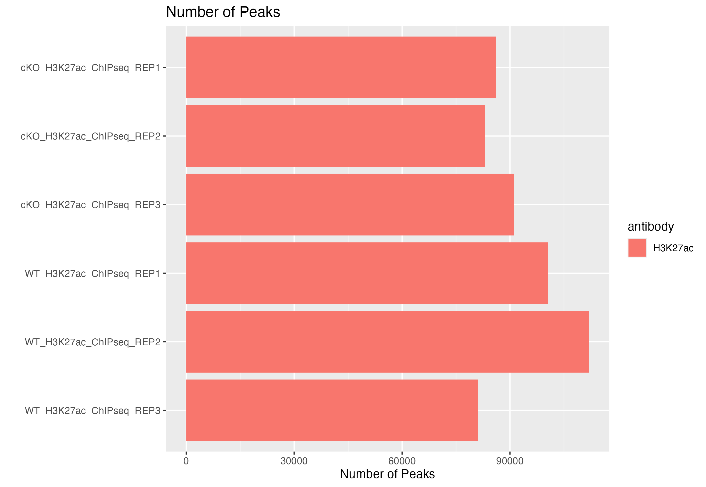

Contributors: Heather Wick, Upendra Bhattarai, Meeta Mistry, Will Gammerdinger

Approximate time: 

## Learning Objectives

* Describe various metrics for peak quality
* Evaluate metrics for assessing the quality of peaks called

## Quality Control

In our peak files we have genomic coordinates identifying regions of the genome where there is a significant amount of enrichment in our samples. A good quality ChIP-seq experiment will have **high enrichment over background**, and so for each of our samples we will use quality metrics to assess this. In this lesson, we describe the differnt ways in which we can quantify the quality and we also present the tools (and associated commands) to compute them for your own dataset.

**INSERT WORKFLOW IMAGE HERE?**


### Load libraries

First we need to set up our environment by loading some useful packages to help us process our data. 

```
# Load libraries - add all libraries here
library(tidyverse)
```

### Load data

Locate the input data called `metrics.csv` which is located in the .... folder in your working directory. We have created for you file which compiles all the metrics for each of the samples in the dataset. This file is a product of the bcbioR package described in lesson 00b. It is a csv in which each row corresponds to a sample, and each column contains information for a quality metric. 

 For each metric we will describe what it represents and how it is calculated. We provide code for you such that you may use it compute similar metrics for your own dataset, and create your own csv. 
 
 > **Note that the majority of the code we provide is for command-line tools, not R.** If you are attempting to run this on your own data it may be beneficial to run this on your local high performac compute cluster where these tools are commonly pre-installed for you.


```
## Load file
metrics <- read.csv("data/metrics.csv")
```

### Total reads

One of the most basic quality evaluations we can make for any genomic (or transcriptomic) data set is to look at the total number of reads in each sample. Ideally, we want to see consistency across samples, and especially across any treatment groups we might compare. We also want to see a minimum of about 20 million reads (represented by the black dashed line).

<details>
<summary><b>Click here for the code to compute total reads from your own data</b></summary>
In order to determine the total number of reads, we can run ... The command to run this is:</br></br>
<pre>
&#35;
 Add code here
</pre></br>
</details>


```
metrics %>%
    ggplot(aes(x = sample,
               y = total_reads/1e6, 
               fill = antibody)) +
    geom_bar(stat = "identity") +
    coord_flip() +
    scale_y_continuous(name = "million reads") +
    scale_x_discrete(limits = rev) +
    xlab("") + 
    ggtitle("Total reads")+
    geom_hline(yintercept=20, color = "black", linetype = "dashed", linewidth=.5)
```

This data set isn't perfect -- while most of our samples have close to or more than 20 million reads, we have some variation between samples. In particular, some of our our input samples, especially two of the WT samples, have many more reads than the other samples. Sometimes, if input reads have many more reads in peaks than their antibody counterparts, this can skew or reduce the number of peaks identified in those samples. However if these reads are scattered throughout the genome, they may just be background noise and the sample was simply sequenced more deeply. By looking at other quality control metrics, we can determine how this might affect the data set and, if necessary, take steps to reduce the impact of this kind of variability, such as through down-sampling.

<p align="center">

</p>

### Mapping rate

Next, we will look at mapping rate, which is the number of reads that were able to successfully be mapped to a unique region of the reference genome, out of the total number of reads (multi-mapped reads were excluded in our pipeline). We want to see consistent mapping rates between samples and over 70% mapping (the black dashed line).

<details>
<summary><b>Click here for the code to compute mapping rate from your own data</b></summary>
In order to determine the mapping rate, we can run ... The command to run this is:</br></br>
<pre>
&#35;
 Add code here
</pre></br>
</details>

```
metrics %>%
    ggplot(aes(x = sample,
               y = mapped_reads_pct, 
               fill = antibody)) +
    geom_bar(stat = "identity") +
    coord_flip() +
    scale_y_continuous(name = "% reads mapped") +
    scale_x_discrete(limits = rev) +
    xlab("") +
    ggtitle("Mapping rate") + xlab("") +
    geom_hline(yintercept=70, color = "black", linetype = "dashed", linewidth=.5)
```

Our samples all have a mapping rate well above the minimum, and the samples are consistent across the dataset.

<p align="center">

</p>


### Normalized strand cross-correlation coefficient (NSC)

The normalized strand cross-correlation coefficient is a representation of the quality of signal to noise for the peaks of each sample. 

* higher NSC values indicate more enrichment (better signal:noise)
* low signal-to-noise: NSC values < 1.1
* minimum possible NSC value: 1 (no enrichment)

You can read detail more about how this coefficient is calculated [here](https://hbctraining.github.io/In-depth-NGS-Data-Analysis-Course/sessionV/lessons/CC_metrics_extra.html).

Thanks to our nf-core/bcbioR pipeline, our `metrics` object already has this data ready to go. However, if you 
are running a different pipeline, you may need to calculate this statistic yourself.

This is computed using phantompeakqualtools R package (its old and difficult to install). Give code to run it 

You can find code for calculating NSC [here] (####INSERT LINK OR DROPDOWN TO CODE SNIPPET)

```
metrics %>%
    ggplot(aes(x = sample,
               y = nsc, 
               fill = antibody)) +
    geom_bar(stat = "identity") +
    coord_flip() +
    scale_y_continuous(name = "NSC coefficient") +
    scale_x_discrete(limits = rev) +
    xlab("") +
    ggtitle("Normalized Strand Cross-Correlation")
```

In our data, you can see that our antibody samples all have NSC values >1, while our input samples all have the minimum value of 1. This reflects the fact that our antibody samples have real signal (peaks), while our input samples are a representation of background noise.

<p align="center">

</p>

### Relative strand cross-correlation coefficient (RSC)

####CAN WE GET A BETTER TAKEAWAY OF WHAT THIS MEANS?

This is the ratio of the fragment-length correlation value minus the background (minimum) cross-correlation value, divided by the phantom-peak cross-correlation value minues the background cross-correlation value.

* high enrichment: RSC values > 1
* low signal-to-noise: RSC values < 0.8
* minimum possible RSC value: 0 (no enrichment)

You can read detail more about how this coefficient is calculated [here](https://hbctraining.github.io/In-depth-NGS-Data-Analysis-Course/sessionV/lessons/CC_metrics_extra.html).

Thanks to our nf-core/bcbioR pipeline, our `metrics` object already has this data ready to go. However, if you are running a different pipeline, you may need to calculate this statistic yourself. You can find code for calculating RSC [here] (####INSERT LINK OR DROPDOWN TO CODE SNIPPET)

```
metrics %>%
    ggplot(aes(x = sample,
               y = rsc, 
               fill = antibody)) +
    geom_bar(stat = "identity") +
    coord_flip() +
    scale_y_continuous(name = "RSC coefficient") +
    scale_x_discrete(limits = rev) +
    xlab("") + 
    ggtitle("Relative Strand Cross-Correlation")
```

####THIS PLOT MAKES NO SENSE IT IS NOT EVEN ON THE CORRECT SCALE I"M NOT SURE WHATS GOING ON

<p align="center">

</p>

### Fraction of reads in peaks (FRiP)

This represents the fraction of mapped reads which are mapped to peaks (as opposed to elsewhere in the genome). This is only calculated for antibody samples in our data set. The expected fraction of reads in peaks will vary by protein. Histone marks, which usually have broader peaks, often have higher FRiPs than transcription factors, which usually have much narrower peaks.

Thanks to our nf-core/bcbioR pipeline, our `metrics` object already has this data ready to go. However, if you are running a different pipeline, you may need to calculate this statistic yourself. You can find code for calculating FRiP [here] (####INSERT LINK OR DROPDOWN TO CODE SNIPPET)

This code exists: https://github.com/hbctraining/Peak_analysis_workshop/blob/main/scripts/calculate_frip.sh

```
metrics %>% filter(!is.na(frip)) %>%
    ggplot(aes(x = sample,
               y = frip, 
               fill = antibody)) +
    geom_bar(stat = "identity") +
    coord_flip() +
    scale_y_continuous(name = "FRiP") +
    scale_x_discrete(limits = rev) +
    xlab("") + 
    ggtitle("Fraction of reads in peaks")
```

Our samples have FRiPs in line with what we might expect for narrow histone marks, and they are fairly consistent.

<p align="center">

</p>


### Non-redundant fraction (NRF)

The non-redundant fraction of reads is the number of distinct uniquely mapping reads (i.e. after removing duplicates and unmapped) divided by the total number of reads. It is a measure of library complexity. This value is 0-1, and ideally, we would want to see values close to 1. Generally, an NRF of 0.8 and higher indicates acceptable data. The ENCODE website also sets out standardized thresholds for this as well and those are summarized in the table below. In our plot, we use a green, orange, and red dashed line to represent Ideal, Compliant, and Acceptable NRF cutoffs, respectively.

Thanks to our nf-core/bcbioR pipeline, our `metrics` object already has this data ready to go. However, if you are running a different pipeline, you may need to calculate this statistic yourself. 

<details>
<summary><b>Click here for the code to compute NRF values from your own data</b></summary>
In order to determine the number of uniquely mapping reads, we can run <code>Picard</code>'s <code>MarkDuplicates</code> function. It will mark duplicate reads and also output a metrics file containing the number of total reads, unmapped reads and duplicated reads. The command to run this is:</br></br>
<pre>
&#35; Mark duplicates and create metrics file
java -jar picard.jar MarkDuplicates \
  --INPUT &lt;SORTED_BAM_FILE&gt; \
  --OUTPUT &lt;REMOVE_DUPLICATES_BAM_FILE&gt; \
  --METRICS_FILE &lt;METRICS_FILE&gt;
</pre></br>
From this we can derive our NRF:</br>
<p align="center">

</p>
</details>

Below are the ENCODE guidelines for NRF:

<p align="center">

</p>

```
metrics %>% 
    ggplot(aes(x = sample,
               y = nrf, 
               fill = antibody)) +
    geom_bar(stat = "identity") +
    coord_flip() +
    scale_y_continuous(name = "Non-Redundant Fraction") +
    scale_x_discrete(limits = rev) +
    xlab("") + 
    ggtitle("Non-Redundant Fraction")+
    geom_hline(yintercept = 0.9, linetype = "dashed", color="green") +
    geom_hline(yintercept = 0.8, linetype = "dashed", color="orange") +
    geom_hline(yintercept = 0.5, linetype = "dashed", color="red")
```

<p align="center">

</p>

All of our samples are at least acceptable, and hover around or surpass the compliant or ideal thresholds.

### Number of peaks

Finally, we want to see a consistent number of peaks between our samples (we only have this metric for our antibody samples.

Thanks to our nf-core/bcbioR pipeline, our `metrics` object already has this data ready to go. However, if you are running a different pipeline, you may need to calculate this statistic yourself. You can find code for calculating number of peaks [here] (####INSERT LINK OR DROPDOWN TO CODE SNIPPET)

Code snippet wc-l of narrowPeak files (might have header)

```
metrics %>% filter(!is.na(peak_count)) %>%
    ggplot(aes(x = sample,
               y = peak_count, 
               fill = antibody)) +
    geom_bar(stat = "identity") +
    coord_flip() +
    scale_y_continuous(name = "Number of Peaks") +
    scale_x_discrete(limits = rev) +
    xlab("") +
    ggtitle("Number of Peaks")
```

<p align="center">

</p>

### Summary

Overall, our data looks pretty good. We do have a large number of reads in some of our input samples, but all of the other QC metrics look acceptable. We can go ahead and take a look at some additional QC metrics in our next lesson, where we will examine more closely the relationship between samples.

***

*This lesson has been developed by members of the teaching team at the [Harvard Chan Bioinformatics Core (HBC)](http://bioinformatics.sph.harvard.edu/). These are open access materials distributed under the terms of the [Creative Commons Attribution license](https://creativecommons.org/licenses/by/4.0/) (CC BY 4.0), which permits unrestricted use, distribution, and reproduction in any medium, provided the original author and source are credited.*
