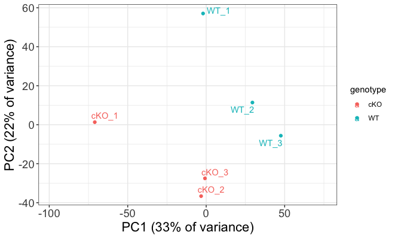
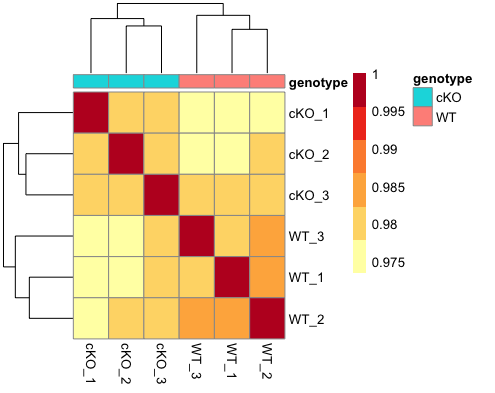
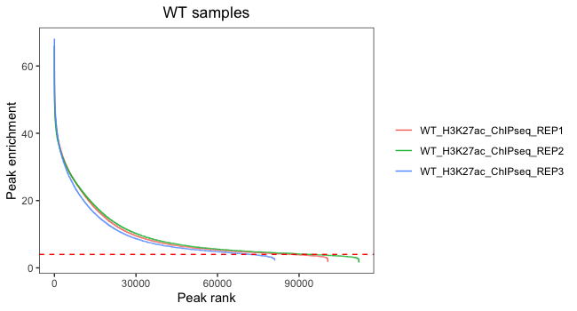
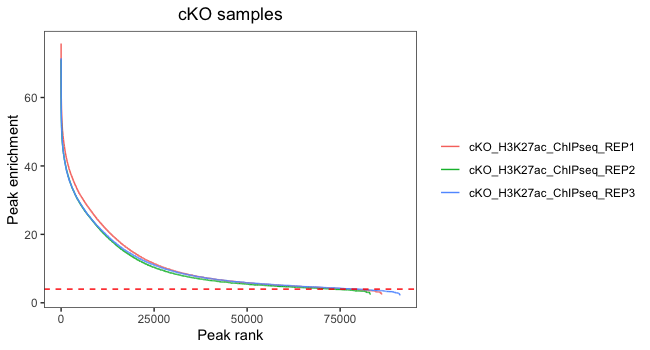

Contributors: Will Gammerdinger, Meeta Mistry

Approximate time: 45 minutes

## Learning Objectives

* Assess sample similarity using read density data
* Plot PCA and hierarchical clustering to assess inter-sample variability
* Evaluate signal enrichment to look at concordance across replicates
  
## Assessing sample similarity

In the previous lesson, we evaluated quality metrics concerning peaks and reads in peaks in individual samples. But these aren't the only ways to measure quality in our data set. We did look for consistency of these metrics across all of our samples, but now it's **time for a closer look at our samples to see how they compare for samples within treatment groups and between groups**. To do this we will be visualizing our data using two different types of data:

1. Read count distribution across the genome and
2. Signal enrichment within regions called as peaks

## Setup

Let's begin by creating a new script for this and the following lesson, and let's call it `peak_similarity.R`. We can add a header to our script and start with a section to load the required libraries:

```
## Assess concordance between samples and find overlapping peaks

# Load libraries
library(DESeq2)
library(ggrepel)
library(ChIPpeakAnno)
library(UpSetR)
```

## Read count density 
Two commonly used methods for evaluating sample similarity are Principal Components Analysis (PCA) and hierarchical clustering. In order to implement both of these, we need the **appropriate inputs**. The requirement is a data matrix. In the case of ChIP-seq or related data, this **matrix would have samples in the columns and genomic regions in the rows**. This matrix can be created using a command-line tool called [`multiBamSummary`](https://deeptools.readthedocs.io/en/develop/content/tools/multiBamSummary.html) from the [deepTools suite](https://deeptools.readthedocs.io/en/develop/index.html) for exploring deep sequencing data. Since this is an R-based workshop, **we have created the matrix for you**, but have provided the code in the drop-down below if you wanted to create it for your own data.

<details>
<summary><b>Click here for the code to create a read count matrix using deepTools</b></summary>
<br>The command <code>multiBamSummary</code> computes the read coverages for genomic regions for two or more BAM files. The analysis can be performed for the entire genome by running the program in ‘bins’ mode. If you want to count the read coverage for specific regions only (for example only consensus regions), you can use the BED-file mode instead. <br><br>
The standard output of multiBamSummary is a compressed numpy array (.npz), which can be used with other functions in deepTools to create PCA plots and correlation heatmaps. <b>Instead we opt to get a tab-delimited file to allow us flexibility to create our own plots by using the <code>--outRawCounts</code> parameter.</b><br>

The command to run this is:</br></br>
<pre>
multiBamSummary bins \
	  --bamfiles cKO_H3K27ac_ChIPseq_REP1.mLb.clN.sorted.bam cKO_H3K27ac_ChIPseq_REP2.mLb.clN.sorted.bam cKO_H3K27ac_ChIPseq_REP3.mLb.clN.sorted.bam \
               WT_H3K27ac_ChIPseq_REP1.mLb.clN.sorted.bam WT_H3K27ac_ChIPseq_REP2.mLb.clN.sorted.bam WT_H3K27ac_ChIPseq_REP3.mLb.clN.sorted.bam \
	  --outFileName multiBamsummary_noInput.npz \
	  --labels cKO_1 cKO_2 cKO_3 WT_1 WT_2 WT_3  \
	  -p 6 \
	  --outRawCounts multiBAMsummary_noInput.tab
</pre></br>

</details>

We have created two versions of the read count matrix: one that contains ChIP and input samples and another that contains ChIP samples only. Both of these files can be found in the `data/multBamSummary` folder. Let's read in the data:

```
# Read in data
counts <- read.delim("data/multiBamSummary/multiBAMsummary_noinput.tab", sep="\t")
```

<p align="center">

</p>

If we look at the file, you can see that the first three columns correspond to genomic coordinate data and also that the headers could use some formatting.
Next, we will **wrangle the data** to keep only the columns with count data and clean up the column names. We will also create a metadata dataframe:

```
# remove genomic coordinate info
plot_counts <- data.frame(counts[, 4:ncol(counts)])

# Change column names
colnames(plot_counts) <- colnames(plot_counts) %>% 
  str_replace( "X.", "") %>% 
  str_remove( "\\.$")

# Create meta
meta <- data.frame(row.names = colnames(plot_counts), 
                   genotype=colnames(plot_counts) %>% str_remove("\\_[0-9]"))
```

### Transforming the counts
To make a fair comparison across samples, we need to normalize the data. We are working with a count matrix in which highly enriched regions consume more sequencing resources and thereby suppress the representation of other regions. This data resembles something quite similar to RNA-seq and gene expression, so we can apply similar methods. Since we are simply visualizing data at this point (and not performing any statistical analysis), a **variance stabilizing transform** (vst) would be adequate rather than normalization. The vst is a transformation method is a log2 transform with an additional step to avoid any bias from the abundance of low-count genes. In short, for genes with lower counts, the values are shrunken towards the genes’ averages across all samples. 

> _Later in this workshop when we perform differential enrichment analysis, we will discuss normalization in more detail._

In order to perform the vst, we will use the [DESeq2 package](https://bioconductor.org/packages/release/bioc/html/DESeq2.html). First, we create a DESeq2 object and then we run the `vst()` function. Following that we can extract the vst transformed counts for visualization.

```
# Create DESeq2 object
dds <- DESeqDataSetFromMatrix(plot_counts, meta, design = ~genotype)

# Run vst and extract transformed counts
vst <- vst(dds)
vst_counts <- assay(vst)
```

### Principal Component Analysis (PCA)

Principal Component Analysis (PCA) is a technique used to emphasize variation and bring out strong patterns in a dataset (dimensionality reduction). This is a very important technique used in the QC and analysis of ChIPseq.

If you've done any RNA-seq or single cell analysis, you're likely familiar with the concept of PCA, as this technique is commonly used to evaluate sample similarity. If you'd like to refamiliarize yourself on the details of how PCA is calculated, we recommend you read our materials [here](https://hbctraining.github.io/DGE_workshop_salmon_online/lessons/principal_component_analysis.html) or [watch this useful video from StatQuest](https://www.youtube.com/watch?v=_UVHneBUBW0&ab_channel=StatQuestwithJoshStarmer).

To perform PCA, we first need to compute the principal components from our read density data. Once we have that, we can plot PC1 and PC2, which explain the most amount of variation in our data.

```
# Compute principal components
pc <- prcomp(t(vst_counts))
plot_pca <- data.frame(pc$x, meta)
summary(pc) # will tell you how much variance is explained by each PC

# Plot with sample names used as data points
ggplot(plot_pca, aes(PC1, PC2, color = genotype, label = rownames(plot_pca)), size = 3 ) + 
  theme_bw() +
  geom_point() +
  geom_text_repel() +
  xlab('PC1 (33% of variance)') +
  ylab('PC2 (22% of variance)') +
  scale_x_continuous(expand = c(0.3,  0.3)) +
  theme(plot.title = element_text(size = rel(1.5)),
        axis.title = element_text(size = rel(1.5)),
        axis.text = element_text(size = rel(1.25)))
```

#### Interpreting PCA plots
Essentially, if two samples have similar levels of expression peak enrichment that contribute significantly to the variation represented by a given PC (Principal Component), they will be plotted close together on the axis that represents that PC. Therefore, we would expect that biological replicates to have similar scores (because our expectation is that there is that same enrichment of the histone marks present) and they would cluster together. 

<p align="center">

</p>

Below we highlight some features of our plot:

* It looks like our samples **mostly separate on PC1, and can be attributed to genotype**.
 	* PC1 does only explain 33% of the variance, and as observed on the plot there are clearly other contributions to the observed variance.
* If you look at within-group variability you see the first **replicate from both WT and cKO are slightly separated from their respective groups on PC2**.

If our biological factor of interest was not explained by these two components, we would want to consider coloring our data points by other aspects of the metadata to identify a covariate. In our case, that would be mostly technical factors (found in `metrics.csv`), but if our samples were processed in different batches, or performed on different dates, or if the samples were from tissues with different sexes or other features, these would be important features to label our plot by when looking at PCA. We could also plot beyond the first two principal components to see if our factor was explained by these.

### Inter-sample correlation 

Inter-correlation analysis (ICA) is another way to look at how well samples cluster by plotting the correlation between the peak regions of the samples.

This method is complementary to PCA, and is helpful in identifying strong patterns in a dataset and potential outliers. The heatmap displays **the correlation of normalized read density across all regions, for all pairwise combinations of samples** in the dataset. Since the difference in read density between WT and cKO are small in comparison to all peaks called, samples will generally have high correlations with each other (values higher than 0.80). Samples below 0.80 may indicate an outlier in your data and/or sample contamination.  

The hierarchical tree along the axes indicates which samples are more similar to each other, i.e., cluster together. The color blocks at the top indicate substructure in the data, and you would expect to see your replicates cluster together as a block for each sample group. Our expectation would be that the samples cluster together similar to the groupings we've observed in the PCA plot. 

We can also add metadata to this plot to aid in identifying any factors explain any of the clustering on any level.

```
# Set annotation and colors
annotation <- meta
heat.colors <- brewer.pal(6, "YlOrRd")

# Plot ICA
pheatmap(cor(vst_counts), color=heat.colors, annotation=annotation)
```

<p align="center">

</p>

As expected given what we saw in the PCA plots, our samples cluster nicely by genotype. The block structure is not as emphasized, but this is likely due to the fact that we are looking at binned regions across the entire genome. If we subset to only look at consensus regions, this would change. If we had more samples and plotted more metadata, we might also be able to see whether batch or other biological or technical factor affected the clustering, and on what level.

***

**Exercise**

1. Read in the file `data/multiBAMsummary.tab` and save it to a variable. This matrix contains counts for input samples as well.
2. Transform the data using `vst()`.
	- _Hint: You will need to follow a similar process as above to first clean the count matrix and create a `dds` object._
	- _Hint: You may find it useful to include input/ChIPseq as a metadata factor._
3. Use the vst data to draw a PCA plot. How do samples separate on the plot? How much variance is explained by PC1 and PC2?
4. Use the vst data to draw a correlation heatmap. How does this result compare to the PCA plot? Do we see defined block structure in the heatmap?

***

## Signal concordance across peaks
Next, we will look at the actual peak data to assess sample similarity. The narrowPeak files contain **genomic coordinates for only those regions that were called as peaks.** For each of these peaks we have some peak calling statistics reported in columns 7 through 9. In particular, we are interested in the **signal** column, which is a **measure of overall enrichment for a given region**. Higher values of signal indicate large amounts of observed read density and usually suggest a higher likelihood of a true binding event. We will use this peak signal data to create two different plots outlined below.

### Signal enrichment vs Peak rank

One way to evaluate concordance of peaks between samples is a signal enrichment vs peak rank plot. This shows the rank of each peak vs the strength of each peak for each replicate. It will help us evaluate the number of peaks we would retain if thresholding by peak enrichment. 

Let's first begin by loading in the data. We will use a for loop to go through and load the narrowPeak file for each sample and then we will save the columns we need into individual dataframes. In your environment you should see that **six new dataframes have appeared**.

```
# Get all narrowpeak file names and path
sample_files <- list.files(path = "./data/macs2/narrowPeak/", full.names = T)

# Create a vector of short names
vars <- str_remove( sample_files, "./data/macs2/narrowPeak//") %>% 
  str_remove("_peaks.narrowPeak")

# Loop through to create a dataframe for each sample with columns required
for(r in 1:length(sample_files)){
  peaks <- read.delim(sample_files[r], header = FALSE)
  df <- data.frame(peak_enrichment = peaks$V7, peak_rank = rank(dplyr::desc(peaks$V7))) %>% 
    dplyr::arrange(peak_rank) 
  assign(vars[r], df)
}
```

Next, we will combine dataframes for the **WT replicates** and then **plot signal versus rank**, with each colored line representing a different replicate.

```
#  WT only
wt <- bind_rows("WT_H3K27ac_ChIPseq_REP1" = WT_H3K27ac_ChIPseq_REP1, 
                     "WT_H3K27ac_ChIPseq_REP2" = WT_H3K27ac_ChIPseq_REP2,
                     "WT_H3K27ac_ChIPseq_REP3" = WT_H3K27ac_ChIPseq_REP3,
                     .id = "reps")

ggplot(wt, aes(peak_rank, peak_enrichment, color = reps)) + 
  geom_line() +
  ggtitle("WT samples") +
  theme_bw() +
  geom_hline(yintercept=4, linetype='dashed', color="red") +
  theme(plot.title = element_text(hjust = 0.5),
        legend.title = element_blank(),
        panel.grid.major = element_blank(), 
        panel.grid.minor = element_blank()) +
  xlab("Peak rank") + ylab("Peak enrichment")
````

<p align="center">

</p>


Now, let's **do the same for cKO replicates**:

```
# cKO only
cko <- bind_rows("cKO_H3K27ac_ChIPseq_REP1" = cKO_H3K27ac_ChIPseq_REP1, 
                "cKO_H3K27ac_ChIPseq_REP2" = cKO_H3K27ac_ChIPseq_REP2,
                "cKO_H3K27ac_ChIPseq_REP3" = cKO_H3K27ac_ChIPseq_REP3,
                .id = "reps")

ggplot(cko, aes(peak_rank, peak_enrichment, color = reps)) + 
  geom_line() +
  ggtitle("cKO samples") +
  theme_bw() +
  geom_hline(yintercept=4, linetype='dashed', color="red") +
  theme(plot.title = element_text(hjust = 0.5),
        legend.title = element_blank(),
        panel.grid.major = element_blank(), 
        panel.grid.minor = element_blank()) +
  xlab("Peak rank") + ylab("Peak enrichment")
```

<p align="center">

</p>

In this plot, we are looking at each individual replicates to evaluate what number of peaks we would retain if thresholding by peak enrichment. It is also valuable to see how this differs between replicates within a sample group. Our **data looks pretty consistent within each group**, with all replicates following a similar trend. Also, there are small differences in where the enrichment value drops off and it drops off at the very end of the curve. This suggests that thresholding peaks for our dataset is not necessary.

### Histogram of quality scores
Finally, we plot a histogram of peak signal values for each sample. This plot is complementary to the above plot, as it can also be used to help determine a minimum value for peak enrichment that can be used for filtering. Additionally, we combine the WT and cKO data into one plot which allows us to **compare signal enrichment between the two groups**.

```
# Combine data into one dataframe
allreps <- rbind(wt, cko)

# Add a column for genotype
allreps$genotype <- str_split_fixed(allreps$reps, "_", 4)[,1]

# Plot histogram
ggplot(allreps, aes(peak_enrichment, fill = genotype)) + 
  geom_histogram(aes(peak_enrichment)) +
  ggtitle("Histogram of peak enrichment values") +
  theme_bw() +
  geom_vline(xintercept=median(df$peak_enrichment), linetype='dashed') +
  geom_vline(xintercept=4, linetype='dashed', color="red") +
  theme(plot.title = element_text(hjust = 0.5),
        legend.title = element_blank(),
        panel.grid.major = element_blank(), 
        panel.grid.minor = element_blank()) +
  xlab("Peak enrichment")
```

<p align="center">

</p>

After plotting the data you will see that **enrichment** value are considerably **higher in the cKO samples**. This suggests that overall there is a difference between groups and later in the workshop we will use statistical appraoches to identify those differences. On the plot we have drawn two dashed lines: one at the median value and the other using the threshold of 4 from the previous plot. In this way we can assess whether we want to shift that threshold to allow more for more peaks.  

### Summary
Overall, our replicates seem to show considerable amount of similarity within group as they share trends at both the read density level across the entire genome and signal value within called peaks. It doesn't seem necessary to threshold on signal, but there do appear to be differences in signal levels between groups. Our next step is to look at how the actual regions (genomic coordinates) overlap between samples.

[Back to Schedule](../schedule/README.md)

[Next Lesson >>](02b_peak_concordance_replicates.md)

***

*This lesson has been developed by members of the teaching team at the [Harvard Chan Bioinformatics Core (HBC)](http://bioinformatics.sph.harvard.edu/). These are open access materials distributed under the terms of the [Creative Commons Attribution license](https://creativecommons.org/licenses/by/4.0/) (CC BY 4.0), which permits unrestricted use, distribution, and reproduction in any medium, provided the original author and source are credited.*
