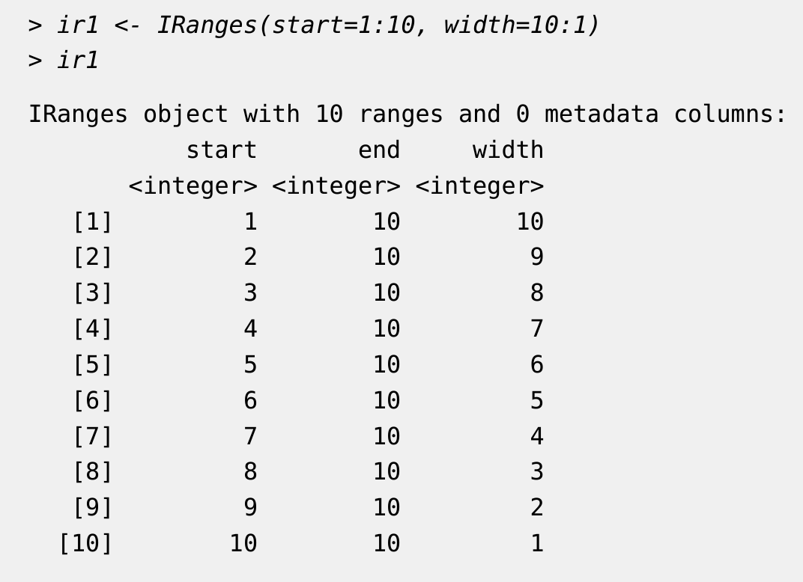
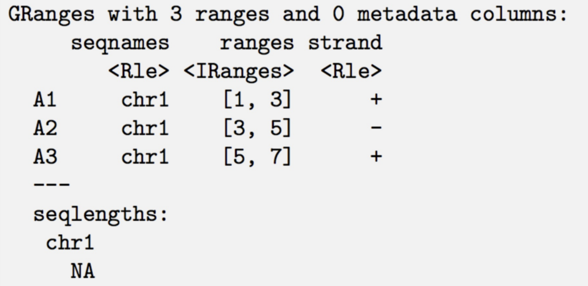

Contributors: Heather Wick, Upendra Bhattarai, Meeta Mistry

Approximate time: 

## Learning Objectives

* Describe IRanges and GRanges in R along with some basic functions
* Identify overlaps between replicates - visualize with VennDiagrams and upSetR
* Extract consensus regions across replicates for a sample group
  
## Peak Overlaps

So far we have looked at quality control metrics for individual samples, as well as statistical concordance between samples. An additional way to look at sample similarity is to look at peak overlap between samples; that is to ask, what peaks are in common between samples within our treatment groups? Looking at peak overlaps serves two purposes: 

1) it is another way of measuring consistency between our samples
2) by creating a set of **consensus peaks** (peaks in common between samples within a treatment group), we are essentially creating a set of peaks in which we are more confident, as these are less likely to be miscalls due to background noise or other technical variation. These consensus peaks can be used in downstream visualization and analysis.

## Essential tools: IRanges and GenomicRanges

You may be familiar with **bedtools** as a useful command line too for manipulating bed files, including finding overlap of genomic regions. Whenever we are doing anything involving overlap of genomic ranges in R, two additional essential tools are of great help: **IRanges** and **GenomicRanges**. These packages allow us to convert bed files and other, more complex and/or binary genomic coordinate files, such as bam files, narrowPeak files and BigWigs into objects in R, and come with a number of different functions that allow us to find overlaps, exclusions, or nearest genomic features, among other things.

### IRanges: the minimal representation of a range in a single space

An IRanges object in R is a very simple representation of a coordinate in a single space (chromosome, in our case), with a `start`, and `end` and a `width`. For example:

<p align="center">

  <figcaption>Image from https://bioconductor.org/packages/release/bioc/vignettes/IRanges/inst/doc/IRangesOverview.pdf, which is also a great place to learn more about IRanges objects and how to manipulate them.</figcaption>
</p>

### GenomicRanges, or GRanges: ranges in multiple spaces

A GRanges object is a little more complex. It lets us store IRanges in multiple spaces (ie multiple chromosomes). In addition to chromosome, a GRanges object also indicates the strand for each region. These objects can also hold additional meta data. Here is a basic example:

<p align="center">

</p>

### Practicing with GRanges

####Have an example here of creating a couple of simple GRanges objects and using a findoverlappingpeaks on them?
```

```
####Include cheat sheet for additional GRanges functions? Such as nearest region, etc, if we think it would be useful

## Finding Consensus peaks

### Reading in narroPeak files and converting into Granges objects

First, we will need to load the appropriate libraries, inlcuding `IRanges`, `GRanges`, and either `consensusSeekeR` or `rtracklayer`, which lets us read our narrowPeak files in as GRanges objects.

####If they've already had to read narrowpeak files in earlier in the previous lesson, then edit this section

####This needs to be changed to read all the files in

```
library(consensusSeekeR)
library(GenomicRanges)

file_narrowPeak <- system.file("extdata",
    "PATH_TO_FILE")

# Create genomic ranges for both the regions and the peaks
result <- readNarrowPeakFile(file_narrowPeak, extractRegions = TRUE, extractPeaks = TRUE)

# Take a look at the first 2 sequences
head(result$narrowPeak, n = 2)
```

For more information about GenomicRanges, we recommend checking out their materials here: https://bioconductor.org/packages/release/bioc/vignettes/GenomicRanges/inst/doc/GenomicRangesHOWTOs.pdf and here: https://www.bioconductor.org/help/course-materials/2015/SeattleApr2015/B_GenomicRanges.html

For more information on `consensusSeekeR`, read here: https://www.bioconductor.org/packages/release/bioc/vignettes/consensusSeekeR/inst/doc/consensusSeekeR.html

### Find overlapping peaks

Once we have read in our peak files, we can look for overlapping genomic ranges using the `findOverlappingPeaks()` function:

```
Will need to take code from section below and make it work for this but not using the peaks object
```

## Plotting consensus peaks with UpsetR

####THIS CODE USES PEAKS OBJECT BUT WE WILL NEED TO GET IT TO WORK ON OUR GRANGES OBJECTS

```
for (current_sample_group in unique(peaks$sample_group)){
  cat("## ", current_sample_group, "\n")

  peaks_sample_group <- peaks %>% filter(sample_group == current_sample_group)
  
  peaks_sample_group_granges <- sapply(
    unique(peaks_sample_group$sample), 
    function(current_sample) {
      ChIPpeakAnno::toGRanges(
        peaks_sample_group %>% filter(sample == current_sample),
        format = ifelse(grepl('broadPeak', peaks_dir), 'broadPeak', 'narroPeak')
      )
    }
  )
  
  # maxgap defaults to -1 which means that two peaks will be merged if they overlap by    at least 1 bp
  # connectedpeaks examples (https://support.bioconductor.org/p/133486/#133603), if 5     peaks in group1 overlap with 2 peaks in group 2, setting connectedPeaks to "merge"      will add 1 to the overlapping counts
  overlaps <- findOverlapsOfPeaks(peaks_sample_group_granges, connectedPeaks = 'merge')
  
  set_counts <- overlaps$venn_cnt[, colnames(overlaps$venn_cnt)] %>% 
    as.data.frame() %>% 
    mutate(group_number = row_number()) %>%
    pivot_longer(!Counts & !group_number, names_to = 'sample', values_to = 'member') %>%
    filter(member > 0) %>%
    group_by(Counts, group_number) %>% 
    summarize(group = paste(sample, collapse = '&'))
  
  set_counts_upset <- set_counts$Counts
  names(set_counts_upset) <- set_counts$group

  p <- upset(fromExpression(set_counts_upset), order.by = "freq", text.scale = 1.5)
  print(p)
  
  cat('\n\n')

}
```


***

*This lesson has been developed by members of the teaching team at the [Harvard Chan Bioinformatics Core (HBC)](http://bioinformatics.sph.harvard.edu/). These are open access materials distributed under the terms of the [Creative Commons Attribution license](https://creativecommons.org/licenses/by/4.0/) (CC BY 4.0), which permits unrestricted use, distribution, and reproduction in any medium, provided the original author and source are credited.*
