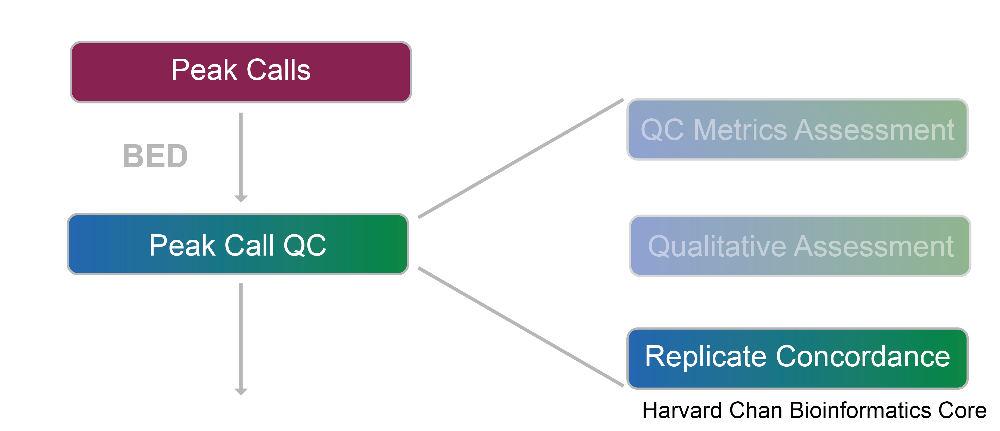
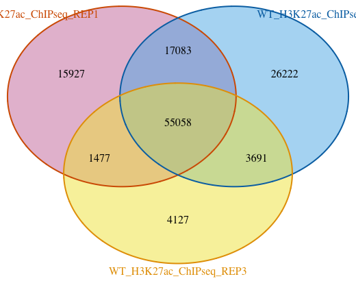
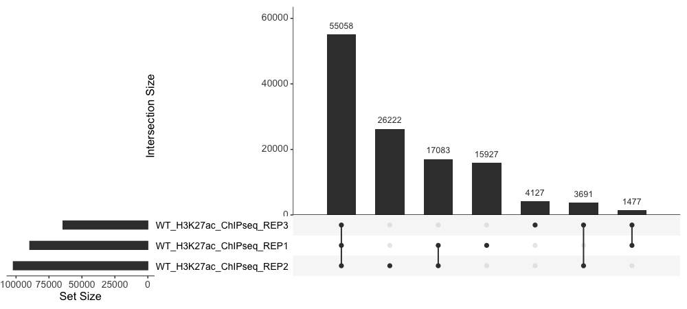

Contributors: Heather Wick, Upendra Bhattarai, Meeta Mistry

Approximate time: 30 minutes

## Learning Objectives

* Describe IRanges and GRanges in R along with some basic functions
* Identify overlaps between replicates and visualize with VennDiagrams and upSetR
  
## Peak Overlaps

So far we have looked at quality control metrics for individual samples, as well as statistical concordance between samples. An additional way to look at sample similarity is to look at peak overlap between samples; that is, to ask what peaks are in common between replicate samples within our treatment groups? Looking at peak overlaps serves two purposes: 

1) It is another way of **measuring consistency** between our samples.
2) We can create a set of **consensus peaks** (peaks in common between samples within a treatment group), in which we are more confident, as these are less likely to be miscalls due to background noise or other technical variation. These consensus peaks can be used in downstream visualization and analysis.

<p align="center">

</p>

## Essential tools: IRanges and GenomicRanges

You may be familiar with **bedtools** as a useful command line too for manipulating bed files, including finding overlap of genomic regions. Whenever we are doing anything involving overlap of genomic ranges in R, two additional essential tools are of great help: **IRanges** and **GenomicRanges**. These packages allow us to convert bed files and other, more complex and/or binary genomic coordinate files, such as bam files, narrowPeak files, and bigWigs, into objects in R, and come with a number of different functions that allow us to find overlaps, exclusions, or nearest genomic features, among other things.

IRanges and GRanges are data structures that can be used to solve a variety of problems, typically related to annotating and visualizing the genome. These data structures are very fast and efficient. Both packages contain very extensive and useful vignettes which we have linked below. If you find yourself stuck with these data structures at any point, we encourage you to review them!

### IRanges: the minimal representation of a range in a single space

An IRanges object in R is a very simple representation of a coordinate in a single space (chromosome, in our case), with a `start`, an `end`, and a `width`. To construct an IRanges object, we call the IRanges constructor. Ranges are normally specified by passing two out of the three parameters: start, end, and width:

```
# Example IRanges
ir <- IRanges(start=1:5, width=5:1)
ir

IRanges object with 5 ranges and 0 metadata columns:
          start       end     width
      <integer> <integer> <integer>
  [1]         1         5         5
  [2]         2         5         4
  [3]         3         5         3
  [4]         4         5         2
  [5]         5         5         1

```
> **NOTE:** The [IRanges vignette](https://bioconductor.org/packages/release/bioc/vignettes/IRanges/inst/doc/IRangesOverview.pdf) is a great place to learn more about IRanges objects and how to manipulate them.

### GenomicRanges, or GRanges: ranges in multiple spaces

A GRanges object is a little more complex. It lets us store IRanges in multiple spaces (i.e., multiple chromosomes). In addition to chromosome, a GRanges object also indicates the strand for each region. These objects can also hold additional metadata. GRanges provide a way to store and manipulate sets of genomic regions. In our example, we will be using it to store the peak calls from each of our samples. Let's start with simple example to create a GRanges object using the `GRanges()` constructor:

```
# Example GRanges
gr <- GRanges(ranges=IRanges(start=c(100, 200), end=c(199, 299)), 
              seqnames=c("chr2L", "chr3R"),
              strand=c("+", "-"))
gr

GRanges object with 2 ranges and 0 metadata columns:
      seqnames    ranges strand
         <Rle> <IRanges>  <Rle>
  [1]    chr2L   100-199      +
  [2]    chr3R   200-299      -
  -------
  seqinfo: 2 sequences from an unspecified genome; no seqlengths
```

You can see that one of the required inputs is an IRanges object, and so functionality in this package is very dependent on the basics of IRanges. For more detailed information on GenomicRanges, we enocurage you to browse through the [GRanges vignette](https://bioconductor.org/packages/devel/bioc/vignettes/GenomicRanges/inst/doc/GenomicRangesIntroduction.html).

Once you have your genomic coordinate data stored in one of these data structures, there are many functions that allow you to easily manipulate the data. There are **functions for basic interval operation** like `shift()`, `reduce()`, `flank()`, `intersect()`, and so much more. We have linked for you a [helpful cheatsheet](https://rpubs.com/Pazz/bioc_cheat_sheet) that describes commonly used functions and some use cases. In this lesson we will first convert our peak files into GRanges and then we will use a package called [ChipPeakAnno](https://bioconductor.org/packages/release/bioc/html/ChIPpeakAnno.html), which will provide wrapper functions that allow us to easily operate on our peak data and pull out the infformation we need.

## Reading in narrowPeak files as Granges objects
To create GRanges objects for our peak files, we are going to use the function `toRanges()` from the ChIPpeakAnno package. Note that there are other alternative packages that have functionality to do this. This function requires at minimum:

* Genomic coordinate data (as a path to file, or a data frame)
* Format (narrowPeak, broadPeak, BED)

We will provide file paths that we had stored in the `sample_files` variable in the [previous lesson](02b_sample_similarity.md#signal-concordance-across-peaks), and we will **use a for loop to create a GRanges object for each sample**. Note that we are assigning the object to overwrite the variables which had the peak data stored as data frames.

```
# If you cannot find sample_files in your environment, uncomment the code below
# Get all narrowpeak file names and path
# sample_files <- list.files(path = "./data/macs2/narrowPeak/", full.names = T)

# Reassign vars so that they are now GRanges instead of dataframes
for(r in 1:length(sample_files)){
  obj <- ChIPpeakAnno::toGRanges(sample_files[r], format="narrowPeak", header=FALSE)  
  assign(vars[r], obj)
}
```

Now let's take a quick look at one of the samples:

```
WT_H3K27ac_ChIPseq_REP1
GRanges object with 100570 ranges and 5 metadata columns:
                                                  seqnames          ranges
                                                     <Rle>       <IRanges>
       WT_H3K27ac_ChIPseq_REP1_peak_1                 chr1 3094273-3094445
       WT_H3K27ac_ChIPseq_REP1_peak_2                 chr1 3095208-3095464
       WT_H3K27ac_ChIPseq_REP1_peak_3                 chr1 3113322-3113761
       WT_H3K27ac_ChIPseq_REP1_peak_4                 chr1 3119377-3120158
       WT_H3K27ac_ChIPseq_REP1_peak_5                 chr1 3120430-3120942

                                    strand |     score signalValue    pValue
                                       <Rle> | <integer>   <numeric> <numeric>
       WT_H3K27ac_ChIPseq_REP1_peak_1      * |        28     3.71719   4.55519
       WT_H3K27ac_ChIPseq_REP1_peak_2      * |        89     6.27302  10.90470
       WT_H3K27ac_ChIPseq_REP1_peak_3      * |        97     7.01319  11.73230
       WT_H3K27ac_ChIPseq_REP1_peak_4      * |       277    13.74740  30.10350
       WT_H3K27ac_ChIPseq_REP1_peak_5      * |       193    10.71350  21.52090

                                     qValue      peak
                                      <numeric> <integer>
       WT_H3K27ac_ChIPseq_REP1_peak_1   2.87376       100
       WT_H3K27ac_ChIPseq_REP1_peak_2   8.96056       111
       WT_H3K27ac_ChIPseq_REP1_peak_3   9.76906        75
       WT_H3K27ac_ChIPseq_REP1_peak_4  27.77500       291
       WT_H3K27ac_ChIPseq_REP1_peak_5  19.34280       160
```

We see that each peak is stored with its ranges and all associated information generated by MACS2. The GRanges can also accomodate metadata fields if we wanted to include additional information.

## Find overlapping peaks
Now that we have read in our peak files, we can look for overlapping genomic ranges using the `findOverlapsOfPeaks()` function. This function allows you to identify overlaps in 2 or more sets of peaks (with an upper limit of 5). The default overlap is set to 1bp.  

Another important argument to note here is `connectedPeaks`. This allows you to specify how to deal with multiple peaks that are involved in the overlap. The options are listed below and examples are given if we had the scenario in which 5 peaks in group 1 are overlapping with 2 peaks in group 2:

* **merge**: will add 1 to the overlapping counts; so in our example this would be 1.
* **min**: will add the minimal involved peaks in each group of connected/overlapped peaks to the overlapping counts; so in our example this would be 2.
* **keepAll**: will add the number of involved peaks for each peak list to the corresponding overlapping counts; so in our example this would mean 5 counts added to group 1 and 2 counts added to group 2.

_This example was taken from the [Bioconductor support site post](https://support.bioconductor.org/p/133486/#133603)_

In the code below we have chosen to use "merge", keeping only one count for the overlap.

```
# Find overlapping peaks of WT samples
# maxgap defaults to -1 which means that two ranges overlap by at least 1 bp
# connectedPeaks to "merge" will add 1 to the overlapping counts

olaps_wt <- findOverlapsOfPeaks(WT_H3K27ac_ChIPseq_REP1,
                                WT_H3K27ac_ChIPseq_REP2,
                                WT_H3K27ac_ChIPseq_REP3, connectedPeaks = "merge")
```

The `olaps_wt` is an object of class "overlappingPeaks". Inside it there are a number of slots which contain different variations of the input data including unique peaks, merged peaks, and overlapping peaks. Next, we will use the results stored in `olaps_wt` to visualize the overlaps.

### Venn Diagram
First we will start with a Venn Diagram. Since there are only three samples, the data is manageable for this type of visualization. **We do not recommend using Venn Diagrams for more than three samples.** The figure becomes very difficult to interpret, especially since the circles/ellipses are not drawn to scale of the peakset sizes.

To draw the figure, we will use the `makeVennDiagram()` function. This function can also performs a test to see if there is an association between two given peak lists; the options are hypergeometric test and permutation testing. We are not concerned with significance of overlap, but rather plotting to see what the numbers look like.

> Note that you will likely see a lot of text written in your console when running this function. At the end the Venn diagram will pop up in the Plots window.

```
# Draw Venn Diagram for WT samples
venstats <- makeVennDiagram(olaps_wt, connectedPeaks = "merge",
                            fill=c("#CC79A7", "#56B4E9", "#F0E442"), # circle fill color
                            col=c("#D55E00", "#0072B2", "#E69F00"), #circle border color
                            cat.col=c("#D55E00", "#0072B2", "#E69F00")) # category name color
```

<p align="center">

</p>

From this figure we can see that there are **about 55K peaks overlapping between the three replicates**. That is a fairly good sized set of consensus peaks and also indicates a **high concordance within the sample group**. 

> #### A nicer Venn Diagram
> The figure could definitely use some aesthetic tweaks. For example, the labels need to be shifted to sit in frame. Also, it would be great if the circles were scaled to the size of each peakset and the overlaps. This is possible by modifying parameters in the underlying function from [VennDiagram](https://cran.r-project.org/web/packages/VennDiagram/VennDiagram.pdf) to place labels in exact positions. However, these tweaks can be be finicky and not worth the time. For more flexibility with the Venn diagrams, we recommend the ggvenn package. We also have some [materials on ggvenn](https://hbctraining.github.io/publication_perfect/lessons/08_figure_specific_packages.html), but you would need to extract the correct inputs from our `olaps_wt` object in order to get it to work.

### UpSet plot
The UpSet plot provides an efficient way to visualize intersections of multiple sets compared to the traditional approaches, i.e. the Venn Diagram. It is implemented in the [UpSetR package](https://upset.app/) in R. UpSet visualizes set intersections in a matrix layout. The matrix layout enables a more clear and **effective representation of overlap and the collection of intersections**.

To create and UpSet plot, we first need to extract the data we need from `olaps_wt` and then it requires some wrangling to get it in a format that is compatible for UpSetR.

```
# Prepare data for UpSetR
  set_counts <- olaps_wt$venn_cnt[, colnames(olaps_wt$venn_cnt)] %>% 
    as.data.frame() %>% 
    mutate(group_number = row_number()) %>%
    pivot_longer(!Counts & !group_number, names_to = 'sample', values_to = 'member') %>%
    filter(member > 0) %>%
    group_by(Counts, group_number) %>% 
    summarize(group = paste(sample, collapse = '&'))

# Set reuquired variables 
  set_counts_upset <- set_counts$Counts
  names(set_counts_upset) <- set_counts$group

# Plot the UpSet plot
 upset(fromExpression(set_counts_upset), order.by = "freq", text.scale = 1.5)
```

<p align="center">

</p>

*** 

**Exercise**

1. Find the overlapping peaks across the cKO samples. Store the result to a variable called `olaps_cko`.
2. Use the results from `olaps_cko` to draw a Venn Diagram. What number of peaks occur in all three replicates?
3. Extract the required data from `olaps_cko` to create an UpSet plot. Draw the Upset plot. How many peaks are unique to each replicate?

***

[Back to Schedule](../schedule/README.md)

[Next Lesson >>](04_peak_annotation_and_visualization.md)


***

*This lesson has been developed by members of the teaching team at the [Harvard Chan Bioinformatics Core (HBC)](http://bioinformatics.sph.harvard.edu/). These are open access materials distributed under the terms of the [Creative Commons Attribution license](https://creativecommons.org/licenses/by/4.0/) (CC BY 4.0), which permits unrestricted use, distribution, and reproduction in any medium, provided the original author and source are credited.*
