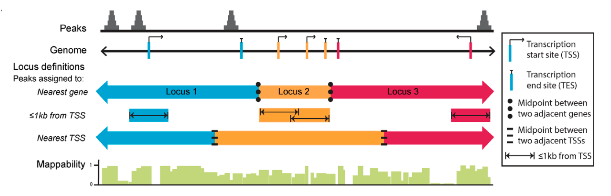
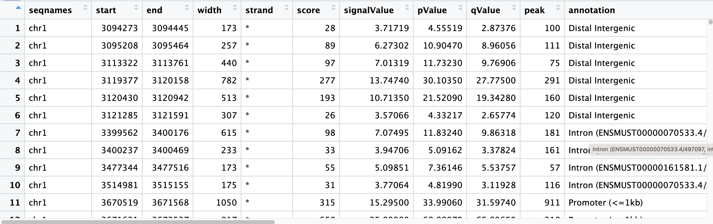
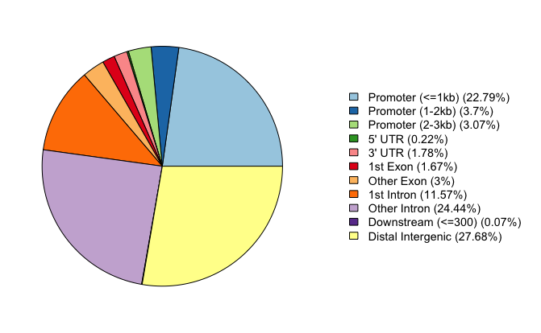
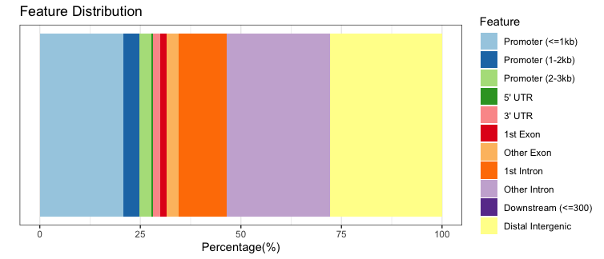
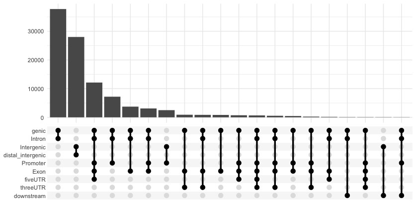
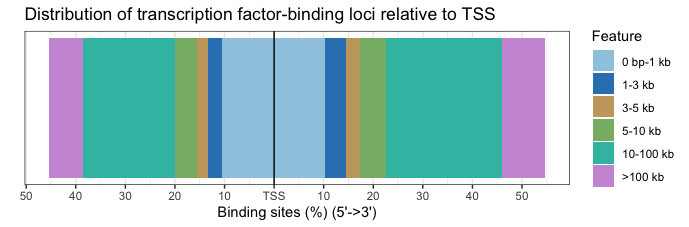
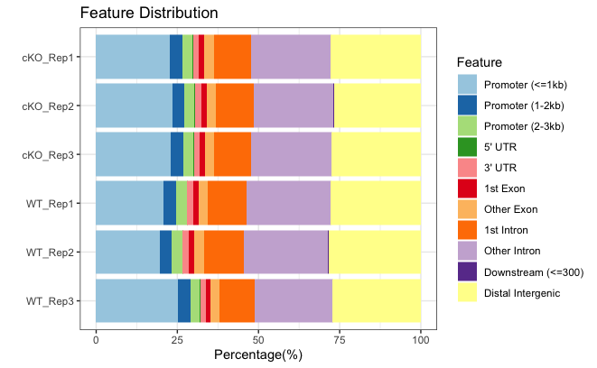
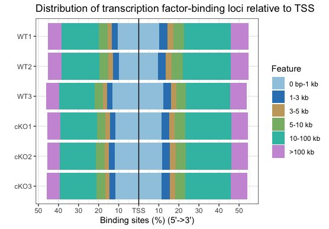
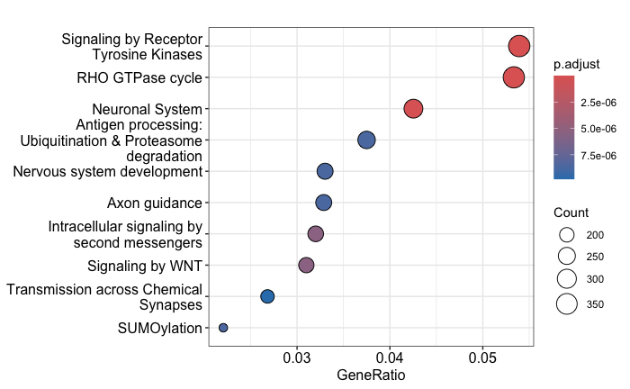
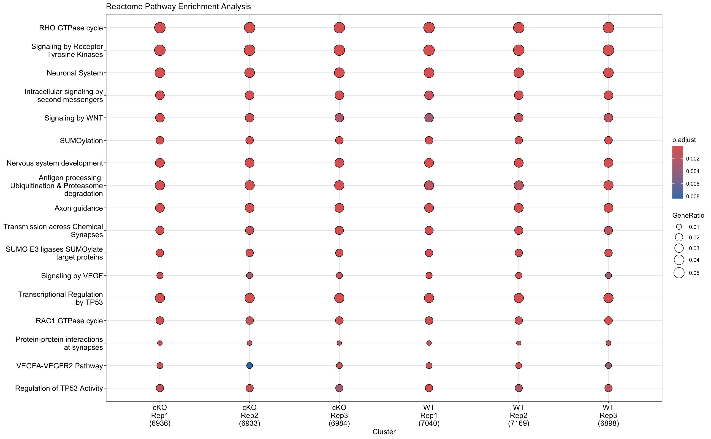

Contributors: Heather Wick, Upendra Bhattarai, Meeta Mistry

Approximate time: 45 minutes

## Learning Objectives

* Annotate peaks with genomic features using Chipseeker
* Visualize annotations and compare peak coverage between experimental groups


## Peak annotation 
Understanding the biological questions addressed by ChIP-seq experiments begins with annotating the genomic regions we have identifed as peaks with genomic context. In order to interpret these binding regions, a number of different peak annotation tools exist. Some examples include [Homer](http://homer.ucsd.edu/homer/motif/), [GREAT](https://pmc.ncbi.nlm.nih.gov/articles/PMC4840234/) (a web-based tool), [ChIPpeakAnno](https://www.bioconductor.org/packages/devel/bioc/vignettes/ChIPpeakAnno/inst/doc/ChIPpeakAnno.html) and [ChIPseeker](https://www.bioconductor.org/packages/devel/bioc/vignettes/ChIPseeker/inst/doc/ChIPseeker.html). Because many cis-regulatory elements are close to transcription start sites of their targets, it is common to associate each peak to its nearest gene, either upstream or downstream. Annotation tools  **apply methods to calculate the nearest TSS to the given genomic coordinates and annotates the peak with that gene**. However, problems exist in regions where multiple genes are located in close proximity. Different tools address this complex issue using different approaches and this can result in varying results.

<p align="center">

</p>

_Image source: Welch R.P. et al, Nucleic Acids Research, 2014 [doi: 10.1093/nar/gku463ChIP](https://www.researchgate.net/publication/262812725_ChIP-Enrich_Gene_set_enrichment_testing_for_ChIP-seq_data)_


## Annotating peaks 
In this workshop we will use an R Bioconductor package called **[ChIPseeker](https://bioconductor.org/packages/release/bioc/vignettes/ChIPseeker/inst/doc/ChIPseeker.html) to annotate peaks, visualize features, and compare profiles**. Some features of ChIPseeker include:

* Comparing results in batch; across replicates or between experimental groups
* Perform functional annotations, and infer cooperative regulation
* Support querying the GEO database to compare experimental datasets with publicly available ChIP-seq data and offers statistical testing for significant overlaps among datasets.

### Setting up
Let's open up a new script file and call it `peak_annotation.R`. Add a title to the script and as usual we will begin with loading required libraries:

```
## Peak Annotation using ChIPseeker

# Load libraries
library(ChIPseeker)
library(clusterProfiler)
library(TxDb.Mmusculus.UCSC.mm10.knownGene)
library(tidyverse)
```

> **NOTE:** The `readPeakFile()` function allows us to load peaks from a BED file. It will convert the BED file into GRanges object. **However, we already have all of our peak data loaded in our environment as GRanges object from the previous lesson.**

First, we will need to assign the **annotation database** to a variable. Bioconductor provides the annotation database `TxDb` for commonly used genome versions to use for annotation in ChIPseeker, e.g. `TxDb.Mmusculus.UCSC.mm10.knownGene`, `TxDb.Hsapiens.UCSC.hg38.knownGene`, but users can also prepare prepare their own database object using UCSC Genome Bioinformatics and BioMart database in R with `makeTxDbFromBiomart()` and `makeTxDbFromUCSC.TxDb()` functions.

Annotation of the peaks to the nearest gene and for various genomic characteristics is performed by `annotatePeak()` function. By default TSS region is defined as -3kb to +3kb, however users can define this region. The result of the annotation comes in csAnno (a special format for ChIP-seq annotation). This can be converted to GRanges with `as.GRanges()` format and to data frame with `as.data.frame()` function.

Lets annotate our peakset:

```{r}
# Set the annotation database
txdb <- TxDb.Mmusculus.UCSC.mm10.knownGene

# Annotate Peaks 
annot_WT1 <- annotatePeak(WT_H3K27ac_ChIPseq_REP1, tssRegion=c(-3000, 3000),TxDb=txdb, annoDb="org.Mm.eg.db")

# View the result
annot_WT1@anno %>% 
  data.frame() %>% View()
```

> Note: The parameter `annoDb` is optional, if provided extra information about the annotation including gene symbol, genename, ensembl/entrezid will be added in extra columns.


<p align="center">

</p>


The annotation output file retains all the information from the peak file and also reports the annotation information. The nearest genes, their position and strand information along with the distance from peak to the TSS of its nearest gene is also reported.  For annotating genomic regions, `annotatePeak()` will not only give the gene information but also reports detailed information when genomic region is Exon or Intron. For example, ‘Exon (ENSMUST00000144339.1/ENSMUST00000144339.1, exon 1 of 3’, means that the peak overlaps with the 1st of 3 exons that transcript possesses.

To view a genomic annotation summary, we can just type out the variable name. We see that a fairly large proportion of our peaks for WT replicate 1 are in promotor regions, but there are also equallly high percentages in intronic and distal intergenic regions. 

```{r}
annot_WT1
```

```{r, output}
Annotated peaks generated by ChIPseeker
100559/100570  peaks were annotated
Genomic Annotation Summary:
              Feature   Frequency
9    Promoter (<=1kb) 20.81862389
10   Promoter (1-2kb)  3.84848696
11   Promoter (2-3kb)  3.17226703
4              5' UTR  0.20982707
3              3' UTR  1.83374934
1            1st Exon  1.59806681
7          Other Exon  2.97437325
2          1st Intron 11.96809833
8        Other Intron 25.65061307
6  Downstream (<=300)  0.07856084
5   Distal Intergenic 27.84733341
```

## Annotation visualization
There are several functions for visualization provided by ChIPseeker package to effectively visualize annotation of various genomic features. We will go through some of these options below.

### Piechart
This function provides a visualization of the suammry we generated earlier, in the form of a pie chart.

```{r}
# Piechart
plotAnnoPie(annot_WT1)
```

<p align="center">

</p>

### Barplot
We can plot the exact same data, but using a stacked barplot instead.

```{r}
# Barplot
plotAnnoBar(annot_WT1)
```

<p align="center">

</p>


### UpsetR

Annotation overlaps can be visualized by upsetR plot. Here, we use a function from ChIPseeker that grabs the required data and formats it to be compatible with UpSetR and draws the plot. With this plot we can see that there are many peaks that contain more than one annotation. We can observe the counts for various combinations of annotations.

```{r}
upsetplot(annot_WT1)
```

<p align="center">

</p>


### Distribution of TF-binding loci with respect to TSS

The distance between the peak and the TSS of the nearest gene is also reported in the annotation output and can be visualzed with a barplot.

```{r}
plotDistToTSS(annot_WT1)
```

<p align="center">

</p>


## Visualizing multiple samples
These are all great ways to visualize the information from our annotation table, however so far we have only done this for a single sample. It would be very helpful to create similar plots after collating annotations across all samples in our dataset. In this way, we can **assess consistencies across replicates within a group and compare samples between groups.**

In order to do this, we will first combine the GRanges objects for each samples into a list and then annotate each sample using `lapply()`.

```{r}

# Create a list of GRanges objects
samples_list <- list(
  WT1 = WT_H3K27ac_ChIPseq_REP1,
  WT2 = WT_H3K27ac_ChIPseq_REP2,
  WT3 = WT_H3K27ac_ChIPseq_REP3,
  cKO1 = cKO_H3K27ac_ChIPseq_REP1,
  cKO2 = cKO_H3K27ac_ChIPseq_REP2,
  cKO3 = cKO_H3K27ac_ChIPseq_REP3)

# Annotate each sample
peakAnnoList <- lapply(samples_list, annotatePeak, TxDb=txdb,
                       tssRegion=c(-3000, 3000), annoDb="org.Mm.eg.db", verbose=FALSE)

```

Now, the annotation feature distribution of all the samples can also be plotted together:

```
# Plot barplot for all samples
plotAnnoBar(peakAnnoList)
```

<p align="center">

</p>

Similarly, we can plot the distance to TSS for all samples in one plot:

```
# Plot distance to TSS for all samples
plotDistToTSS(peakAnnoList)
```

<p align="center">

</p>

By plotting all samples together, we can easily identify trends. Overall, there are **not dramatic differences** between the WT and cKO groups. This is not surprising since we are comparing enrichment from the same histone mark with slightly different conditions. We do see a **small shift in the promoter regions**, that is less enrichment is observed around the TSS in WT compared to cKO. There may be subtle differences that will be more clearly visible when we drill down to individual regions.

## Visualizing enrichment around the TSS
To plot the binding around the TSS region, we need to first prepare the TSS regions using `getPromoters()`. To identify TSS regions we set up the flanking regions of 2000bp upstream and 2000bp downstream. Then we align the peaks that are mapping to these regions, and generate the tagMatrix. This tagMatrix will be used as input for various visualizations described below.

Let's begin with WT replciate 1 as an example:

```{r}
# Get promoters
promoter <- getPromoters(TxDb = txdb, upstream = 2000, downstream = 2000)

# Create tag matrix
tagMatrix_wt1 <- getTagMatrix(WT_H3K27ac_ChIPseq_REP1, windows = promoter)
```

### Profile plots
Now, that we have a tagMatrix we can use this to create a profile plot.

```
# Draw a profile plot for WT rep1
plotAvgProf(tagMatrix_wt1, xlim=c(-2000, 2000),
            xlab="Genomic Region (5'->3')", ylab = "Read Count Frequency",
            conf = 0.95, resample = 1000)
```

> Note: Confidence intervals, estimated using bootstrap methods, are supported for characterizing binding profiles.


<p align="center">

</p>

### Heatmaps
Now, that we have a tagMatrix we can use this to create a profile plot.

```
# Plot heatmap - this takes too much memory!
tagHeatmap(tagMatrix_wt1, nbin=800)
```

<p align="center">

</p>

> Note: Tag matrices can also be created for other genomic regions and visualized as heatmaps.


### Functional enrichment analysis

As we have the nearest gene annotation for the peaks, we can perform functional enrichment analysis to investigate the predominant biological theme among the genes. Depending on the biological questions we can use, clusterProfiler for GO, KEGG enrichment analysis, DOSE to investigate Disease ontology (DO), or ReactomePA for reactome pathway.

In this session, we are using Reactome database. 

```{r}
library(ReactomePA) #load the library if you have not already.
reac_ckoR1 <- enrichPathway(as.data.frame(annot.ckoR1)$geneId, organism = "mouse")
```

**Dotplot**

Dotplot is an easy way to visualize the enriched categories:

```{r}
dotplot(reac_ckoR1)
```

<p align="center">

</p>


### Functional profiles comparison

The `clusterProfiler` package provides `compareCluster()` function for comparing functional annotations gene clusters and can be adopted to compare different ChIP peak experiments.

```{r}
genes <- lapply(annot_list, function(i) as.data.frame(i)$geneId)
names(genes) <- sub("_", "\n", names(genes))

compPathway <- compareCluster(geneCluster = gene, 
                         fun = "enrichPathway",
                         organism = "mouse",
                         pvalueCutoff = 0.05, 
                         pAdjustMethod = "BH")
```

**Dotplot**

```{r}
dotplot(compPathway, showCategory = 10, title = "Reactome Pathway Enrichment Analysis")
```
<p align="center">

</p>

### Exercise:
1. Carryout functional comparison using KEGG database.
   

***

*This lesson has been developed by members of the teaching team at the [Harvard Chan Bioinformatics Core (HBC)](http://bioinformatics.sph.harvard.edu/). These are open access materials distributed under the terms of the [Creative Commons Attribution license](https://creativecommons.org/licenses/by/4.0/) (CC BY 4.0), which permits unrestricted use, distribution, and reproduction in any medium, provided the original author and source are credited.*
