Contributors: Heather Wick, Upendra Bhattarai, Meeta Mistry

Approximate time: 

## Learning Objectives

* Annotate peaks with genomic features using Chipseeker
* Visualize the annotation and compare peak coverage between experimental groups.
* Explore the biological content using functional enrichment analysis


## Overview

The insights on the biological questions on the ChIP-seq experiments comes after annotating the peaks and exploring the differences between classes under comparisons. ChIPseeker is a Bioconductor package in R, developed to annotate the nearest genes and genomic features to the peaks. It also supports various ways of visualization, comparisons of the peak profiles and coverage between the experimental groups. We can also use ChIPseeker to investigate the sample concordance, carryout the functional annotation and also use it to infer cooperative regulation, for example if the data using two different binding proteins overlap significantly, these two proteins may form a complex or have interaction in regulating gene expression or chromosomal remodeling.

ChIPseeker can also be used to access GEO database to compare the experimental ChIP seq dataset with the publicly available one. It supports statistical testing of significant overlap abmong ChIP seq data sets.

In this tutorial we use ChIPseeker to annotate peaks, visualize, explore various features, and compare peak profiles and coverage between the experimental groups. We will also perform functional annotation and analysis to explore the biology in our dataset.

# cKO_Rep1
Importing peak sets
```{r}
ckoR1 <- readPeakFile("data/macs2/narrowPeak/cKO_H3K27ac_ChIPseq_REP1_peaks.narrowPeak")

```

Annotating peaks

```{r}
txdb <- TxDb.Hsapiens.UCSC.hg38.knownGene

annot.ckoR1 = annotatePeak(ckoR1, tssRegion=c(-3000, 3000),TxDb=txdb, annoDb="org.Mm.eg.db")
```

Genomic annotation summary

```{r}
annot.ckoR1
```

```{r, output}
Annotated peaks generated by ChIPseeker
86143/86148  peaks were annotated
Genomic Annotation Summary:
 
Feature                     Frequency
<fctr>                          <dbl>

9	Promoter (<=1kb)	  22.79465540		
10	Promoter (1-2kb)	   3.70082305		
11	Promoter (2-3kb)	   3.06815412		
4	5' UTR	               0.21592004		
3	3' UTR	               1.78308162		
1	1st Exon	           1.67047816		
7	Other Exon	           2.99850249		
2	1st Intron	          11.57261762		
8	Other Intron	      24.44307721		
6	Downstream (<=300)	   0.07081249
5	Distal Intergenic	  27.68187781
```

## Annotation visualization

### UpsetR
```{r}
upsetplot(annot.ckoR1)
```

<p align="center">
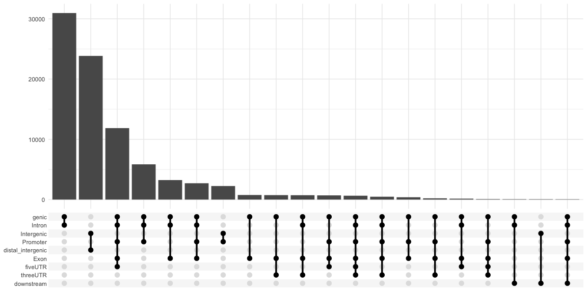
</p>

### Distribution of loci with respect to TSS

```{r}
plotDistToTSS(annot.ckoR1)
```

<p align="center">

</p>


### Genomic annotation by barplot

```{r}
plotAnnoBar(annot.ckoR1)
```

<p align="center">
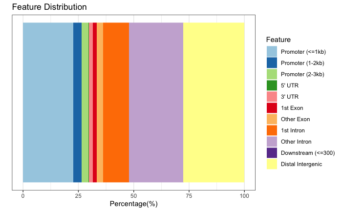
</p>


### Heatmap of ChIP bindin to TSS regions

```{r}
promoter <- getPromoters(TxDb = txdb, upstream = 3000, downstream = 3000)
tagMatrix_ckoR1 <- getTagMatrix(ckoR1, windows = promoter)
tagHeatmap(tagMatrix_ckoR1)
```

<p align="center">
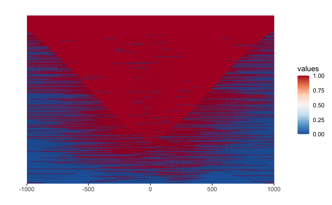
</p>

## CKO_Rep2

Importing peak sets
```{r}
ckoR2 <- readPeakFile("data/macs2/narrowPeak/cKO_H3K27ac_ChIPseq_REP2_peaks.narrowPeak"

```

Annotating peaks

```{r}
annot.ckoR2 = annotatePeak(ckoR2, tssRegion=c(-3000, 3000),TxDb=txdb, annoDb="org.Mm.eg.db")
```

Genomic annotation summary

```{r}
annot.ckoR2
```

```{r, output}
Annotated peaks generated by ChIPseeker
83085/83089  peaks were annotated
Genomic Annotation Summary:
 
Feature                     Frequency
<fctr>                          <dbl>
9	Promoter (<=1kb)	  23.41577902		
10	Promoter (1-2kb)	   3.77083709		
11	Promoter (2-3kb)	   3.06433171		
4	5' UTR	               0.22025636		
3	3' UTR	               1.82343383		
1	1st Exon	           1.66335680		
7	Other Exon	           3.00174520		
2	1st Intron	          11.68321598		
8	Other Intron	      24.45327075		
6	Downstream (<=300)	   0.08064031
5	Distal Intergenic	  26.82313294			
```

## Annotation visualization

### UpsetR
```{r}
upsetplot(annot.ckoR2)
```

<p align="center">

</p>

### Distribution of loci with respect to TSS

```{r}
plotDistToTSS(annot.ckoR2)
```

<p align="center">
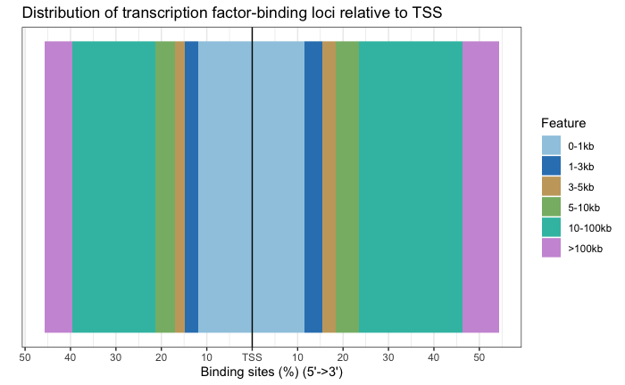
</p>


### Genomic annotation by barplot

```{r}
plotAnnoBar(annot.ckoR2)
```

<p align="center">

</p>


### Heatmap of ChIP bindin to TSS regions

```{r}
promoter <- getPromoters(TxDb = txdb, upstream = 3000, downstream = 3000)
tagMatrix_ckoR2 <- getTagMatrix(ckoR2, windows = promoter)
tagHeatmap(tagMatrix_ckoR2)
```

<p align="center">
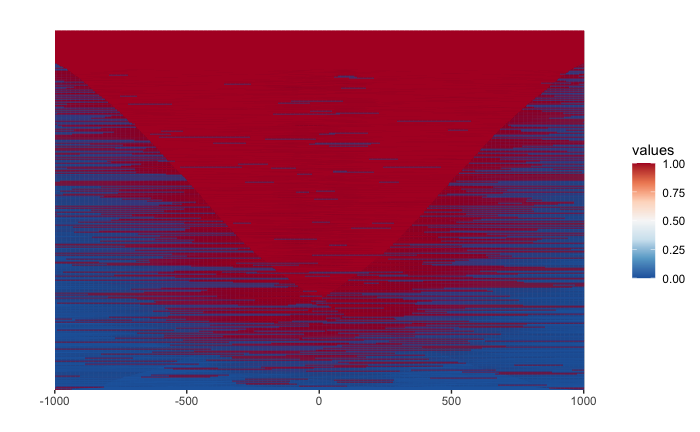
</p>

## CKO_Rep3

Importing peak sets
```{r}
ckoR3 <- readPeakFile("data/macs2/narrowPeak/cKO_H3K27ac_ChIPseq_REP3_peaks.narrowPeak"

```

Annotating peaks

```{r}
annot.ckoR3 = annotatePeak(ckoR3, tssRegion=c(-3000, 3000),TxDb=txdb, annoDb="org.Mm.eg.db")
```

Genomic annotation summary

```{r}
annot.ckoR3
```

```{r, output}
Annotated peaks generated by ChIPseeker
91046/91053  peaks were annotated
Genomic Annotation Summary:
 
Feature                     Frequency
<fctr>                          <dbl>
9	Promoter (<=1kb)	  22.96092085		
10	Promoter (1-2kb)	   3.91560310		
11	Promoter (2-3kb)	   3.11271226		
4	5' UTR	               0.19660391		
3	3' UTR	               1.72879643		
1	1st Exon	           1.57612635		
7	Other Exon	           2.81725721		
2	1st Intron	          11.52494344		
8	Other Intron	      24.53594886		
6	Downstream (<=300)	   0.08237594
5	Distal Intergenic	  27.54871164			
```

## Annotation visualization

### UpsetR
```{r}
upsetplot(annot.ckoR3)
```

<p align="center">
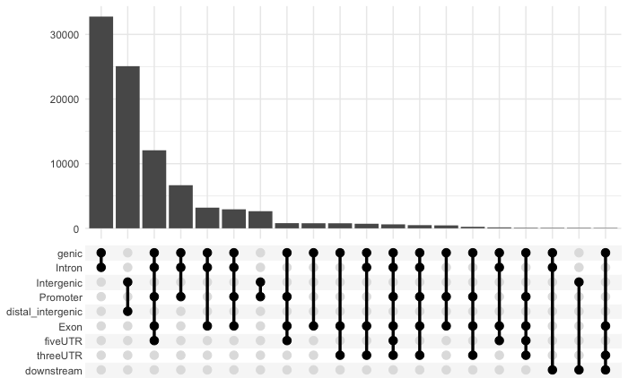
</p>

### Distribution of loci with respect to TSS

```{r}
plotDistToTSS(annot.ckoR3)
```

<p align="center">

</p>


### Genomic annotation by barplot

```{r}
plotAnnoBar(annot.ckoR3)
```

<p align="center">
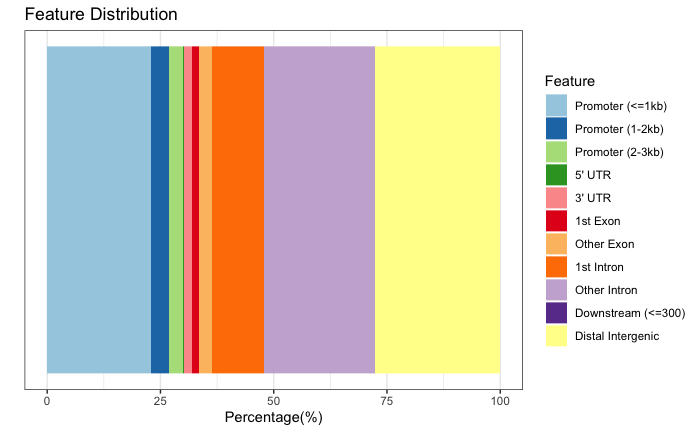
</p>


### Heatmap of ChIP bindin to TSS regions

```{r}
#promoter <- getPromoters(TxDb = txdb, upstream = 3000, downstream = 3000)
tagMatrix_ckoR3 <- getTagMatrix(ckoR3, windows = promoter)
tagHeatmap(tagMatrix_ckoR3)
```

<p align="center">
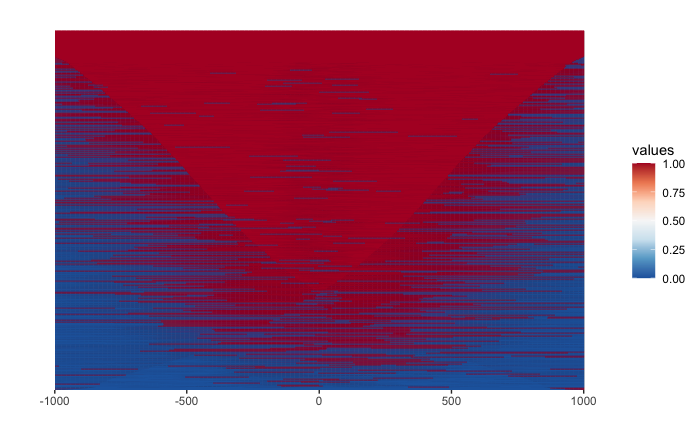
</p>


## WT_Rep1

Importing peak sets
```{r}
wtR1 <- readPeakFile("data/macs2/narrowPeak/WT_H3K27ac_ChIPseq_REP1_peaks.narrowPeak"

```

Annotating peaks

```{r}
annot.wtR1 = annotatePeak(wtR1, tssRegion=c(-3000, 3000),TxDb=txdb, annoDb="org.Mm.eg.db")
```

Genomic annotation summary

```{r}
annot.wtR1
```

```{r, output}
Annotated peaks generated by ChIPseeker
100559/100570  peaks were annotated
Genomic Annotation Summary:
 
Feature                     Frequency
<fctr>                          <dbl>
9	Promoter (<=1kb)	  20.81762945		
10	Promoter (1-2kb)	   3.84749252		
11	Promoter (2-3kb)	   3.17226703		
4	5' UTR	               0.20883263		
3	3' UTR	               1.83275490		
1	1st Exon	           1.59806681		
7	Other Exon	           2.97337881		
2	1st Intron	          11.96909277		
8	Other Intron	      25.65459084		
6	Downstream (<=300)	   0.07856084
5	Distal Intergenic	  27.84733341					
```

## Annotation visualization

### UpsetR
```{r}
upsetplot(annot.wtR1)
```

<p align="center">
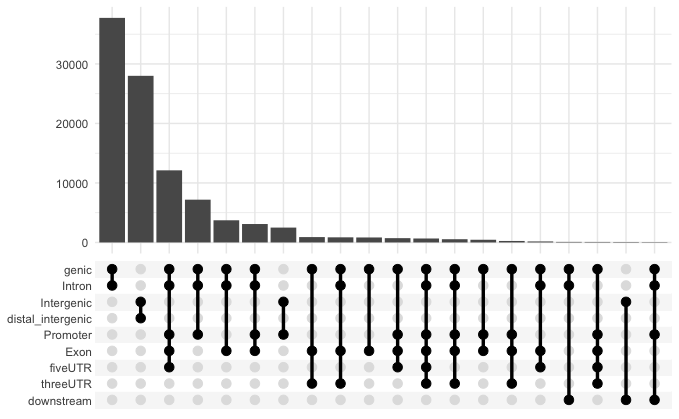
</p>

### Distribution of loci with respect to TSS

```{r}
plotDistToTSS(annot.wtR1)
```

<p align="center">

</p>


### Genomic annotation by barplot

```{r}
plotAnnoBar(annot.wtR1)
```

<p align="center">

</p>


### Heatmap of ChIP bindin to TSS regions

```{r}
#promoter <- getPromoters(TxDb = txdb, upstream = 3000, downstream = 3000)
tagMatrix_wtR1 <- getTagMatrix(wtR1, windows = promoter)
tagHeatmap(tagMatrix_wtR1)
```

<p align="center">
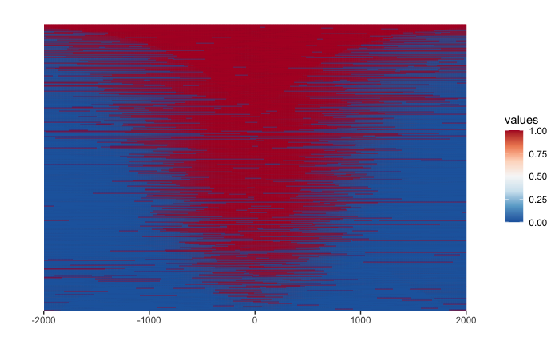
</p>


## WT_Rep2

Importing peak sets
```{r}
wtR2 <- readPeakFile("data/macs2/narrowPeak/WT_H3K27ac_ChIPseq_REP2_peaks.narrowPeak"

```

Annotating peaks

```{r}
annot.wtR2 = annotatePeak(wtR2, tssRegion=c(-3000, 3000),TxDb=txdb, annoDb="org.Mm.eg.db")
```

Genomic annotation summary

```{r}
annot.wtR2
```

```{r, output}
Annotated peaks generated by ChIPseeker
111961/111978  peaks were annotated
Genomic Annotation Summary:
 
Feature                     Frequency
<fctr>                          <dbl>
9	Promoter (<=1kb)	  19.52644224		
10	Promoter (1-2kb)	   3.83079822		
11	Promoter (2-3kb)	   3.11894320		
4	5' UTR	               0.22418521		
3	3' UTR	               1.85957610		
1	1st Exon	           1.55500576		
7	Other Exon	           3.08768232		
2	1st Intron	          12.18727950		
8	Other Intron	      26.07425800		
6	Downstream (<=300)	   0.09378266
5	Distal Intergenic	  28.44204678
```

## Annotation visualization

### UpsetR
```{r}
upsetplot(annot.wtR2)
```

<p align="center">
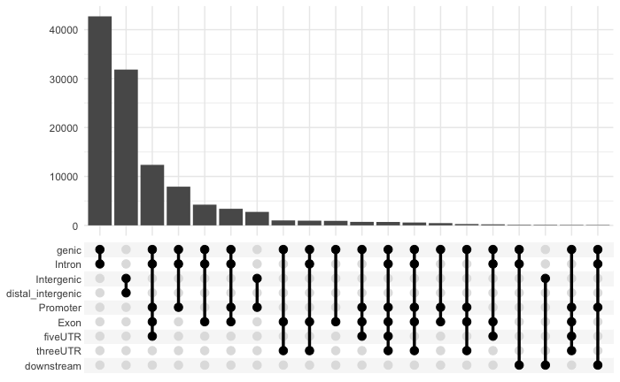
</p>

### Distribution of loci with respect to TSS

```{r}
plotDistToTSS(annot.wtR2)
```

<p align="center">

</p>


### Genomic annotation by barplot

```{r}
plotAnnoBar(annot.wtR2)
```

<p align="center">
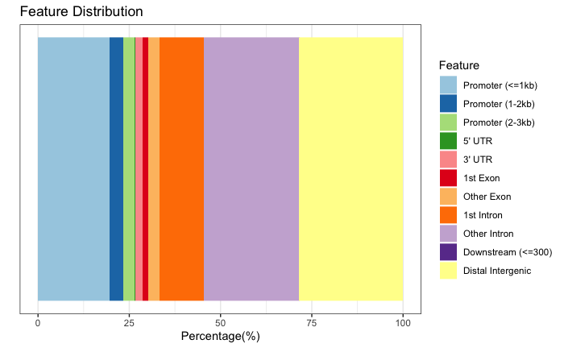
</p>


### Heatmap of ChIP bindin to TSS regions

```{r}
#promoter <- getPromoters(TxDb = txdb, upstream = 3000, downstream = 3000)
tagMatrix_wtR2 <- getTagMatrix(wtR2, windows = promoter)
tagHeatmap(tagMatrix_wtR2)
```

<p align="center">
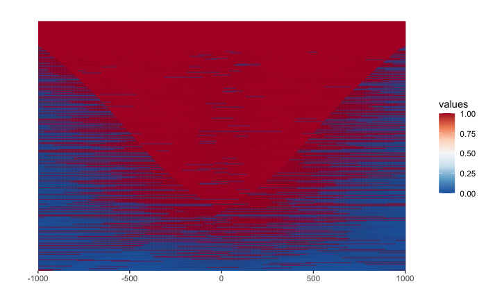
</p>


## WT_Rep3

Importing peak sets
```{r}
wtR3 <- readPeakFile("data/macs2/narrowPeak/WT_H3K27ac_ChIPseq_REP3_peaks.narrowPeak"

```

Annotating peaks

```{r}
annot.wtR3 = annotatePeak(wtR3, tssRegion=c(-3000, 3000),TxDb=txdb, annoDb="org.Mm.eg.db")
```

Genomic annotation summary

```{r}
annot.wtR3
```

```{r, output}
Annotated peaks generated by ChIPseeker
81024/81030  peaks were annotated
Genomic Annotation Summary:
 
Feature                     Frequency
<fctr>                          <dbl>
9	Promoter (<=1kb)	  25.30731635		
10	Promoter (1-2kb)	   3.72111967		
11	Promoter (2-3kb)	   2.85470972		
4	5' UTR	               0.18883294		
3	3' UTR	               1.64025474		
1	1st Exon	           1.58965245		
7	Other Exon	           2.62144550		
2	1st Intron	          11.02142575		
8	Other Intron	      23.74234795		
6	Downstream (<=300)	   0.09626777
5	Distal Intergenic	  27.21662717
```

## Annotation visualization

### UpsetR
```{r}
upsetplot(annot.wtR3)
```

<p align="center">
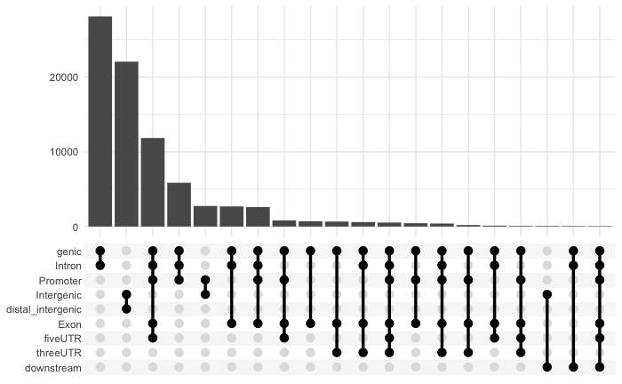
</p>

### Distribution of loci with respect to TSS

```{r}
plotDistToTSS(annot.wtR3)
```

<p align="center">

</p>


### Genomic annotation by barplot

```{r}
plotAnnoBar(annot.wtR3)
```

<p align="center">
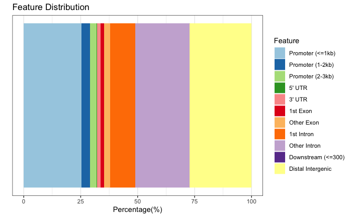
</p>


### Heatmap of ChIP bindin to TSS regions

```{r}
#promoter <- getPromoters(TxDb = txdb, upstream = 3000, downstream = 3000)
tagMatrix_wtR3 <- getTagMatrix(wtR3, windows = promoter)
tagHeatmap(tagMatrix_wtR3)
```

<p align="center">
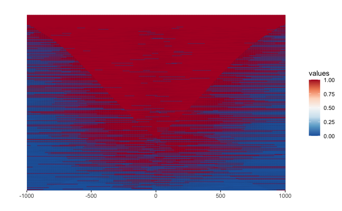
</p>


### Average profiles of all the samples

```{r, message=FALSE, warning=FALSE, results='hide'}
tagMatrix_list <- list(
  cKO_Rep1 = tagMatrix_ckoR1,
  cKO_Rep2 = tagMatrix_ckoR2,
  cKO_Rep3 = tagMatrix_ckoR3,
  WT_Rep1 = tagMatrix_wtR1,
  WT_Rep2 = tagMatrix_wtR2,
  WT_Rep3 = tagMatrix_wtR3
)

plotAvgProf(tagMatrix_list, xlim = c(-1000, 1000), conf = 0.95, resample=500, facet = "column")
```

<p align="center">
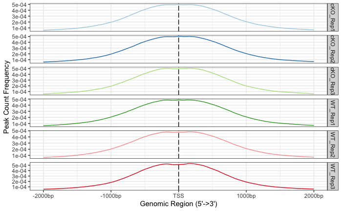
</p>


### Chip peak annotation Feature distribution all samples

```{r}
annot_list <- list(
  cKO_Rep1 = annot.ckoR1,
  cKO_Rep2 = annot.ckoR2,
  cKO_Rep3 = annot.ckoR3,
  WT_Rep1 = annot.wtR1,
  WT_Rep2 = annot.wtR2,
  WT_Rep3 = annot.wtR3
)

plotAnnoBar(annot_list)
```
<p align="center">

</p>


### Chip peak annotation distrubution of loci with respect to TSS all samples

```{r}
plotDistToTSS(annot_list)
```
<p align="center">
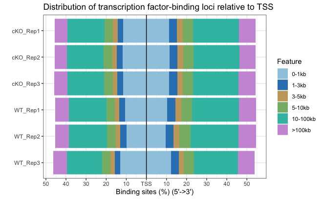
</p>


- Annotation for individual samples and for consensus peaks for each sample group.
- Peak annotation of genomic features (not on target genes) [see](https://hbctraining.github.io/Intro-to-ChIPseq/lessons/12_functional_analysis.html)
    - Peak distance from TSS and other genomic feaures.
    - Include genometricCorr or other statistical evaluation of proximity of peaks to genomic regions of interest.
          Alternatively:use bedr to implement Jaccard statistics (for overlaps not proximity). [link](https://cran.r-project.org/web/packages/bedr/vignettes/Using-bedr.html#jaccard-and-reldist) [bedtools](https://bedtools.readthedocs.io/en/latest/content/tools/jaccard.html)
    - ChiPSeeker plots [see](https://github.com/hbctraining/Peak_analysis_workshop/blob/main/lessons/OLD_ChipSeeker_analysis.md#visualization-with-chipseeker)
    - Talk about Deeptools as an alternative using bam files. point to [chromatin biology workshop material](https://github.com/hbctraining/Intro-to-ChIPseq-flipped/blob/main/lessons/09_data_visualization.md)
***

*This lesson has been developed by members of the teaching team at the [Harvard Chan Bioinformatics Core (HBC)](http://bioinformatics.sph.harvard.edu/). These are open access materials distributed under the terms of the [Creative Commons Attribution license](https://creativecommons.org/licenses/by/4.0/) (CC BY 4.0), which permits unrestricted use, distribution, and reproduction in any medium, provided the original author and source are credited.*
