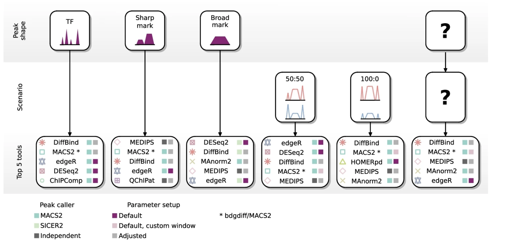

Contributors: Upendra Bhattarai, Meeta Mistry

Approximate time: 70 minutes

## Learning Objectives

* Perform exploratory data analysis using an affinity binding matrix
* Demonstrate the use of DiffBind for differential binding analysis
* Evaluate results and export output for further downstream analysis

## Differential enrichment analysis

Differential enrichment analysis is a powerful computational approach used to identify variations in protein-DNA binding events across different biological conditions, such as treatments, disease states, or cell types. It is applicable for datasets in which more than one sample class is being evaluated and best results are achieved in cases where each sample class has biological replicates. By **comparing enriched regions of the genome**—where proteins like transcription factors or histone modifications are bound—researchers can **pinpoint specific genomic sites that exhibit statistically significant changes** in binding between the conditions being studied. 

In our dataset we have samples from two different conditions: wildtype and the conditional knockout of PRDM16 (cKO). This analysis will be helpful in understanding the transcriptional programs impacted during cortical development when PRDM16 is non-functional. 

**INSERT WORKFLOW IMAGE HERE**

## Tools for evaluating differential enrichment

A wide variety of computational tools are available for differential analysis of ChIP-seq experiments. Each of these tools differ in the underlying algorithms and the assumptions of the data; as such, this results in the challenge of knowing which tool is right for your condition. Below are some key factors to consider when evaluating the different approaches:

* **Peak calls or alignment files**
  * Some tools require peaks to be called prior to differential enrichment analysis, while others implement their own detection method or work using sliding windows.
* **Statistical distribution**
  * Use of a Poisson distribution or on a more flexible negative binomial distribution.
* **Assumptions of the data**
  * Methods adapted from RNA-seq assume the majority of occupied genomic regions do not differ between experimental state. This may not hold for studies where large perurbations can have large scale global impact on chromatin.
* **Biological replicates**
  * Some tools can work in the absence of replicates for each condition, while others require replicates to provide differential analysis.
* **Binding profile**
  * A narrow peak will identify smaller regions, whereas broad peaks can range between a few hundred to thousands of base pairs.   

All of these aspects  make it challenging to know what the optimal computational tool is for differential enrichment analysis of your data. A recent [study performed a comprehensive assessment of differential ChIP-seq tools](https://genomebiology.biomedcentral.com/articles/10.1186/s13059-022-02686-y). In this work the authors **evaluated the performance of 33 computational tools** using reference datasets obtained by _in silico_ simulation of ChIP-seq. Tool performances were evaluated with precision-recall curves, and the accuracy of tested tools was assessed depending on peak shape and biological regulation scenario. The **decision tree** displayed below was generated based on the results of this study and is helpful in **providing recommendations**.

<p align="center">

</p>

_Image source: [Eder T. and Grebian F., Genome Biology 2022](https://genomebiology.biomedcentral.com/articles/10.1186/s13059-022-02686-y)_ 

In this workshop, we have chosen to use **[DiffBind](https://bioconductor.org/packages/devel/bioc/vignettes/DiffBind/inst/doc/DiffBind.pdf)** for the differential enrichment analysis. From the figure above we see that it appears to be a top 5 tool for every scenario. We will walk through the DiffBind pipeline to perform data exploration, conduct differential binding analysis, evaluate the results, and save the output. 

## DiffBind

DiffBind is an R Biocondutor package designed to identify genomic sites that are differentially enriched between sample groups. It works primarily with sets of peak calls ('peaksets'), which represent candidate protein binding sites as genomic intervals for each sample. **Biological replicates are required in order to run DiffBind analysis.** DiffBind provides a range of functionalities that support the processing of peaksets, including:

- Overlapping and merging peaksets across an entire dataset
- Counting sequencing reads in overlapping intervals
- Identifying statistically significant differentially bound sites based on differences in read densities (a proxy for binding affinity)
  
We will discuss the importance of each step in the process, but for more detailed information please refer to the [DiffBind vignette](https://bioconductor.org/packages/devel/bioc/vignettes/DiffBind/inst/doc/DiffBind.pdf).

 The following **files are required as input** to run DiffBind:

- Alignment files (BAM) from the ChIP sample
- Alignment files (BAM) from the input sample
- Peak file (BED file format) output from peak caller

> **NOTE:** Peaks from replicates are used individually, not merged.

### Setting up

1. Open the R project `chipseq-project` in your RStudio environment.
2. Open a new R script `'File' -> 'New File' -> 'Rscript'`, and save it as `diffbind.R`

Let's begin with loading the DiffBind and Tidyverse libraries.

```{r}
# Load libraries
library(DiffBind)
library(tidyverse)
```

### Reading in the data
The DiffBind pipeline starts with importing the required data (BAM files and peaksets). Rather than reading and loading in individaul samples from the dataset, DiffBind requires you to create a metadata file. This **metadata file creation is a critical step**, and if not done correctly can cause errors, preventing us from moving foward! 

This metadata file includes one line for each ChIP peakset, with columns of information that we describe in more detail below. Let's read in our metadata and inspect the column headers to understand the required format for DiffBind.

```{r}
# Read in samplesheet
samples <- read.csv("data/DiffBind/metadata.csv")
names(samples)
```

Output:

```{r}
[1] "SampleID"   "Tissue"     "Factor"     "Condition"  "Replicate"  "bamReads"   "ControlID"  "bamControl" "Peaks"      "PeakCaller"
```

Each sample listed in the sample sheet needs a unique SampleID. A comparative analysis requires at least two samples in a class. Classes are indicated in the metadata as **Factor**, **Tissue**, **Condition**, **Treatment**. 

> **NOTE**: These columns are mandatory and if there is no difference among samples, the same entry can be used across all rows. At least one of these columns will need to have two or more sample classes.

- **Tissue** - This is a designation for the cell type, tissue type, or some other indication of the biological source of the material.
- **Factor** - This is usually what protein the antibody was targeting, such as a transcription factor or a histone mark.
- **Condition** - Indicates an experimental condition, such as WT or Mutant.
- **Treatment** - Specifies any treatments applied to the cells.

Metadata should also contain columns pointing to the path where alignment files and peak calls are located, for reading in. 

- **bamReads**: This points to the primary aligned file for the sample from Chip experiment (or other assays like ATAC)
- **bamControl**: This is an optional set of control reads associated with the sample or sample class. For ChIP experiments, this is most often an Input control (ChIP run without an antibody), or a ChIP run with a non-specific antibody (IgG). ATAC-seq experiment usually do not have a control.
- **ControlID**: ID for the input control sample
- **Peaks**: The path to peakset files (in our case narrowPeak files)
- **PeakCaller**: The type of peak file (e.g., narrow, bed, macs). Different peak callers will produce files in different formats, so identifying the type of file tells DiffBind what columns to expect.

 > There is also a 'SpikeIn' option to provide the BAM files from alignment to the spike-in genome. More information on spike-ins is discussed below.

### Affinity binding matrix
DiffBind will read in the data and **determine a set of consensus peaks**. Using default settings peaks that are called in at least two samples, regardless of which sample group the belong to are considered in the consensus set. You can create your own consensus peak set as outlined in Section 8.2 in the DiffBind vignette. For example, you may want to only include peaks that overlap in a subset of WT samples _and_ a subset of cKO samples. This is the consensus-of-consensus approach, where you first make a consensus peakset for each sample group, then combine them in an overall consensus you use for counting. This consensus peakset represents the overall set of candidate binding sites for further analysis.

The `dba()` function is used to read in data files an create the DiffBind object. The `scoreCol` refers to the peak signal score in the peak files. If using MACS software, scores are generally in 5th column. **The code below will not work since we do not have BAM files locally available.**

```
### DO NOT RUN THIS CODE ###

## Read in data files to create DiffBind object 
dbObj <- dba(sampleSheet=sample, scoreCol=5) 
```

Next, we use the `dba.count()` which takes the alignment files and **compute for each sample, the count information for each of the peaks/regions in the consensus set**. In this step, for each of the consensus regions DiffBind takes the number of aligned reads in the ChIP sample and the input sample, to compute a normalized read count for each sample at every potential binding site. The peaks in the consensus peakset may be re-centered and trimmed based on calculating their summits (point of greatest read overlap) in order to provide more standardized peak intervals.

This step is very **computationally intensive**, as such we will not run this code in class.

```{r}
# Count reads to create affinity binding matrix
dbObj <- dba.count(dbObj, bParallel=FALSE) # This is the most computationally intensive part
```

We have run this code for you on the O2 cluster and have saved the resulting DiffBind object. The file is located in your working directory under `data/DiffBind` and we will have you load it in using the code below:

```
# Load in the existing DiffBind object
dbObj <- readRDS("data/DiffBind/dbObj.rds")
```

> #### What are my options for normalization?
> For each region the ChIP peak count is computed by subtracting out the background using `max(chip_counts - control_counts,1)`. Those values are  normalized based on sequencing depth. Normalization is discussed in great detail in Section 7 of the DiffBind vignette. Note that when running the differential analysis, the normalization applied will depend on the method (DESeq2 or edgeR), which is discussed later in the lesson.
>
> There is also an option for spike-in normalization. The spike-in strategy is based on the use of a fixed amount of exogenous chromatin from another species that is added to sample in an effort to control for technical variation. More information on how spike-in data is ideally, [this lesson](https://hbctraining.github.io/Intro-to-ChIPseq-flipped/lessons/01b_experimental_design_considerations.html#spike-in-dna) is a good resource.

### Data exploration
Before performing differential binding analysis, it is essential to explore the count matrix, examine various sample statistics, and assess the overall similarity between samples. 

This initial step can help us understand:

- Which samples are similar to each other and which are different?
- What are the major sources of variation, and do they align with the expectations from the research design?

Let's examine our DiffBind object:

```{r}
dbObj
```

Output:

```
6 Samples, 85868 sites in matrix:
        ID Tissue  Factor Condition Replicate    Reads FRiP
1  WT_REP1 PRDM16 H3K27ac        WT         1 14916464 0.20
2  WT_REP2 PRDM16 H3K27ac        WT         2 21174308 0.18
3  WT_REP3 PRDM16 H3K27ac        WT         3 14433557 0.20
4 cKO_REP1 PRDM16 H3K27ac       cKO         1 13292841 0.22
5 cKO_REP2 PRDM16 H3K27ac       cKO         2 13900397 0.20
6 cKO_REP3 PRDM16 H3K27ac       cKO         3 16677061 0.20
```

From this output, we observe **85,868 total sites in the consensus peaksets across six samples**. The first five columns display the sample metadata provided in the sample sheet used to create the DiffBind object. The Reads column indicates the number of reads in each sample, while the FRiP score (Fraction of Reads in Peaks) shows the fraction of mapped reads falling into the consensus peaksets. Multiplying the number of reads by FRiP score gives the number of reads that overlap the consensus peaksets. We can calculate this using `dba.show` function.

```{r}
# Create a dataframe with total number of reads in our affinity matrix
info <- dba.show(dbObj)
libsizes <- cbind(LibReads=info$Reads, FRiP=info$FRiP, peakReads=round(info$Reads * info$FRiP))
rownames(libsizes) <- info$ID

libsizes
```

Output:

```{r}
         LibReads FRiP peakReads
WT_REP1  14916464 0.20   2983293
WT_REP2  21174308 0.18   3811375
WT_REP3  14433557 0.20   2886711
cKO_REP1 13292841 0.22   2924425
cKO_REP2 13900397 0.20   2780079
cKO_REP3 16677061 0.20   3335412
```

### PCA
We can use Principal Component Analysis (PCA) to explore the sample similarity. A PCA plot helps us determine how replicates cluster together and identifies the primary source of variation in the data. The `dba.plotPCA()` function in DiffBind uses the log2-normalized read counts by default.

```{r}
# PCA plot
dba.plotPCA(dbObj, attributes=DBA_CONDITION, label=DBA_ID, score = DBA_SCORE_NORMALIZED, labelSize = 0.6)
```

<p align="center">

</p>


In this data, PC1 is explaining 32% of the variation, and on this axis we observe a separation of the WT and cKO samples. This is a good indication that the primary source of variation in the dataset is the difference between conditions. PC2 is accounting for 22% of the variation. Here, we see that there is slightly more variability in WT replicate 3 and cKO replicate 2 compared to their counterparts.

### Correlation Heatmap
An inter-sample correlation heatmap visualizes the clustering of samples based on their similarity. This can be generated using the `dba.plotHeatmap()` function. Often, this plot will complement any trends we observe with PCA.

```{r}
# Plot correlation heatmap
dba.plotHeatmap(dbObj, ColAttributes = DBA_TISSUE,
                score = DBA_SCORE_NORMALIZED)
```

<p align="center">

</p>

From the heatmap, we observe that the replicates cluster together, as expected. Although there is variability between the replicates, the largest differences are between the two conditions (WT and cKO).


### Differential binding affinity analysis
The core functionality of DiffBind is its ability to identify differentially bound sites; binding sites that exhibit statistically significant differences in binding affinity between sample groups. There are two tools that are used to find statisticaly different sites, DESeq2 and edgeR. By default DESeq2 is set with input substraction and library-size normalization automatically in its pipeline. Each tool assigns a p-value and FDR to candidate binding sites, indicating confidence in their differential binding status.

Before running the differential binding analysis, we need to **define the contrast**; i.e. the groups of samples to be compared. In this example, the factor of interest is **Condition** (WT vs cKO). Contrasts are set using the `dba.contrast()` function, as follows:

```{r}
# Set contrasts
dbObj <- dba.contrast(dbObj, categories = DBA_CONDITION)
dbObj
```

```{r}
6 Samples, 85868 sites in matrix:
        ID Tissue  Factor Condition Replicate    Reads FRiP
1  WT_REP1 PRDM16 H3K27ac        WT         1 14916464 0.20
2  WT_REP2 PRDM16 H3K27ac        WT         2 21174308 0.18
3  WT_REP3 PRDM16 H3K27ac        WT         3 14433557 0.20
4 cKO_REP1 PRDM16 H3K27ac       cKO         1 13292841 0.22
5 cKO_REP2 PRDM16 H3K27ac       cKO         2 13900397 0.20
6 cKO_REP3 PRDM16 H3K27ac       cKO         3 16677061 0.20

Design: [~Condition] | 1 Contrast:
     Factor Group Samples Group2 Samples2
1 Condition   cKO       3     WT        3
```

If there are only two replicates in any group, specify `minMembers = 2` within `dba.contrast`. Here the design [~Condition] indicates that the analysis is focused on the **Condition**, with one contrast: cKO vs WT.

Now we can **perform differential binding** analysis using the `dba.analyze()` function. Note that we have opted to run both edgeR and DESeq2 by using `DBA_ALL_METHODS` By default, this function also applies both blacklist and greylist filtering, which are designed to exclude problematic regions in the genome. Since the dataset has already undergone blacklist filtering in the upstream workflow, we can skip this step and proceed with the analysis.

```{r}
# Identify differentially bound regions
dbObj <- dba.analyze(dbObj, method = DBA_ALL_METHODS, bGreylist = FALSE, bBlacklist = FALSE)
```

> #### Blacklists and Greylists
> * **Blacklists:** are pre-defined lists of regions specific to a reference genome that are known to be problematic. The [best known lists](http://mitra.stanford.edu/kundaje/akundaje/release/blacklists/) have been identified as part of the ENCODE project. The blacklisted regions typically **appear uniquely mappable so simple mappability filters do not remove them**. These regions are often found at specific types of repeats such as centromeres, telomeres and satellite repeats. 
> * **Greylists:** are specific to a ChIP-seq experiment, and are derived from the controls generated as part of the experiment. The idea is to identify anomalous regions where a disproportionate degree of signal is present in the input controls. These regions can then be excluded from subsequent analysis.
>
> Within DiffBind blacklist regions for many reference genomes identified as part of the ENCODE project can be accessed through the `dba.blacklist()` function. As for greylist filtering, if the control samples are available, one can prepare regions to be excluded specific to the experiment using the [`GreyListChIP` package](https://www.bioconductor.org/packages/release/bioc/html/GreyListChIP.html).

Let's **extract summary** of the analysis with `dba.show()` function. The default significance threshold is padj <0.05

```{r}
# Extract summary
de_summary <- dba.show(dbObj, bContrasts = T, th=0.05)
de_summary
```

```{r, output}
     Factor Group Samples Group2 Samples2 DB.edgeR DB.DESeq2
1 Condition   cKO       3     WT        3     3244       925
```
Here, **DESeq2 identifies fewer peaks than edgeR**, reflecting it is a more stringent approach. This is not unusual, as we also see a lack of complete agreement with these tools with RNA-seq analyses.

***

**Exercise**

1. Try summarizing results with a more stringent threshold of 0.01 and a more lenient threshold of 0.1 Compare the differences between the differntially bound sites between the conditions. Is it a dramatic difference in numbers?

***

## Visualization

### Overlaps of differentially bound sites between DESeq2 and edgeR
Perhaps you are curious if there is any consensus in result from the two differnet methods. We can visualize overlaps of differentially bound sites identified by DESeq2 and edgeR using a Venn diagram:

```{r}
# Overlap between edgeR and DESeq2 results
dba.plotVenn(dbObj, contrast = 1, method = DBA_ALL_METHODS)
```

<p align="center">

</p>

It is a very simple figure (not scaled to peakset sizes), but it gets the information across. We see that the differentially bound sites detected by DESeq2 is a subset of those detected by edgeR.

### PCA with differentially bound sites
Lets plot another PCA for our data, but this time only use the regions those were identified as significantly differentially bound by DESeq2 in two conditions.

```{r}
# Plot PCA using only DE regions
dba.plotPCA(dbObj, contrast=1, method=DBA_DESEQ2, attributes=DBA_FACTOR, label=DBA_ID)
```

<p align="center">

</p>


### MA plot
An MA plots show the relationship between the overall binding level at each site and the magnitude of the change in binding enrichment between conditions, as well as the effect of normalization on data. In the plot below, each point represents a binding site, with **882 points in magenta representing sites identified as differentially bound**. There is a blue horizontal line through the origin (0 logFoldChange), as well as a horizontal red curve representing a non-liner loess fit showing the underlying relationship between coverage levels and fold changes.

```{r}
# MA plot
dba.plotMA(dbObj, method=DBA_DESEQ2)
```

<p align="center">

</p>


### Volcano plots

We can use volcano plots to visualize significantly differentially bound sites and their fold change.

```{r}
# Volcano plot
dba.plotVolcano(dbObj, contrast = 1)
```
<p align="center">

</p>

### Binding affinity Heatmaps

The heatmap below shows the patterns of binding affinity in the differentially bound sites. The affinities and clustering of the differentially bound sites are in rows and the samples are represented in columns. The normalized counts have been row-scaled and plotted with red/green heatmap color palette.

```{r}
# Plot heatmap
hmap <- colorRampPalette(c("red", "black", "green"))(n = 13)
readscores <- dba.plotHeatmap(dbObj, correlations = FALSE,
                              scale="row", colScheme = hmap)
```
<p align="center">

</p>


## Extracting results

To extract the full DiffBind results we use `dba.report()` function:

```{r}
# Extract results
res_deseq <- dba.report(dbObj, method=DBA_DESEQ2, contrast = 1, th=1)
```
This **produces a GRanges object** with genomic coordinates and binding statistics, including fold-change, p-value and FDR.

```{r}
res_deseq
```

```{r}
GRanges object with 85868 ranges and 6 metadata columns:
              seqnames              ranges strand |      Conc  Conc_cKO   Conc_WT         Fold     p-value         FDR
                 <Rle>           <IRanges>  <Rle> | <numeric> <numeric> <numeric>    <numeric>   <numeric>   <numeric>
  49848           chr3   30416730-30417130      * |   6.11794   6.92282   4.13514      2.66588 5.14546e-29 4.41826e-24
  35260          chr17   35752313-35752713      * |   5.38700   6.16246   3.59245      2.40666 2.57355e-17 1.10492e-12
   6541          chr10   19836109-19836509      * |   4.98147   5.91894   1.42217      4.12468 1.19158e-16 3.41059e-12
  45132           chr2   71683577-71683977      * |   6.08795   6.67869   5.07048      1.56467 3.29837e-14 7.08052e-10
  60772           chr5   39856175-39856575      * |   4.75552   1.77349   5.66120     -3.52770 2.62106e-13 4.50125e-09
    ...            ...                 ...    ... .       ...       ...       ...          ...         ...         ...
  51430           chr3   87949757-87950157      * |   3.71883   3.73308   3.70444 -2.97549e-06    0.999943    0.999977
  57367           chr4 117361114-117361514      * |   3.38110   3.37527   3.38692  1.79131e-06    0.999964    0.999977
  67053           chr6   55543641-55544041      * |   3.02659   3.02324   3.02994 -1.58102e-06    0.999965    0.999977
  13506          chr11   87064690-87065090      * |   3.03299   3.03534   3.03063  4.18053e-07    0.999991    0.999991
  84146 chrUn_JH584304         94029-94429      * |   0.00000   0.00000   0.00000  0.00000e+00    1.000000    1.000000
  -------
  seqinfo: 29 sequences from an unspecified genome; no seqlengths
```

Each of the **columns in the results are described below**:

- **Conc**: mean read concentration over all the samples (the default calculation uses log2 normalized ChIP read counts with control read counts subtracted)
- **Conc_cKO**: mean concentration over the first (cKO) group
- **Conc_WT**: mean concentration over the second (WT) group
- **Fold**: shows the difference in mean concentrations between the two groups, with a positive value indicating increased binding affinity in the cKO group and a negative value indicating increased binding affinity in the WT group.
- **p-value**: pvalue from the significance test
- **FDR**: False discovery rate after multiple correction


First, we'll save the GRanges object to a file for downstream functional analysis. Then, we can convert the GRanges object to a data frame where the genomic coordinates get written as columns and can be saved as a tab-delimited file.

```{r}

# Write GRanges to rds
saveRDS(res_deseq, file = "all_res_deseq2.rds")

# Write results to a file
out <- as.data.frame(res_deseq)
write.table(out, file="results/cKO_vs_WT_deseq2.txt", sep="\t", quote=F, row.names=F)
```

Additionally, we can also create BED files for each set of significant regions identified by DESeq2, separating them based on the gain or loss of enrichment. We will write these regions to file and use as input for downstream visualization.

```{r}
# Create bed files for each keeping only significant peaks (p < 0.05)
cKO_enrich <- out %>% 
  filter(FDR < 0.05 & Fold > 0) %>% 
  select(seqnames, start, end)
  
# Write to file
write.table(cKO_enrich, file="results/cKO_enriched.bed", sep="\t", quote=F, row.names=F, col.names=F)

WT_enrich <- out %>% 
  filter(FDR < 0.05 & Fold < 0) %>% 
  select(seqnames, start, end)

# Write to file
write.table(WT_enrich, file="results/WT_enriched.bed", sep="\t", quote=F, row.names=F, col.names=F)
```

> **NOTE:** BED files cannot contain headers and so we have added the col.names=F argument to address that. Additionally, we took only the first three columns from the results (genomic coordinates) to adhere to a minimal BED file format.


***

*This lesson has been developed by members of the teaching team at the [Harvard Chan Bioinformatics Core (HBC)](http://bioinformatics.sph.harvard.edu/). These are open access materials distributed under the terms of the [Creative Commons Attribution license](https://creativecommons.org/licenses/by/4.0/) (CC BY 4.0), which permits unrestricted use, distribution, and reproduction in any medium, provided the original author and source are credited.*
