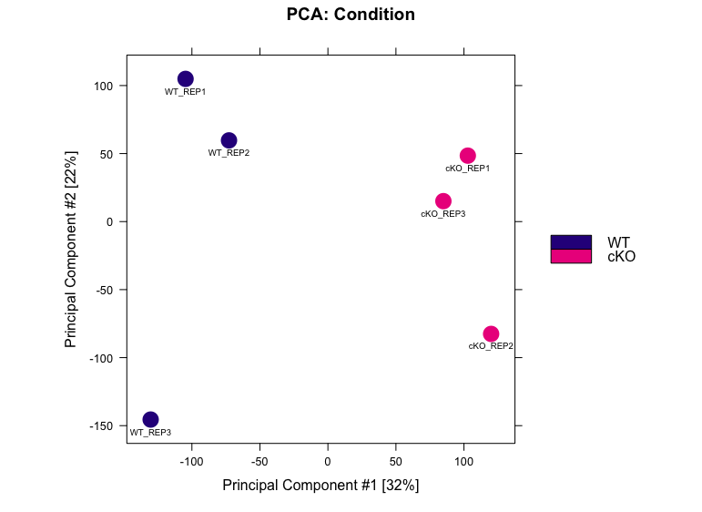
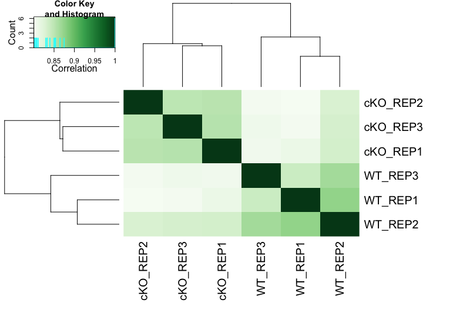
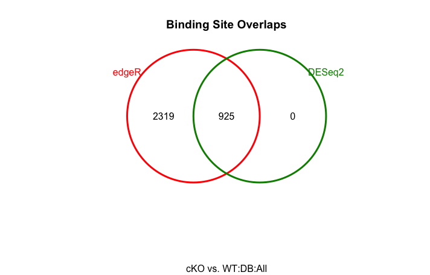
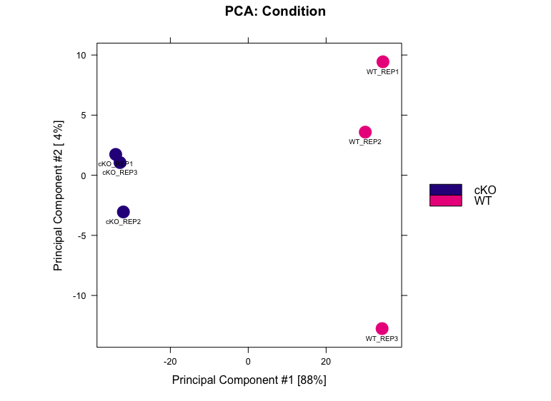
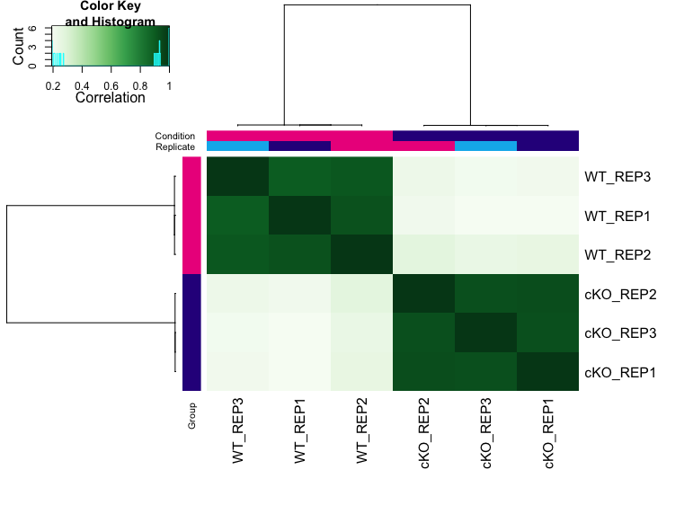
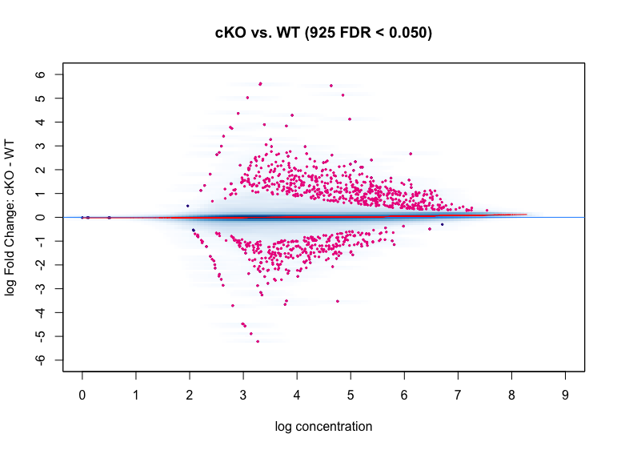
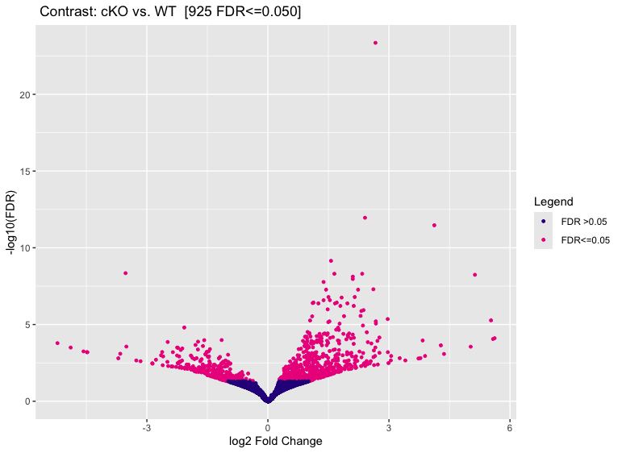
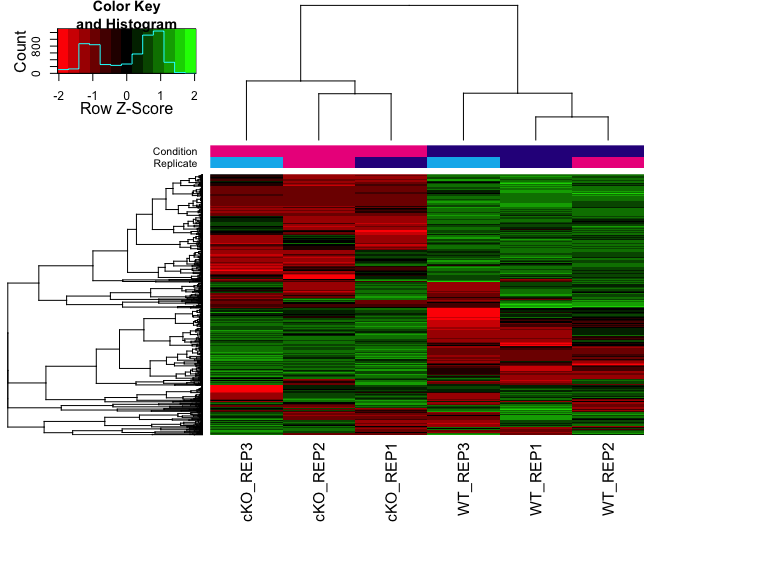

Contributors: Heather Wick, Upendra Bhattarai, Meeta Mistry

Approximate time: 

## Learning Objectives

* Perform exploratory data analysis and visualize sample concordance.
* Learn to use DiffBind for differential binding analysis
* Interpret results and export output for further downstream analysis.


## Overview

Differential binding analysis aims to detect and quantify changes in protein-DNA interactions between sample groups. In this dataset, two sample groups—**Wild Type (WT)** and **PRDM Knockout (KO)**—were processed using chromatin immunoprecipitation for the **H3K27Ac mark** followed by sequencing. This analysis identifies genomic locations where binding signals significantly differ between WT and KO, allowing us to assess and quantify these differences.

## Tools for evaluating differential enrichment

A large number of algorithms and tools exists for quantitative comparison of ChIP-seq data. 

| **Peak Dependent Tools**  | **Peak Independent Tools** |
|---------------------------|----------------------------|
| ChIPComp                  | bdgdiff/MACS2              |
| DiffBind                  | ChIPDiff                   |
| DESeq2                    | ChiPnorm                   |
| uniquepeak                | chromstaR                  |
| DiffReps                  | csaw                       |
| edgeR                     | diffReps                   |
| HOME/Rep                  | EpiCenter                  |
| MAnorm                    | GenoGAM                    |
| MAnorm2                   | histoneHMM                 |
| MMDiff                    | HMMcan                     |
| narrowPeaks               | HOMER                      |
|                           | MEDIPS                     |
|                           | MultiGPS                   |
|                           | normR                      |
|                           | ODIN                       |
|                           | PePr                       |
|                           | QChIPat                    |
|                           | RSEG                       |
|                           | SICER2                     |
|                           | slidingwindow              |
|                           | THOR                       |

Some tools require a priori peak calling, while others do not need peak calling to be performed beforehand. Although these tools operate differently, they share the same overarching goal: identify differential enrichment. The coice of tool depends on your dataset and the biological question being addressed. 
Consider the following factors:

- What inputs are required by the user? Some tools require preliminary detection of enriched regions by external peak-calling algorithms, while others implement their own detection method.
  
- Does the tool facilitate the use of replicates within each sample group?
  
- What is the underlying statistical model used for signal distribution? Is it based either on the Poisson distribution or on a more flexible negative binomial distribution.
  
- Some tools have been specifically designed for particular ChIP-seq data (signal type), such as histone modifications or transcription factor (TF) binding.

In this session, we will use DiffBind for the differential analysis. We will walk through the pipeline to perform data exploration, conduct differential binding analysis, evaluate the results, and save the output. 

DiffBind is an R Biocondutor package designed to identify genomic sites that are differentially enriched between sample groups. It works primarily with sets of peak calls ('peaksets'), which represent candidate protein binding sites as genomic intervals for each sample. DiffBind provides a range of functionalities that support the processing of peaksets, including:

- Overlapping and merging peaksets across an entire dataset.
- Counting sequencing reads in overlapping intervals.
- Identifying statistically significant differentially bound sites based on differences in read densities (a proxy for binding affinity).
  
We will discuss the importance of each step in the process, but for more detailed information please refer to the [DiffBind vignette](https://bioconductor.org/packages/devel/bioc/vignettes/DiffBind/inst/doc/DiffBind.pdf).

### Required inputs:

- bam files from the ChIP sample's read mapping.
- bam files from the input sample's read mapping.
- called peaks, output from peak caller.

> Note: Peaks from replicates are used individually, not merged.

## Setting up

We do not need to download any new data because all necessary files are already in the current project.

1. Open the R project `chipseq-project` in your RStudio environment.
2. Open a new R script `'File' -> 'New File' -> 'Rscript'`, and save it as `diffbind.R`

Now that we are setup, let's load the DiffBind and Tidyverse libraries.

```{r}
library(DiffBind)
library(tidyverse)
```

## Reading in the data
The DiffBind pipeline starts with importing the required data (bam files and peaksets). Bam files are the alignment files of the samples to the reference and peaksets are derived from peak callers such as MACS. The easy way of importing these data is through a metadata file. We need to prepare a metadata file that includes one line for each peakset in a format compatible with DiffBind. 

> Note: If multiple peak callers are used for comparison, each sample will have more than one line in the sample sheet. A merging function generates a consensus peakset for the experiment. 

After reading in the peaksets, a merging function finds all overlapping peaks and derives a single set of unique genomic intervals, called the consensus peakset. A region is included in the consensus set if it appears in at least two samples. This consensus peakset represents the overall set of candidate binding sites further analysis.


## Metadata format
Let's read in our metadata and inspect the column headers to understand the required format DiffBind.


```{r}
samples <- read.csv("data/DiffBind/metadata.csv")
names(samples)
```

Output:

```{r}
[1] "SampleID"   "Tissue"     "Factor"     "Condition"  "Replicate"  "bamReads"   "ControlID"  "bamControl" "Peaks"      "PeakCaller"
```


An experiment will have multiple samples. Each sample needs a unique SampleID. A comparative analysis requires at least two samples in a class. Classes are indicated in the metadata as **Factor**, **Tissue**, **Condition**, **Treatment**


- **Tissue** - This is a designation for the cell type, tissue type, or some other indication of the biological source of the material.


- **Factor** - This is usually what protein the antibody was targeting, such as a transcription factor or a histone mark.


- **Condition** - Indicates an experimental condition, such as WT or Mutant.

 
- **Treatment** - Specifies any treatments applied to the cells.


> Note: Not all classes are required, but at leaset one is necessary for comparision. For example, in our datasheet, we have Tissue, Factor, and Condition.


Metadata should also comprise aligned sequencing reads (generally in bam format). Each sample needs an aligned sequencing library, but may include the following:


- bamReads: This points to the primary aligned file for the sample from Chip experiment (or other assays like ATAC)


- bamControl: This is an optional set of control reads associated with the sample or sample class. For ChIP experiments, this is most often an Input control (ChIP run without an antibody), or a ChIP run with a non-specific antibody. ATAC experiment usually do not have a control.


- SpikeIn: This is also an option set of spike-in reads for normalization.


Id for the input control is given in `ControlID` column.


Diffbind requires a called peaks for each sample. The aligned reads are used to call the peaks with the peak calling software such as MACS. The called peaks here are denoted in the `Peaks` column.


## Affinity binding matrix

The initial steps of the pipeline can be computationally intensive, so they have been done for you, and the output saved as an `.rds` file in the data folder. Lets review these steps (Do NOT RUN).

```{r}
sample=read.csv("metadata.csv") # reading the metadata as above

dbObj=dba(sampleSheet=sample, scoreCol=5) # creating the diffbind object with dba function, scoreCol refers to the peak signal score in the peak files. If used MACS software scores are generally in 5th column

dbObj=dba.count(dbObj, bParallel=FALSE) # This is the most computationally intensive part
```

First step in generating the affinity binding matrix involves reading in the metadata that we prepared. The second step involves creating the diffbind object. We do that using `dba` function. This function takes the metadata as `sampleSheet` and `scoreCol` referes to the peak singal score in the peak files. If used MACS, score is generally in the 5th column. 

Next step is to take the alignment files and compute count information for each of the peaks/regions in the consensus set, we can use `dba.count()` function to do that. In this step, for each of the consensus regions DiffBind takes the number of aligned reads in the ChIP sample and the input sample, to compute a normalized read count for each sample at every potential binding sites. The peaks in the consensus peakset may be re-centered and trimmed based on calculating their summits (point of greatest read overlap) in order to provide more standardized peak intervals. This is the computationally intensive step so we ran these steps and saved the output as an RDS object. Which we are going to import in our local Rstudio for downstream analysis.

## Data exploration

Before performing differential binding analysis, it is essential to explore the count matrix, examine various sample statistics, and assess the overall similarity between samples. 

This initial step help us understand:

- Which samples are similar to each other and which are different?
  
- What are the major sources of variation, and do they align with the expectations from the research design?

Let's load the DiffBind object in our RStudio and examine it.

```{r}
dbObj <- readRDS("data/DiffBind/dbObj.rds")
dbObj
```

Output:
```
6 Samples, 85868 sites in matrix:
        ID Tissue  Factor Condition Replicate    Reads FRiP
1  WT_REP1 PRDM16 H3K27ac        WT         1 14916464 0.20
2  WT_REP2 PRDM16 H3K27ac        WT         2 21174308 0.18
3  WT_REP3 PRDM16 H3K27ac        WT         3 14433557 0.20
4 cKO_REP1 PRDM16 H3K27ac       cKO         1 13292841 0.22
5 cKO_REP2 PRDM16 H3K27ac       cKO         2 13900397 0.20
6 cKO_REP3 PRDM16 H3K27ac       cKO         3 16677061 0.20
```

From this output, we observe 85,868 total sites in the consensus peaksets across six samples. The first five columns display the sample metadata provided in the sample sheet used to create the DiffBind object. The Reads column indicates the number of reads in each sample, while the FRiP score (Fraction of Reads in Peaks) shows the fraction of mapped reads falling into the consensus peaksets. Multiplying the number of reads by FRiP score gives the number of reads that overlap the consensus peaksets. We can calculate this using `dba.show` function.

```{r}
info <- dba.show(dbObj)
libsizes <- cbind(LibReads=info$Reads, FRiP=info$FRiP, peakReads=round(info$Reads * info$FRiP))
rownames(libsizes) <- info$ID

libsizes
```

Output:

```
         LibReads FRiP peakReads
WT_REP1  14916464 0.20   2983293
WT_REP2  21174308 0.18   3811375
WT_REP3  14433557 0.20   2886711
cKO_REP1 13292841 0.22   2924425
cKO_REP2 13900397 0.20   2780079
cKO_REP3 16677061 0.20   3335412
```
### PCA

We can use Principal Component Analysis (PCA) to explore the sample similarity. A PCA plot helps us determine how replicates cluster together and identifies the primary source of variation in the data. The `dba.plotPCA` function in DiffBind uses log2-normalized read counts by default.

```{r}
dba.plotPCA(dbObj, attributes=DBA_CONDITION, label=DBA_ID, score = DBA_SCORE_NORMALIZED, labelSize = 0.6)
```
<p align="center">

</p>


In this data, PC1 explaining 32% of the variation, separates the WT and cKO samples, indicating that the primary source of variation in the dataset is the difference between conditions, PC2, accounting for 22% of the variation, shows slightly more variability in WT replicate 3 and cKO replicate 2 compared to their counterparts.

### Correlation Heatmap
Correlational heatmap visualizes the clustering of samples based on their similarity. This can be generated using the `dba.plotHeatmap` function.

```{r}
dba.plotHeatmap(dbObj, ColAttributes = DBA_TISSUE,
                score = DBA_SCORE_NORMALIZED)
```

<p align="center">

</p>


From the heatmap, we observe that the replicates cluster together, as expected. Although there is variability between the replicates, the largest differences are between the two conditions (WT and cKO).


Discussion:
What do you think about sample concordance?
Were these plots helpful?


## Differential binding affinity analysis

The core functionality of DiffBind is its ability to identify differentially bound sites; binding sites that exhibit statistically significant differences in binding affinity between sample groups. DiffBind uses DESeq2 for differential binding analysis by default with input substraction and library-size normalization set automatically in its pipeline. Additionally, users have option to use edgeR within DiffBind. Each tool assigns a p-value and FDR to candidate binding sites, indicating confidence in their differential binding status.


### Establishing a contrast

Before running the differential binding analysis, we need to define the contrast; i.e. the groups of samples to be compared. In this example, the factor of interst is **Condition** (WT vs cKO). Contrasts are set using the `dba.contrast()` function, as follows:

```{r}
dbObj <- dba.contrast(dbObj, categories = DBA_CONDITION)
dbObj
```

```{r, output}
6 Samples, 85868 sites in matrix:
        ID Tissue  Factor Condition Replicate    Reads FRiP
1  WT_REP1 PRDM16 H3K27ac        WT         1 14916464 0.20
2  WT_REP2 PRDM16 H3K27ac        WT         2 21174308 0.18
3  WT_REP3 PRDM16 H3K27ac        WT         3 14433557 0.20
4 cKO_REP1 PRDM16 H3K27ac       cKO         1 13292841 0.22
5 cKO_REP2 PRDM16 H3K27ac       cKO         2 13900397 0.20
6 cKO_REP3 PRDM16 H3K27ac       cKO         3 16677061 0.20

Design: [~Condition] | 1 Contrast:
     Factor Group Samples Group2 Samples2
1 Condition   cKO       3     WT        3
```

If there are only two replicates in any group, specify `minMembers = 2` within `dba.contrast`. Here the design [~Condition] indicates that the analysis is focused on the **Condition**, with one contrast: cKO vs WT.


### Differential analysis
Now we can perform differential binding analysis using the `dba.analyze()` function. By default, this function applies both blacklist and greylist filtering, which are designed to exclude problematic regions in the genome.

    Note: 
      * **Blacklists:** are pre-defined lists of regions specific to a reference genome that are known to be problematic. The best known lists have been identified as part of the ENCODE project.
    
      * **Greylists:** are specific to a ChIP-seq experiment, and are derived from the controls generated as part of the experiment. The idea is to identify anomalous regions where a disproportionate degree of signal is present. These regions can then be excluded from subsequent analysis.

`Blacklist` regions for many reference genomes identified as part of the ENCODE project can be accessed through the `dba.blacklist()` function in DiffBind. If the control samples are available, one can prepare regions to be excluded specific to the experiment. Those are called `Greylists` using the `GreyListChIP` package.

Since the dataset has already undergone blacklist filtering via the nf-core pipeline, we can skip this step and proceed with the analysis.

```{r}
dbObj <- dba.analyze(dbObj, method = DBA_ALL_METHODS, bGreylist = FALSE, bBlacklist = FALSE)
```
Extract summary of the analysis with `dba.show()` function. The default significance threshold is padj <0.05


```{r}
de_summary <- dba.show(dbObj, bContrasts = T, th=0.05)
de_summary
```


```{r, output}
     Factor Group Samples Group2 Samples2 DB.edgeR DB.DESeq2
1 Condition   cKO       3     WT        3     3244       925
```
Here, DESeq2 identifies fewer peaks than edgeR, reflecting its more stringent. This is not unsual, as we also see a lack of complete agreement with these tools ub RNA-seq analyses.

Exercise:

- Try a more stringent threshold of 0.01 and a more lenient threshold of 0.1 and compare the differences between the differnetially bound sites between the conditions.

## Visualization

### Overlaps of differentially bound sites in two methods

Visualize overlaps of differentially bound sites identified by DESeq2 and edgeR using a Venn diagram:

```{r}
dba.plotVenn(dbObj, contrast = 1, method = DBA_ALL_METHODS)
```
<p align="center">

</p>


It shows that the differentially bound sites detected by DESeq2 is a subset of those detected by edgeR.

### PCA with differentially bound sites

Lets plot another PCA for our data, but this time only use the regions those were identified as significantly differentially bound by DESeq2 in two conditions.


```{r}
dba.plotPCA(dbObj, contrast=1, method=DBA_DESEQ2, attributes=DBA_FACTOR, label=DBA_ID)
```

<p align="center">

</p>


Exercise:
- Modify the code above and use results from edegeR to plot a PCA.


### Venn diagrams

We can separate sites into gain (increased binding in cKO) and loss (decreased binding in cKO) categories and visualize them in Venn diagram. 


```{r}
dba.plotVenn(dbObj, contrast = 1, bDB = TRUE, bGain = TRUE, bLoss = TRUE, bAll = FALSE)
```
<p align="center">

</p>

If we had multiple constrasts we could specify the specific number of contrast with `contrast=` option. Here we have only one contrast so contrast is set as = 1.

### Correlation heatmap

Lets generate a heatmap of correlations among samples based on differentially bound sites.

```{r}
plot(dbObj, contrast=1)
```

<p align="center">

</p>

### MA plot

MA plots show the relationship between the overall binding level at each site and the magnitude of the change in binding enrichment between conditions, as well as the effect of normalization on data. In the plot below, each point represents a binding site, with 882 points in magenta representing sites identified as differnetially bound. There is a blue horizongal line through the origin (0 logFoldChange), as well as a horizontal red curve representing a non-liner loess fit showing the underlying relationship between coverage levels and fold changes.

```{r}
dba.plotMA(dbObj, method=DBA_DESEQ2)
```

<p align="center">

</p>


### Volcano plots

We can use volcano plots to visualize significantly differentially bound sites and their fold change.

```{r}
dba.plotVolcano(dbObj, contrast = 1)
```
<p align="center">

</p>

### Binding affinity Heatmaps

Heatmap below shows the patterns of binding affinity in the differentially bound sites. The affinities and clustering of the differentially bound sites are in rows and sample clustering in columns. The normalized counts have been row scaled and plotted with red/green heatmap color palette.

```{r}
hmap <- colorRampPalette(c("red", "black", "green"))(n = 13)
readscores <- dba.plotHeatmap(dbObj, correlations = FALSE,
                              scale="row", colScheme = hmap,)
```
<p align="center">

</p>


## Extracting results

To extract the full DiffBind results we use `dba.report()` function:

```{r}
res_deseq <- dba.report(dbObj, method=DBA_DESEQ2, contrast = 1, th=1)
```
This produces a GRanges object with genomic coordinates and binding statistics, including fold-change, p-value and FDR.

```{r}
res_deseq
```

```{r, output}
GRanges object with 85868 ranges and 6 metadata columns:
              seqnames              ranges strand |      Conc  Conc_cKO   Conc_WT         Fold     p-value         FDR
                 <Rle>           <IRanges>  <Rle> | <numeric> <numeric> <numeric>    <numeric>   <numeric>   <numeric>
  49848           chr3   30416730-30417130      * |   6.11794   6.92282   4.13514      2.66588 5.14546e-29 4.41826e-24
  35260          chr17   35752313-35752713      * |   5.38700   6.16246   3.59245      2.40666 2.57355e-17 1.10492e-12
   6541          chr10   19836109-19836509      * |   4.98147   5.91894   1.42217      4.12468 1.19158e-16 3.41059e-12
  45132           chr2   71683577-71683977      * |   6.08795   6.67869   5.07048      1.56467 3.29837e-14 7.08052e-10
  60772           chr5   39856175-39856575      * |   4.75552   1.77349   5.66120     -3.52770 2.62106e-13 4.50125e-09
    ...            ...                 ...    ... .       ...       ...       ...          ...         ...         ...
  51430           chr3   87949757-87950157      * |   3.71883   3.73308   3.70444 -2.97549e-06    0.999943    0.999977
  57367           chr4 117361114-117361514      * |   3.38110   3.37527   3.38692  1.79131e-06    0.999964    0.999977
  67053           chr6   55543641-55544041      * |   3.02659   3.02324   3.02994 -1.58102e-06    0.999965    0.999977
  13506          chr11   87064690-87065090      * |   3.03299   3.03534   3.03063  4.18053e-07    0.999991    0.999991
  84146 chrUn_JH584304         94029-94429      * |   0.00000   0.00000   0.00000  0.00000e+00    1.000000    1.000000
  -------
  seqinfo: 29 sequences from an unspecified genome; no seqlengths
```
The value columns are described below:

- Conc: mean read concentration over all the samples (the default calculation uses log2 normalized ChIP read counts with control read counts subtracted)
- Conc_cKO: mean concentration over the first (cKO) group
- Conc_WT: mean concentration over the second (WT) group
- Fold: shows the difference in mean concentrations between the two groups, with a positive value indicating increased binding affinity in the cKO group and a negative value indicating increased binding affinity in the WT group.
- p-value: pvalue from the significance test
- FDR: False discovery rate after multiple correction

Let's save the GRange object for downstream analysis. We can save it as an RDS object.
```{r}
saveRDS(res_deseq, file = "all_res_deseq2.rds")
```

Exercise: 
Extract only the significantly differentially bound sites in the analysis with pvalue cutoff of 0.05 and save it as RDS object.

Solution:
```{r}
sig_res_deseq <- dba.report(dbObj, method=DBA_DESEQ2, contrast = 1, th=0.05)

saveRDS(sig_res_deseq, file = "sig_res_deseq2.rds")
```

We can also convert the GRange to a data frame where the genomic coordinates get written as columns and can be saved as a table.

```{r}
#Write to a file
out <- as.data.frame(res_deseq)
write.table(out, file="results/cKO_vs_WT_deseq2.txt", sep="\t", quote=F, row.names=F)
```

Additionally, we can also create BED files for each set of significant regions identified by DESeq2, separating them based on the gain or loss of enrichment. We will write these regions to file and use as input for downstream visualization.

```{r}
# Create bed files for each keeping only significant peaks (p < 0.05)

cKO_enrich <- out %>% 
  filter(FDR < 0.05 & Fold > 0) %>% 
  select(seqnames, start, end)
  
# Write to file
write.table(cKO_enrich, file="cKO_enriched.bed", sep="\t", quote=F, row.names=F, col.names=F)

WT_enrich <- out %>% 
  filter(FDR < 0.05 & Fold < 0) %>% 
  select(seqnames, start, end)

# Write to file
write.table(WT_enrich, file="WT_enriched.bed", sep="\t", quote=F, row.names=F, col.names=F)
```

> NOTE: BED files cannot contain headers and so we have added the col.names=F argument to address that. Additionally, we took only the first three columns from the results (genomic coordinates) to adhere to a minimal BED file format.


***

*This lesson has been developed by members of the teaching team at the [Harvard Chan Bioinformatics Core (HBC)](http://bioinformatics.sph.harvard.edu/). These are open access materials distributed under the terms of the [Creative Commons Attribution license](https://creativecommons.org/licenses/by/4.0/) (CC BY 4.0), which permits unrestricted use, distribution, and reproduction in any medium, provided the original author and source are credited.*
