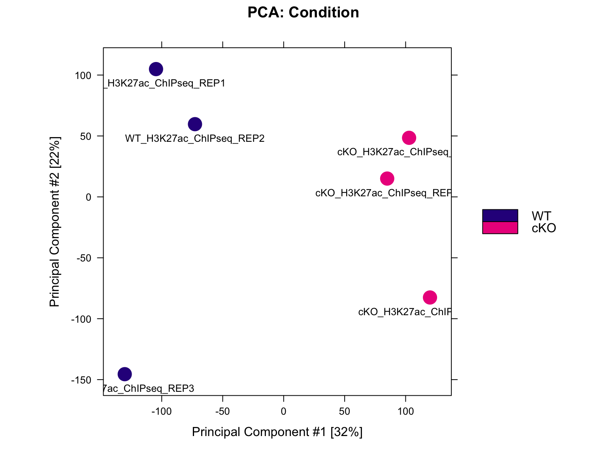
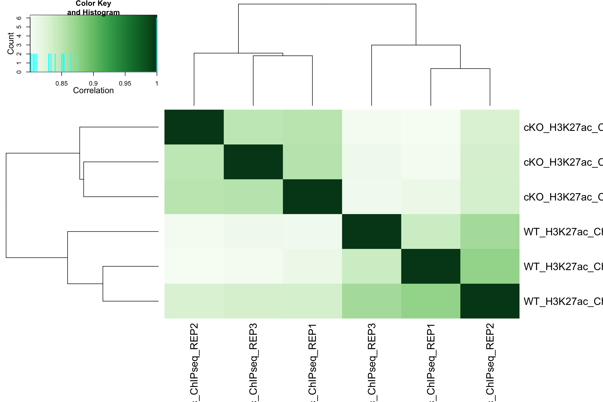
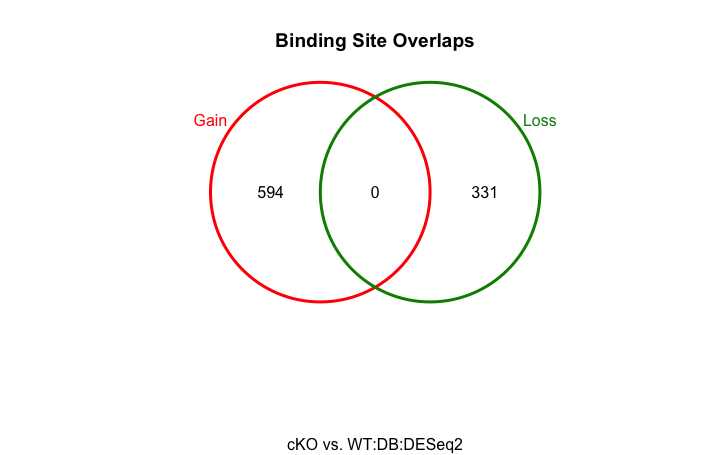
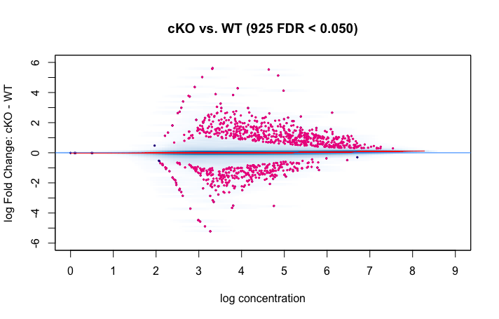

Contributors: Heather Wick, Upendra Bhattarai, Meeta Mistry

Approximate time: 

## Learning Objectives

* Carryout data exploratory analysis and visualization for sample concordance.
* Learn to use DiffBind for differential binding analysis
* Evaluate the results and export the output.


## Overview

The aim of differential binding analysis is to compare the changes in protein-DNA interactions between sample groups. In our dataset, we have two sample groups: Wild types (WT) and PRDM KO (KO) and these have been processed with chromatin immunoprecipitation for H3K27Ac mark and sequenced. So with the differential binding analysis we should be able to identify the locations in the genome where binding signal is different between WT vs KO and quantify the differences.


## Tools for evaluating differential enrichment

A large number of algorithms and tools exists for quantitative comparison of ChIP-seq data. 

| **Peak Dependent Tools** | **Peak Independent Tools** |
|--------------------------|----------------------------|
| ChIPComp                  | bdgdiff/MACS2             |
| DiffBind                  | ChIPDiff                  |
| DESeq2                    | ChiPnorm                  |
| DiffBind                  | chromstaR                |
| DiffReps                  | csaw                      |
| edgeR                     | diffReps                  |
| HOME/Rep                  | EpiCenter                 |
| MAnorm                    | GenoGAM                   |
| MAnorm2                   | histoneHMM               |
| MMDiff                    | HMMcan                   |
| narrowPeaks               | HOMER                    |
| uniquepeaks               | MEDIPS                   |
|                           | MultiGPS                 |
|                           | normR                    |
|                           | ODIN                     |
|                           | PePr                     |
|                           | QChIPat                  |
|                           | RSEG                     |
|                           | SICER2                   |
|                           | slidingwindow            |
|                           | THOR                     |

Some of these tools require apriori peak calling, while other do not require peak calling to be performed beforehand. Each of the tools work differently from one another but have the same overarching goal. Which one you choose will come down to the dataset you are working with and your biological question. Some things to consider:

- What inputs are required by the user? Some tools require preliminary detection of enriched regions by external peak-calling algorithms, while others implement their own detection method.
- Does the tool facilitate the use of replicates within each sample group?
- What is the underlying statistical model used for signal distribution? Is it based either on the Poisson distribution or on a more flexible negative binomial distribution.
- Some tools have been specifically designed for particular ChIP-seq data (signal type), such as histone modifications or transcription factor (TF) binding.

In this session we are going to use DiffBind for the differential analysis. We will go over through the pipeline to perform some data exploratory analysis and carryout the differential binding analysis. We will then evaluate the results and save those in files.

DiffBind is an R Biocondutor package that is used for identifying sites that are differentially enriched between sample groups. It works primarily with sets of peak calls ('peaksets'), which are sets of genomic intervals representing candidate protein binding sites for each sample. DiffBind includes functions that support the processing of peaksets, including overlapping and merging of the peak sets across an entire dataset, counting sequencing reads in overlapping intervals in peak sets, and identifying statistically significantly differentially bound sites based on evidence of binding affinity (measured by differences in read densities). We will discuss the importance of each step but for more detailed information please take a look at the DiffBind vignette ###LINK###.

### Required inputs:
- bam files from the ChIP sample's read mapping
- bam files from the input sample's read mapping
- called peaks, output from peak caller

    Note: Peaks from replicates are used individually, not merged.

## Setting up
We do not need to download any new data because everything we need is already in the current project. The samplesheet that we used for ChIPQC is also required here.
1. Open up RStudio and open up the `chipseq-project` that we created previously.
2. Open up a new R script ('File' -> 'New File' -> 'Rscript'), and save it as `diffbind.R`

Now that we are setup let's load the DiffBind and Tidyverse libraries.

```{r{
library(DiffBind)
library(tidyverse)
```

## Reading in the data
DiffBind pipeline starts with reading in a required data (bam files and peaksets). Bam files are the alignment files of the samples to the reference and peaksets are derived from peak callers such as MACS. We need to generate a metadata file with one line for each peakset and in the format that is compatible with DiffBind. 

Note: If multiple peak callers are used for comparison purposes each sample would have more than one line in the sample sheet. A merging function will generate a consensus peakset for the experiment. 

Once the peaksets are read in, a merging function finds all overlapping peaks and derives a single set of unique genomic intervals covering all the supplied peaks (a consensus peakset for the experiment). A region is considered for the consensus set if it appears in more than two of the samples. This consensus set represents the overall set of candidate binding sites to be used in further analysis.


## Metadata format
Let's read our metadata and look at the column headers to understand the format DiffBind requires.


```{r}
samples <- read.csv("data/metadata.csv")
names(samples)
```

```{r, output}
[1] "SampleID"   "Tissue"     "Factor"     "Condition"  "Replicate"  "bamReads"   "ControlID"  "bamControl" "Peaks"      "PeakCaller"
```


An experiment will have multiple samples. Each sample needs a unique SampleID. A comparative analysis requires at least two samples in a class. Classes are indicated in the metadata as **Factor**, **Tissue**, **Condition**, **Treatment**

- **Tissue** - This is a designation for the cell type, tissue type, or some other indication of the biological source of the material.
  
- **Factor** - This is usually what protein the antibody was targeting, such as a transcription factor or a histone mark.

- **Condition** - Indicates an experimental condition, such as WT or Mutant.
  
- **Treatment** - Can denote how the cells were treated.

Not all of these classes are required, but there should be at leaset one class to compare. eg in our datasheet we have Tissue, Factor, and Condition.

Metadata should also comprise aligned sequencing reads (generally in bam format). Each sample needs an aligned sequencing library, but may include the following:

- bamReads: This points to the primary aligned file for the sample from Chip experiment (or other assays like ATAC)
- 
- bamControl: This is an optional set of control reads associated with the sample or sample class. For ChIP experiments, this is most often an Input control (ChIP run without an antibody), or a ChIP run with a non-specific antibody. ATAC experiment usually do not have a control.
- SpikeIn: This is also an option set of spike-in reads for normalization.

Id for the input control is given in `ControlID` column.

Diffbind requires a called peaks for each sample. The aligned reads are used to call the peaks with the peak calling software such as MACS. The called peaks here are denoted in the `Peaks` column.

## Affinity binding matrix

The first few steps in the pipeline can be computationally intensive, so this has been done for you and the output saved in the data folder as an `rds` object. Lets go over through these steps (Do NOT RUN)

```{r}
sample=read.csv("metadata.csv") # reading the metadata as above

dbObj=dba(sampleSheet=sample, scoreCol=5) # creating the diffbind object with dba function, scoreCol refers to the peak signal score in the peak files. If used MACS software scores are generally in 5th column

dbObj=dba.count(dbObj, bParallel=FALSE) # This is the most computationally intensive part
```

First step in generating the affinity binding matrix involves reading in the metadata that we prepared. The second step involves creating the diffbind object. We do that using `dba` function. This function takes the metadata as `sampleSheet` and `scoreCol` referes to the peak singal score in the peak files. If used MACS software, the scores are generally in the 5th column. 

The next step is to take the alignment files and compute count information for each of the peaks/regions in the consensus set, we can use `dba.count()` function to do that. In this step, for each of the consensus regions DiffBind takes the number of aligned reads in the ChIP sample and the input sample, to compute a normalized read count for each sample at every potential binding site. The peaks in the consensus peakset may be re-centered and trimmed based on calculating their summits (point of greatest read overlap) in order to provide more standardized peak intervals. This is the computationally intensive step so we ran these steps and saved the output as an RDS object. Which we are going to import in our local Rstudio to carryout the downstream analysis.

## Data exploration

Before the differential binding analysis, it is useful to look at the count matrix, various sample statistics and assess the overall similarity between samples. 
This initial step help us understand:
- which samples are similar to each other and which are different?
- What are the major source of variation and this fit the expectations from research design?

Lets load the diffbind object in our RStudio and look at it.

```{r}
dbObj <- readRDS("data/DiffBind/dbObj.rds")
dbObj
```

Output:
```
## 6 Samples, 85868 sites in matrix:
##                         ID Tissue  Factor Condition Replicate    Reads FRiP
## 1  WT_H3K27ac_ChIPseq_REP1 PRDM16 H3K27ac        WT         1 14916464 0.20
## 2  WT_H3K27ac_ChIPseq_REP2 PRDM16 H3K27ac        WT         2 21174308 0.18
## 3  WT_H3K27ac_ChIPseq_REP3 PRDM16 H3K27ac        WT         3 14433557 0.20
## 4 cKO_H3K27ac_ChIPseq_REP1 PRDM16 H3K27ac       cKO         1 13292841 0.22
## 5 cKO_H3K27ac_ChIPseq_REP2 PRDM16 H3K27ac       cKO         2 13900397 0.20
## 6 cKO_H3K27ac_ChIPseq_REP3 PRDM16 H3K27ac       cKO         3 16677061 0.20
```
Here we can see that there are 85,868 total sites in the consensus peaksets from 6 samples. First five column displays the sample metadata we supplied through our sample sheet to create diffbind object. Reads column shows the number of reads in each sample. FRiP score represents fraction of all mapped reads that fall into the consensus peaksets. Multiplying the number of reads by FRiP gives the number of reads that overlap the consensus peaksets. We can calculate this using `dba.show` function.

```{r}
info <- dba.show(dbObj)
libsizes <- cbind(LibReads=info$Reads, FRiP=info$FRiP, peakReads=round(info$Reads * info$FRiP))
rownames(libsizes) <- info$ID

libsizes
```

Output:

```
##                          LibReads FRiP PeakReads
## WT_H3K27ac_ChIPseq_REP1  14916464 0.20   2983293
## WT_H3K27ac_ChIPseq_REP2  21174308 0.18   3811375
## WT_H3K27ac_ChIPseq_REP3  14433557 0.20   2886711
## cKO_H3K27ac_ChIPseq_REP1 13292841 0.22   2924425
## cKO_H3K27ac_ChIPseq_REP2 13900397 0.20   2780079
## cKO_H3K27ac_ChIPseq_REP3 16677061 0.20   3335412
```
### PCA

We can perform Principal Component Analysis (PCA) to explore the sample similarity. PCA plot shows us how similar are the replicates to each others and what is the major source of variation in the data. We can use dba.plotPCA function in DiffBind to plot the PCA and look at sample concordance.
By default dba.plotPCA() uses log2 values of the read counts from each samples.

```{r}
dba.plotPCA(dbObj, attributes=DBA_CONDITION, label=DBA_ID, score = DBA_SCORE_NORMALIZED)
```
<p align="center">

</p>


PC1 shows the major source of variation in the data which is 32% in our case. And we see that WT and KO samples are separated in PC1 showing that the major source of variation in our dataset is from the difference in WT and KO condition. We can also see that Replicate 3 in WT samples and Replicate 2 in cKO samples shows more variation compared to other two replicate in PC2. PC2 has variation of 22%

### Correlation Heatmap
Correlational heatmap shows how the samples cluster. To plot this heatmap we can use dba.plotHeatmap function.

```{r}
dba.plotHeatmap(dbObj, ColAttributes = DBA_TISSUE,
                score = DBA_SCORE_NORMALIZED)
```

<p align="center">

</p>


In our data, we see that the replicates cluster together, which is what we would hope for. Although there is variability between the replicates, the largest amount of variability can be attributed to differences between the two groups.


What do you think about sample concordance?
Were these plots helpful?


## Differential binding affinity analysis

The core functionality of DiffBind is the differential binding affinity analysis, which enables binding sites to be identified that are statistically significantly differentially bound between sample groups. DiffBind uses DESeq2 for differential binding analysis by default. Input substraction and library-size normalization are set by default in the DiffBind pipeline. We also have option to use edgeR within DiffBind. Each tool will assign a p-value and FDR to each candidate binding site indicating confidence that they are differentially bound.


### Establishing a contrast

Before running the differential enrichment analysis, we need to tell DiffBind which samples we want to compare to one another. In our case we only have one factor of interest which is the Condition (WT vs cKO). Contrasts are set up using the dba.contrast function, as follows:

```{r}
dbObj <- dba.contrast(dbObj, categories = DBA_CONDITION)
dbObj
```
```{r, output}
6 Samples, 85868 sites in matrix:
                        ID Tissue  Factor Condition Replicate    Reads FRiP
1  WT_H3K27ac_ChIPseq_REP1 PRDM16 H3K27ac        WT         1 14916464 0.20
2  WT_H3K27ac_ChIPseq_REP2 PRDM16 H3K27ac        WT         2 21174308 0.18
3  WT_H3K27ac_ChIPseq_REP3 PRDM16 H3K27ac        WT         3 14433557 0.20
4 cKO_H3K27ac_ChIPseq_REP1 PRDM16 H3K27ac       cKO         1 13292841 0.22
5 cKO_H3K27ac_ChIPseq_REP2 PRDM16 H3K27ac       cKO         2 13900397 0.20
6 cKO_H3K27ac_ChIPseq_REP3 PRDM16 H3K27ac       cKO         3 16677061 0.20

Design: [~Condition] | 1 Contrast:
     Factor Group Samples Group2 Samples2
1 Condition   cKO       3     WT        3
```

If there are only two replicates in any comparison class we need to specify option `minMembers = 2` with `dba.contrast` function. Here we can see the design `[~Condition]` and the contrast: contrast 1: cKO vs WT.


### Differential analysis
Now we can perform differential analysis using `dba.analyze()` function. By default this function will also run blacklist filtering and greylist filtering. These are the problematic regions in the genome.

###DEFINE PROBLEMATIC###  
Note: 
  * **Blacklists:** are pre-defined lists of regions specific to a reference genome that are known to be problematic. The best known lists have been identified as part of the ENCODE project.
    
  * **Greylists:** are specific to a ChIP-seq experiment, and are derived from the controls generated as part of the experiment. The idea is to identify anomalous regions where a disproportionate degree of signal is present. These regions can then be excluded from subsequent analysis.

`Blacklist` regions for many reference genomes identified as part of the ENCODE project can be accessed through the `dba.blacklist()` function in DiffBind. If the control samples are available, one can prepare regions to be excluded specific to the experiment. Those are called `Greylists` using the `GreyListChIP` package.

We have ran our data through nf-core pipeline, which employs blacklist removal as a part of the analysis, so we are skipping this here. We can run differential analysis as below:

```{r}
dbObj <- dba.analyze(dbObj, method = DBA_ALL_METHODS, bGreylist = FALSE, bBlacklist = FALSE)
```
Extract summary of the analysis with `dba.show()` function. We are using the default, 0.05 as the cutoff threshold for multiple test correction for significance test.


```{r}
de_summary <- dba.show(dbObj, bContrasts = T, th=0.05)
de_summary
```


```{r, output}
     Factor Group Samples Group2 Samples2 DB.edgeR DB.DESeq2
1 Condition   cKO       3     WT        3     3244       925
```
This appears as though DESeq2 is a bit more stringent in our analysis and results in fewer peaks compared to edgeR. This is not unsual, as we also see a lack of complete agreement with these tools during RNA-seq analysis.

Exercise:

The default threshold is padj < 0.05. How many regions are differentially bound between cKO and WT? How does this change with a more stringent threshold of 0.01? (HINT: use th=0.01)

## Visualization

### Overlaps of differentially bound sites in two methods

```{r}
dba.plotVenn(dbObj, contrast = 1, method = DBA_ALL_METHODS)
```
<p align="center">

</p>


It shows that the differentially bound sites detected by DESeq2 is a subset of those detected by edgeR.

### PCA with differentially bound sites

Try plotting a PCA but this time only use the regions that were identified as significant by DESeq2 using the code below.

```{r}
dba.plotPCA(dbObj, contrast=1, method=DBA_DESEQ2, attributes=DBA_FACTOR, label=DBA_ID)
```

###INSERT IMAGE of pca plot

Exercise:
Modify the code above so that you only plot a PCA using the regions identified as significant by edgeR.


### Venn diagrams
We can visualize the overlaps between different sets of peaks. for example, among the differentially bound sites in a venn diagram. We can see the differences between the "Gain" sites (peaks with increase binding enrichment in the cKO vs WT) and the "Loss" sites (with lower enrichment in cKO vs WT).

```{r}
dba.plotVenn(dbObj, contrast = 1, bDB = TRUE, bGain = TRUE, bLoss = TRUE, bAll = FALSE)
```
<p align="center">

</p>

If we had multiple constrasts we could specify the specific number of contrast with contrast option. Here we have only one contrast so contrast is set as = 1.

### Correlation heatmap

We can plot a corrrelation heatmap with differentially bound sites from the analysis.

```{r}
plot(dbObj, contrast=1)
```

### MA plot

MA plots show the relationship between the overall binding level at each site and the magnitude of the change in binding enrichment between conditions, as well as the effect of normalization on data. In the plot below, each point represents a binding site, with 882 points in magenta representing sites identified as differnetially bound. There is a blue horizongal line through the origin (0 logFoldChange), as well as a horizontal red curve representing a non-liner loess fit showing the underlying relationship between coverage levels and fold changes.

```{r}
dba.plotMA(dbObj, method=DBA_DESEQ2)
```

<p align="center">

</p>


### Volcano plots

Similar to MA plots, volcano plots also highlight significantly differentially bound sites and show their fold changes.

```{r}
dba.plotVolcano(dbObj, contrast = 1)
```
<p align="center">

</p>

### Binding affinity Heatmaps

Heatmap below shows the patterns of binding affinity in the differentially bound sites. The affinities and clustering of the differentially bound sites are in rows and sample clustering in columns. The normalized counts have been row scaled and plotted with red/green heatmap color palette.

```{r}
hmap <- colorRampPalette(c("red", "black", "green"))(n = 13)
readscores <- dba.plotHeatmap(dbObj, correlations = FALSE,
                              scale="row", colScheme = hmap,)
```
### IMAGE ###


## Extracting results

To extract the full DiffBind results we use dba.report:

```{r}
res_deseq <- dba.report(dbObj, method=DBA_DESEQ2, contrast = 1, th=1)
```
This result file is a GRanges object and it contains the genomic coordinates for all consensus sites and statistics for differential enrichment including fold-change, p-value and FDR.

```{r}
res_deseq
```

```{r, output}
GRanges object with 85868 ranges and 6 metadata columns:
              seqnames              ranges strand |      Conc  Conc_cKO   Conc_WT         Fold     p-value         FDR
                 <Rle>           <IRanges>  <Rle> | <numeric> <numeric> <numeric>    <numeric>   <numeric>   <numeric>
  49848           chr3   30416730-30417130      * |   6.11794   6.92282   4.13514      2.66588 5.14546e-29 4.41826e-24
  35260          chr17   35752313-35752713      * |   5.38700   6.16246   3.59245      2.40666 2.57355e-17 1.10492e-12
   6541          chr10   19836109-19836509      * |   4.98147   5.91894   1.42217      4.12468 1.19158e-16 3.41059e-12
  45132           chr2   71683577-71683977      * |   6.08795   6.67869   5.07048      1.56467 3.29837e-14 7.08052e-10
  60772           chr5   39856175-39856575      * |   4.75552   1.77349   5.66120     -3.52770 2.62106e-13 4.50125e-09
    ...            ...                 ...    ... .       ...       ...       ...          ...         ...         ...
  51430           chr3   87949757-87950157      * |   3.71883   3.73308   3.70444 -2.97549e-06    0.999943    0.999977
  57367           chr4 117361114-117361514      * |   3.38110   3.37527   3.38692  1.79131e-06    0.999964    0.999977
  67053           chr6   55543641-55544041      * |   3.02659   3.02324   3.02994 -1.58102e-06    0.999965    0.999977
  13506          chr11   87064690-87065090      * |   3.03299   3.03534   3.03063  4.18053e-07    0.999991    0.999991
  84146 chrUn_JH584304         94029-94429      * |   0.00000   0.00000   0.00000  0.00000e+00    1.000000    1.000000
  -------
  seqinfo: 29 sequences from an unspecified genome; no seqlengths
```
The value columns are described below:

- Conc: mean read concentration over all the samples (the default calculation uses log2 normalized ChIP read counts with control read counts subtracted)
Conc_cKO: mean concentration over the first (cKO) group
Conc_WT: mean concentration over the second (WT) group
Fold: shows the difference in mean concentrations between the two groups, with a positive value indicating increased binding affinity in the cKO group and a negative value indicating increased binding affinity in the WT group.


Before writing to file we need to convert it to a data frame so that genomic coordinates get written as columns and not GRanges.

```{r}
#Write to a file
out <- as.data.frame(res_deseq)
write.table(out, file="results/cKO_vs_WT_deseq2.txt", sep="\t", quote=F, row.names=F)
```

Additionally, we will want to create BED files for each set of significant regions identified by DESeq2, separating them based on the gain or loss of enrichment. We will write these regions to file and use as input for downstream visualization.

```{r}
# Create bed files for each keeping only significant peaks (p < 0.05)

cKO_enrich <- out %>% 
  filter(FDR < 0.05 & Fold > 0) %>% 
  select(seqnames, start, end)
  
# Write to file
write.table(cKO_enrich, file="cKO_enriched.bed", sep="\t", quote=F, row.names=F, col.names=F)

WT_enrich <- out %>% 
  filter(FDR < 0.05 & Fold < 0) %>% 
  select(seqnames, start, end)

# Write to file
write.table(WT_enrich, file="WT_enriched.bed", sep="\t", quote=F, row.names=F, col.names=F)
```

NOTE: BED files cannot contain headers and so we have added the col.names=F argument to address that. Additionally, we took only the first three columns from the results (genomic coordinates) to adhere to a minimal BED file format.


[old material](https://github.com/hbctraining/Peak_analysis_workshop/blob/main/lessons/OLD_diffbind_differential_peaks.md)
- Needs significant updating due to updates to diffbind
- Go through entire workflow; share dbObj with them because we will compute the affinity binding matrix on cluster (provide code and script)
- Some Viz such as MA plots, volcano and heatmaps


***

*This lesson has been developed by members of the teaching team at the [Harvard Chan Bioinformatics Core (HBC)](http://bioinformatics.sph.harvard.edu/). These are open access materials distributed under the terms of the [Creative Commons Attribution license](https://creativecommons.org/licenses/by/4.0/) (CC BY 4.0), which permits unrestricted use, distribution, and reproduction in any medium, provided the original author and source are credited.*
