Contributors: Heather Wick, Upendra Bhattarai, Meeta Mistry, Will Gammerdinger

Approximate time: 

## Learning Objectives

* Visualize peaks in IGV (Integrative Genomics Viewer)
* Qualitatively assess whether DiffBind correctly assess differential binding
* Use R package (graphViz/rtracklayer) to plot and study differential peak enrichment between experimental groups

## Overview

When working with next-generation sequecing data, it can be helpful to visualize your analysis. [Integrate Genomics Viewer (IGV)](https://igv.org/) is an open-source desktop genome visualization tool, which supports visualization for a wide variety of file formats including:

- BED
- bigWig
- VCF
- BAM/SAM
- wig
- bedGraph
- narrowPeak/broadPeak
- GFF3
- GTF
- More and with a complete list of suppported file formats can be found [here](https://igvteam.github.io/igv-webapp/fileFormats.html)

Below we will learn about the file formats used to visualize peaks in IGV and use it to explore peaks in our experiment samples. We will also use graphViz/rtracklayer to plot the peak signals in R. 

## IGV

### Selecting the mm10 reference genome

Open IGV on your computer. The first thing we will need to use the appropriate reference genome (mm10). There should be a dropdown menu in the top-left of IGV, which let's you select your preferred reference genome. If your selected reference genome is already **mm10**, then you can skip the next few steps. Otherwise, left-click on the dropdown menu:

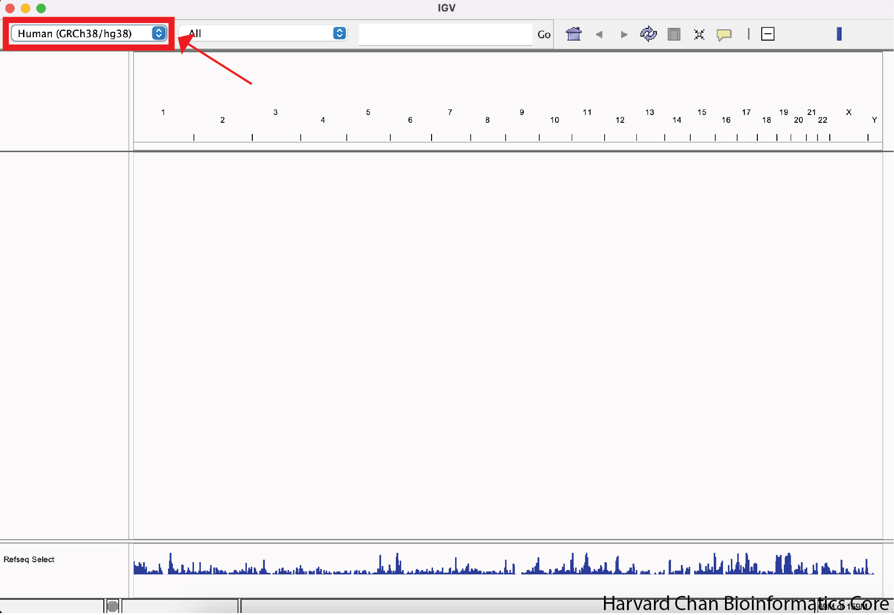

You can see a few options for refernce genomes to select from. If you see **mm10**, then you can select it. Otherwise, left-click on "Click for more ..."

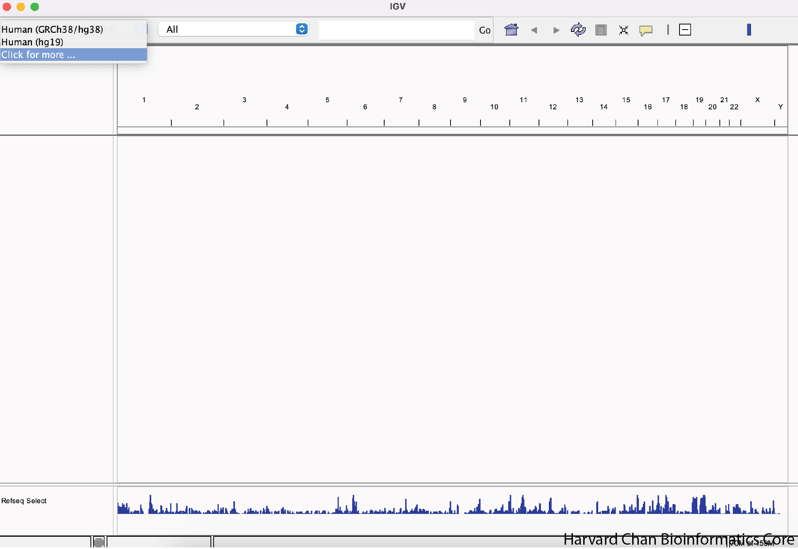

Find "Mouse mm10" from the menu and left-click "OK"

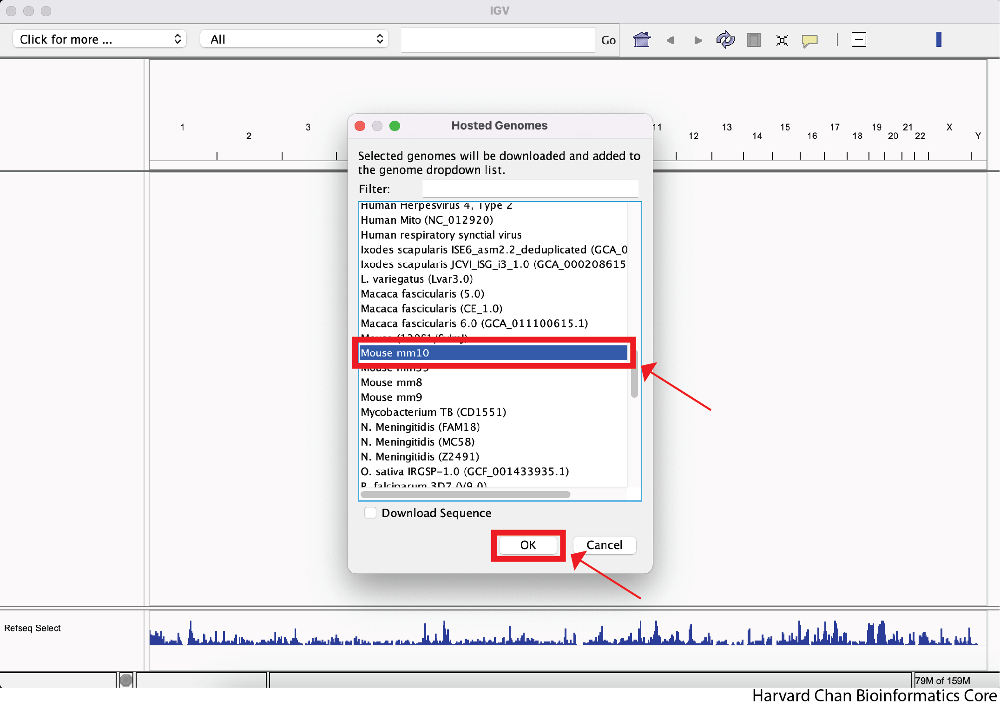

### Download files for visualization

Next, we need to download some files that we will be visualizing in IGV. Right-click [this link](https://www.dropbox.com/s/7pzb1yvpgopzar9/bigWig.zip?st=jgzjx01b&dl=0) and select "Save Link As..." to download the ZIP compressed directory of the BigWig files from Dropbox. Place this file within the `data` folder of your `Peak_analysis`. Repeat this process with [this link](https://www.dropbox.com/scl/fi/lwwm49gfgh433pzhxzdnu/DiffBind.zip?rlkey=b8xwzcftsn0dyjha1uzpdnn3q&st=jfyqpmco&dl=0) for the BED file of differentially called peaks from DiffBind and also place this file within the `data` folder of your `Peak_analysis`.

<b>Click here to see how to create bigWig files</b>

We will need to use the output from the <code>picard</code>`'s <code>CollectAlignmentSummaryMetrics</code> tool once again. As a reminder the code for running this would be: 

<pre>
# Run picard CollectAlignmentSummaryMetrics for a sample
java -jar picard.jar CollectAlignmentSummaryMetrics \
  --INPUT $INPUT_BAM \
  --REFERENCE_SEQUENCE $REFERENCE \
  --OUTPUT $OUTPUT_METRICS_FILE
</pre> 

We will be interested in the value associated with <code>PF_READS_ALIGNED</code>. This is the number of your mapped reads. We will use this number to create a scaling factor in the next step to create a bedGraph file. 

The full documentation for <code>picard CollectAlignmentSummaryMetrics</code> can be found <a href="https://gatk.broadinstitute.org/hc/en-us/articles/360040507751-CollectAlignmentSummaryMetrics-Picard">here</a>. 

In order to create a bedGraph file we will use <code>bedtools</code>'s <code>genomecov</code> tool. 

<pre>
$SCALE_FACTOR=`awk 'BEGIN { print 1000000 / $MAPPED_READ_COUNT }'`
  
bedtools genomecov \
  -ibam $INPUT_SORTED_BAM \
  -bg \
  -scale $SCALE_FACTOR | \
  sort -k1,1 -k2,2n \
  > $OUTPUT_FILE
</pre> 

We will need to create a bash variabel to hold a scale factor to a miilion which we will call in the <code>bedtools</code> command. The command to do this is: 
<code>$SCALE_FACTOR=`awk 'BEGIN { print 1000000 / $MAPPED_READ_COUNT }'`</code> 

<ul><li><code>bedtools genomecov</code> - Calls the <code>bedtools</code>'s <code>genomecov</code> tool
  <li><code>-ibam</code> - Input sorted BAM file</li>
  <li><code>-bg</code> - Output depth in bedGraph format</li>
  <li><code>-scale</code> - Scale factor used for scaling the data</li>
  <li><code>sort -k1,1 -k2,2n</code> - The output file is unsorted and needs to be sorted by chromosome and chromosome start location
  <li><code>&gt; $OUTPUT_FILE</code> - Write to an ouptut file</li>
</ul> 

The full documentation for <code>bedtools genomecov</code> can be found <a href="https://bedtools.readthedocs.io/en/latest/content/tools/genomecov.html">here</a>.

At this point it is possible to load bedGraph formatted files into IGV, but they are much larger than BigWig files, so we will convert our bedGraph files into BigWig files using a tool called <code>bedGraphToBigWig</code>: 

<pre>
bedGraphToBigWig \
    $BEDGRAPH_INPUT \
    $CHROMOSOME_SIZES_FILE \
    $BIGWIG_OUTPUT 
</pre> 

We can break this command down as: 

<ul><li><code>bedGraphToBigWig</code> - Calls the <code>bedGraphToBigWig</code> tool</li>
  <li><code>$BEDGRAPH_INPUT</code> - The bedGraph input file</li>
  <li><code>$CHROMOSOME_SIZES_FILE</code> - A tab-delimited file with chromosomes in the first column and their associated sizes in the second column. For more information on how to create this file, click on the dropdown below called "Click here to see how to create a chromosome sizes file"</li>
  <li><code>$BIGWIG_OUTPUT</code> - The BigWig output file</li>
</ul> 

The download for <code>bedGraphToBigWig</code> can be found <a href="https://github.com/ENCODE-DCC/kentUtils">here</a>. 

<b>Click here to see how to create a chromosome sizes file</b>

There are several ways to make a tab-delimited file with the chromosomes in the first column and their asscoiated sizes in the second column. One way is to use the <code>samtools</code> package <code>faidx</code> to create a FASTA index file. The documentation to run this cool can be found <a href="https://www.htslib.org/doc/samtools-faidx.html">here</a>. The command to run the <code>samtools faidx</code> tool is:

<pre>
  samtools faidx \
    $REFERENCE_GENOME_FASTA
</pre> 

We can break this command into two parts: 

<ul><li><code>samtools faidx</code> - Call the <code>samtools faidx</code> tool</li>
  <li><code>$REFERENCE_GENOME_FASTA</code> - The reference genome FASTA file</li>
</ul> 

The full documentation for using <code>samtools faidx</code> can be found <a href="https://www.htslib.org/doc/samtools-faidx.html">here</a>. 

However, this output will have a few more column than you need. You only need the first two columns, so we can use <code>awk</code> to parse out the first two columns:

<pre>
  awk \
  -v OFS='\t' \
  '{print $1, $2}' \
  $FASTA_INDEX_FILE \
  > $CHROMOSOME_SIZES_FILE
</pre>

This command is composed of a few parts:

<ul><li><code>awk</code> - Calling <code>awk</code></li>
  <li><code>-v OFS='\t'</code> - Output as tab-delimited</li>
  <li><code>'{print $1, $2}'</code> - Print the first and second columns</li>
  <li><code>$FASTA_INDEX_FILE</code> - Input FASTA index file that was made with the above <code>samtools faidx</code> command</li>
  <li><code>&gt; $CHROMOSOME_SIZES_FILE</code> - Output Chromosome sizes file that we can use in out <code>bedGraphToBigWig</code> command</li>
</ul>

We discuss an alternative way of generating BigWig files in our <a href="https://hbctraining.github.io/Intro-to-ChIPseq-flipped/lessons/08_creating_bigwig_files.html">Chromatin Biology materials</a>.

### Load a track

Now that we have the data that we would like to visualize, let's go ahead and load it into IGV. Many file formats you load into IGV will load as a single "track", or horizonatla row of genomic data. However some, like BAM/SAM, will load as multiple tracks. Let's go ahead and load the BigWig track for our cKO IP replicate 3 sample.

In order to load a track, left-click on "File" in the top-left and select "Load from File...":

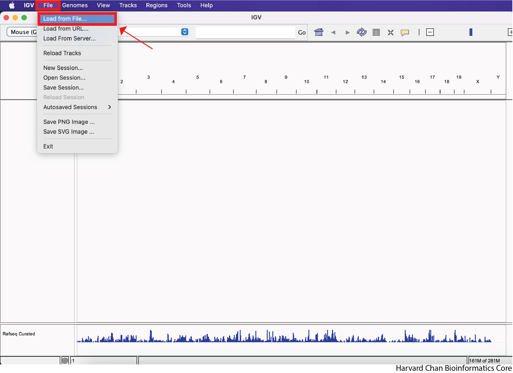

Next, navigate in your file browser to the file you'd like to load, then left-click to select it and left-click "Open". In this case we are trying to open the file called "cKO_H3K27ac_ChIPseq_REP3.bigWig", which should be inside your "bigWig" directory within your "data" directory:

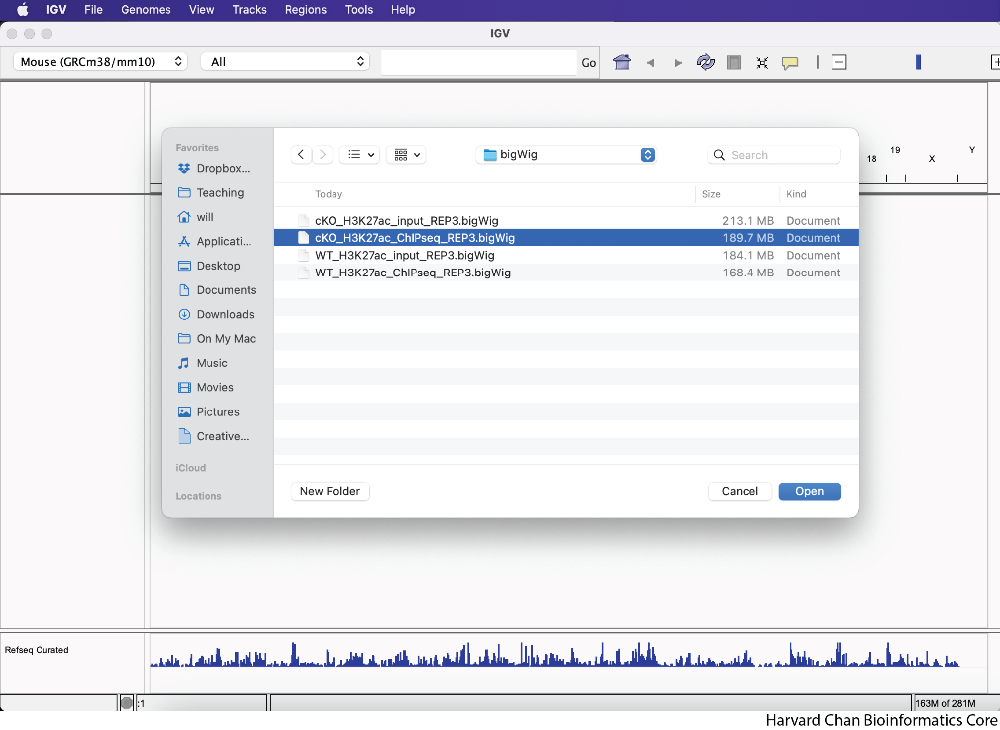

After loading the cKO IP replicate 3 BigWig track, your IGV session should look like:

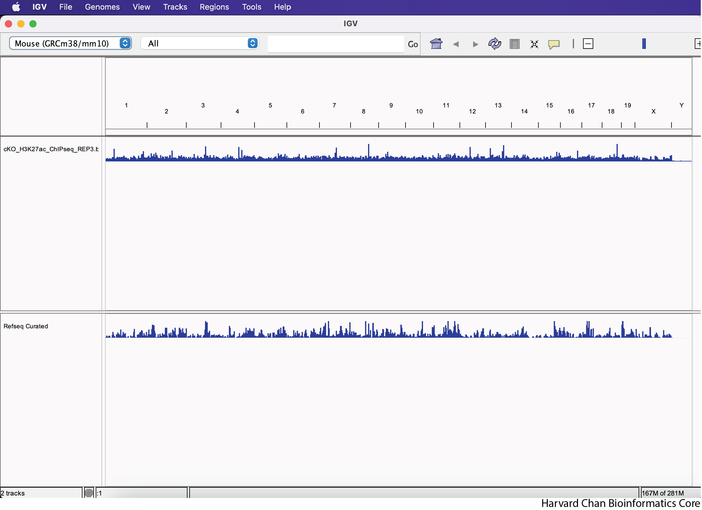

### Exercise 

Load the three additional BigWig files you were provided within the "BigWig" directory along with the two BED files within the "DiffBind" directory. Were the BED files loaded in the same area in IGV as the BigWig tracks? If not, where did they load?

<b>Click here to see what your IGV window should look like after loading these files</b>

  Note: The order of the track is dependent on the order that you loaded the tracks in, so your track order <i>may</i> be different than in the image below.
  

  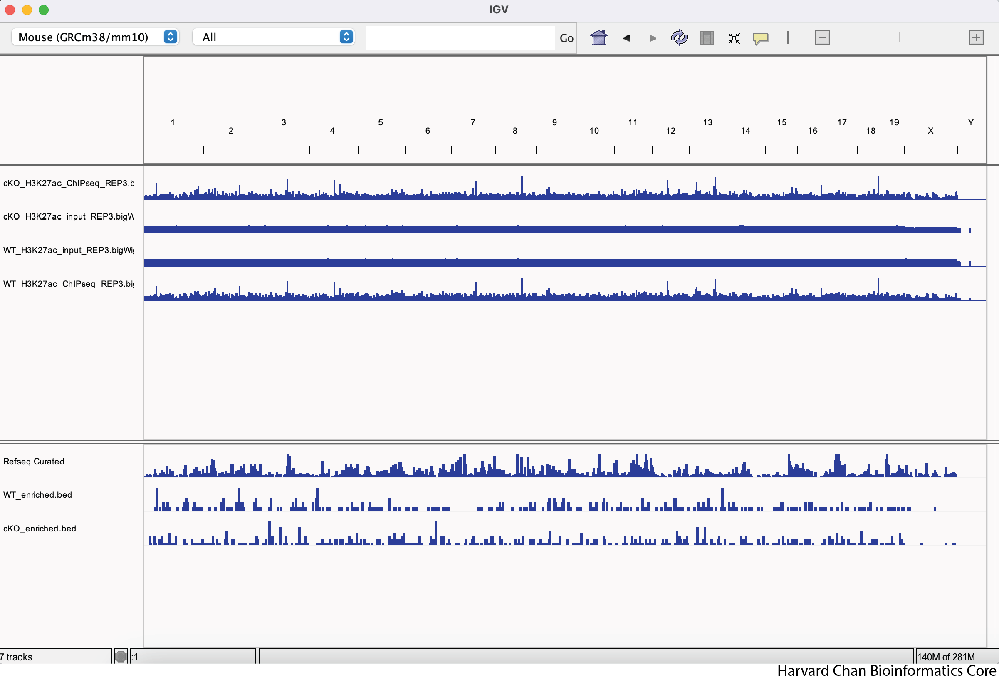
  

### Moving tracks

Oftentimes, just because you loaded some tracks, that doesn't mean that they are arranged in the order that you would like them to be in. IN order to change the order of the tracks we will left-click on the track where the track's name is located and move it to where you'd like to se it. This process is visualized in the GIF below:

### Exercise

Re-order the tracks so that the WT tracks are above the cKO tracks and the IP samples are above the input samples for their respective experimental condition. Your IGV browser should look like:

### Navigating in IGV

When using IGV it is critical that you are able to navigate to the place in the genome that you are interested in viewing. Below we will discuss a couple of ways to navigate around the genome in the IGV browser.

#### Zooming in and out on regions

The first way that we can zoom in on a region in IGV is to left-click and hold while dragging over the region we are interested in. This can be iteratively done as one narrows down the region that they are interested in viewing. This process is visualized in the GIF below:

We can zoom in and out using the <kbd>+</kbd> and <kbd>-</kbd>, respectively, on the right of the top bar. This process is visualized in the GIF below:

#### Jumping to regions

Rather than zooming in on a region, you may already have an idea of where you you would like to analyze and you would like to just jump right to that region. Let's go to a region where we might want to inspect a peak that DiffBind has informed us shows is very significant differentially binding. It is located on Chromosome 13 from 64,400,764 to 64,401,164, but let's broaden our region by a kilobase on each side in order to give us some context of the genomic landscape around this differentially expressed peak. In the genomic coordinates box in the top-center of the IGV browser, let's enter `chr13:64,399,764-64,402,164` and left-click "Go".

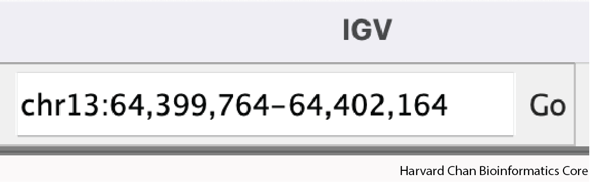

The IGV window should look like:

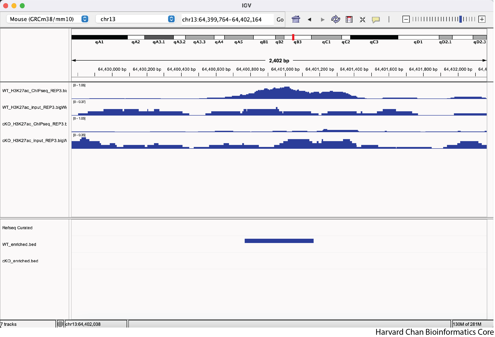

### Modifying Tracks

At this point, we have identified a region that we'd like to investigate, but we need to clean up the aesthetics of this region in order for us to more clearly evaluate this peak, which DiffBind has indicated shows significant differentially binding.

#### Adjust data range

One of the most important steps when comparing between tracks with quantitative ranges like BigWig files, is that you'll need to set the data range to be the same across all tracks. We can look at our IGV browser and look in the top-left of each track (to the right of the track's name) and we will see the track's minimum and maximum data range displayed as [Minimum - Maximum]. 

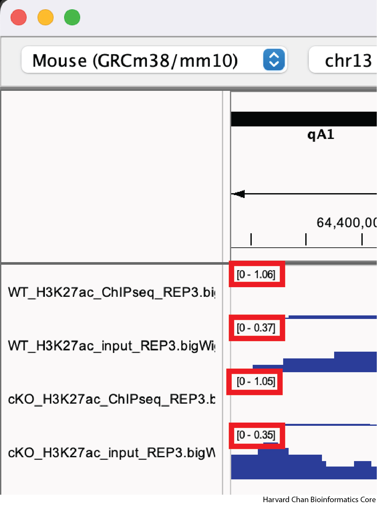

There are two ways to modify a track's data range:

- Setting each track's data range manually
- Utilizing IGV's `Group Autoscale` feature

##### Setting Data Range Manually

Let's first look at setting a track's data range manually. We can to right-click on our top track, WT_H3K27ac_ChIPseq_REP3.bigWig, and select "Set Data Range..." from the dropdown menu:

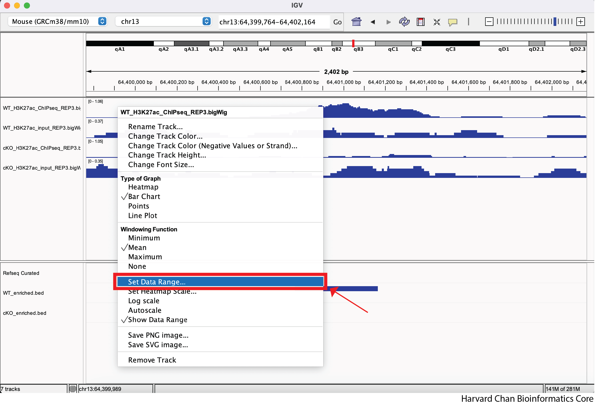

Next, let's alter the maximum to be 2 and left-click "OK" from the pop-up menu:

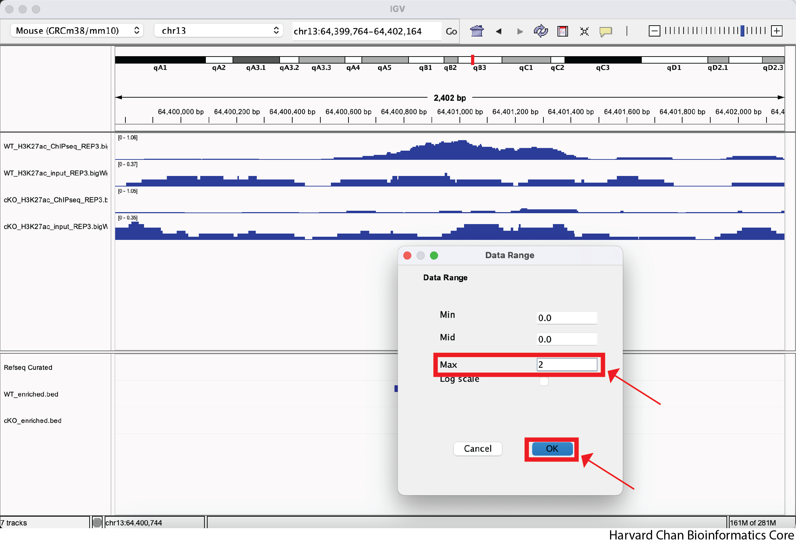

If we wanted, we could also alter the minimum value or make our data range be log-scaled from this pop-up menu. We can know see that our track's data range has changed from [0-1.06] to [0 - 2.00].

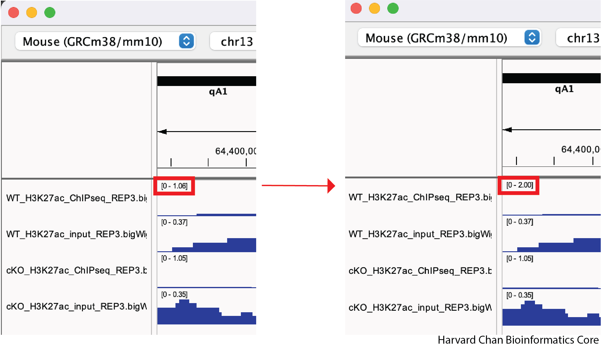

##### Using IGV's Group Autoscale

While it is nice to be able to adjust a data range, it can be tedious to do it across all of your samples in order to make your sample comparable. Furthermore, if you move to a different location in the genome to look at a different peak, you will likely need to re-adjust your data ranges. Fortunately, IGV has a nifty function called "Group Autoscale" that can help with this. It will:

- Automatically adjust the data range for all of the sample in the group to be the same
- Automatically re-adjust the data range as genomic coordinates change

In order to use the "Group Autoscale" function in IGV you will need to select all of the tracks you would like to group by either:

- Selecting a range of track while holding <kbd>Shift</kbd>
- Selecting tracks individually while holding <kbd>Command</kbd> on MacOS or <kbd>Ctrl</kbd> on Windows 

Next, right-click in the track names area and select the "Group Autoscale" function. Now, the tracks will be have the same datsa range and will automatically adjust as the data range changes. This process is visualized in the GIF below:

#### Adjust track height

We can see in our IGV browser that there is a lot of whitespace that we might like to have our tracks occupy. There are a two ways to adjust the height of the tracks so that they occupy some of the white space. First, we can right-click on a track and select "Change Track Height...". Then select a new height and left-click "OK". This process is visualized in the GIF below:

Alternatively, we canuse the "Resize tracks to fit in window" button on the top of our IGV browser to resize all of our tracks to take up more of the whitespace. This process is visualized in the GIF below:

If you have too few tracks there still might be some whitespace left and if you have twoo many it may only squish them to a certain point before offering you the option to scroll down through the tracks.

#### Adjust color

#### Rename Tracks

#### Load track from URL
Remove

### Save a Session

### Load a Session

***

*This lesson has been developed by members of the teaching team at the [Harvard Chan Bioinformatics Core (HBC)](http://bioinformatics.sph.harvard.edu/). These are open access materials distributed under the terms of the [Creative Commons Attribution license](https://creativecommons.org/licenses/by/4.0/) (CC BY 4.0), which permits unrestricted use, distribution, and reproduction in any medium, provided the original author and source are credited.*
