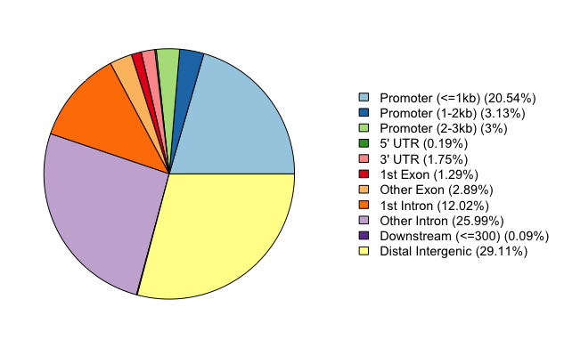
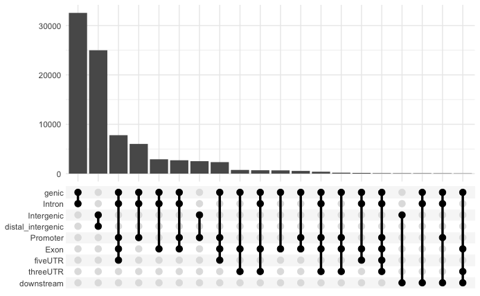
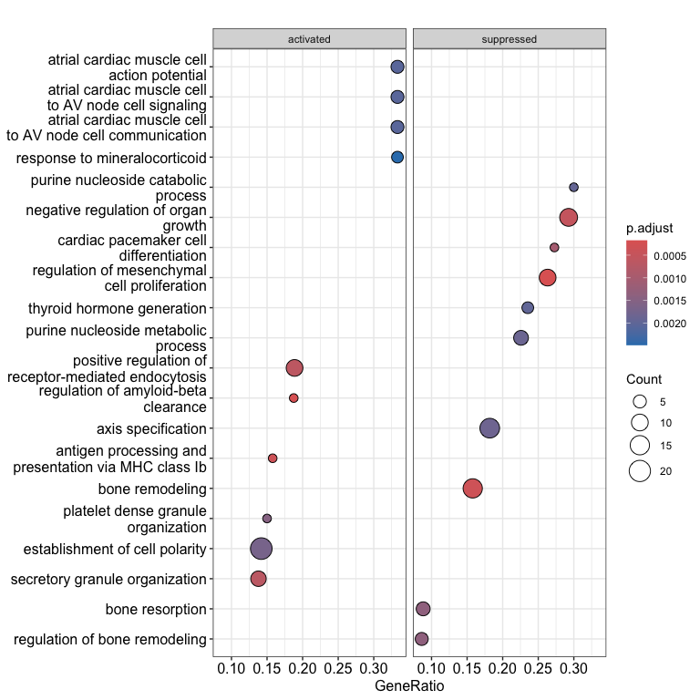
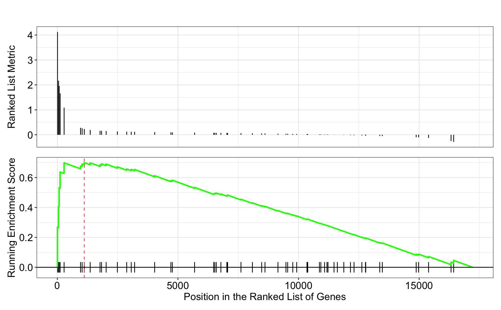

Contributors: Heather Wick, Upendra Bhattarai, Meeta Mistry

Approximate time: 

## Learning Objectives

* Annotate and visualize the differentially bound regions.
* Perform over-representation analysis using clusterProfiler on the significant genes from DiffBind.
* Discuss the Functional analysis approaches and the biological insights from the analysis.

## Overview

Functional enrichment analysis will determine whether some functions are enriched in the differentially bound sites. In this step, we will map the differentially bound sites to a functional annotation database and visualize the enrichment. This analysis provides insights into the collective function of a group of genes rather than focusing on individual genes.

Functional enrichment analysis typically involves three key decision steps:

1. Over-Representation Analysis (ORA) vs Gene Set Enrichment Analysis.
2. Use of different gene identifiers and gene descriptions for functional annotation (Entrezid, Uniprot, KEGG, etc.)
3. Using R/python or Web-based tools.
4. Interpreting the results.

In this session, we will peform Over Representation Analysis (ORA) using the R Bioconductor package called `clusterProfiler`.

# Over-representation analysis

Over Representation Analysis (ORA) determines whether the biological functions or pathways associated with a list of genes of interest are over-represented (i.e occur more frequently than expected by chance) when compared to the complete list of genes. 

Most genes in the genome have pre-existing annotations compiled through a combination of manual curation and computational algorithms. Various databases use controlled vocabularies to define genes and categorize them into groups (gene sets) based on shared functions, pathway involved, callular localization and more. 

A widely used gene annotation resource is the Gene Ontology (GO) database, which we will utilize in this workflow. 


## Hypergeometric test
The statistical method used to determine whether a category is over-represented is the Hypergeometric test.

The hypergeometric distribution describes the probability of observing some number of genes (k) associated with a specific functional category (e.g "Functional category 1") in a list of of all of the genes (n), compared to the total number of genes (M) associated with that functional category in the entire genome with (N) genes.

The p-value is calcualted using the formula:

$$ P(X = k) = \frac{\binom{K}{k} \binom{N - K}{n - k}}{\binom{N}{n}} $$

Where:

- k: Number of genes assocaited with the functional category in the gene list.
- n: Total number of genes in the gene list.
- M: Total number of genes associated with the functional category in the genome.
- N: Total number of genes in the genome.


The test produces a p-value for each category tested, and multiple testing correction is applied to adjust these p-values. This ensures statistical rigor when identifying significantly over-represented categories.

# Running ORA with clusterProfiler

Now, let's analyze our significantly differentially bound sites and their nearest gene annotations to determine if any GO terms are over-represented in our gene list of interest. 

First, open an R script in RStudio and load the GRange object saved from the results of the DiffBind analysis along with the packages we will need.


```{r}
#Libraries to load if not already loaded
library(GenomicRanges)
library(ChIPseeker)
library(TxDb.Hsapiens.UCSC.hg19.knownGene)
library(clusterProfiler)

# Load result from DiffBind analysis
res_all <- readRDS("res_all.rds")
```

## Annotating Peaks with ChIPseeker

Many annotation tools use nearest gene methods for assigning a peak to a gene in which the algorithm looks for the nearest TSS to the given genomic coordinates and annotates the peak with that gene. This can be misleading as binding sites might be located between two start sites of different genes.

The `annotatePeak()` function, as part of the `ChIPseeker`///÷ package, uses the nearest gene method described above but also provides parameters to specify a max distance from the TSS. For annotating genomic regions, annotatePeak will not only give the gene information but also reports detail information when genomic region is Exon or Intron.

This GRange object `res_all` contains results from the Diffbind analysis, including genomic coordinates, fold change, p-values, and FDR for each analyzed site. Before functional analysis, we need to annotate the genomic loci with their nearest gene names.

```{r}
annot_res_all <- annotatePeak(res_all, tssRegion = c(-3000, 3000), TxDb = TxDb.Mmusculus.UCSC.mm10.knownGene, annoDb = "org.Mm.eg.db")
```

## Visualization of Peak Annotation
We can visualize the annotation to better understand the distribution of genomic features.

### Pie chart
```{r}
plotAnnoPie(annot_res_all)
```

<p align="center">

</p>

### Bar plot
```{r}
plotAnnoBar(annot_res_all)
```
<p align="center">

</p>

### Upset plot
```{r}
upsetplot(annot_res_all)
```
<p align="center">

</p>

### Distance to TSS
```{r}
plotDistToTSS(annot_res_all)
```
<p align="center">

</p>

## Preparing Data for ORA

To run ORA analysis we need a background dataset and a query dataset. In our case, we will use all the sites in our analysis as a background and significantly upregulated sites in cKO vs WT as a query set for the hypergeometric test.


Convert the annotated GRange object to a dataframe.
```{r}
annot_res_all_df <- as.data.frame(annot_res_all)
```

Create the background dataset.
```{r}
background_set <- as.character(annot_res_all_df$geneID)
```

Extract gene list for the significantly upregulated genes in cKO vs WT to prepare a query set.

```{r}
sigUp <- dplyr::filter(annot_res_all_df, FDR < 0.05, Fold > 0)
sigUp_genes <- as.character(sigUp$geneId)
```

Now we can perform ORA with Gene Ontology (GO) dataset as follows.

```{r}
go_ORA_Up <- enrichGO(gene = sigUp_genes,
                      universe = background_set,
                      keyType = "ENTREZID",
                      OrgDb = org.Mm.eg.db,
                      ont = "ALL",
                      pAdjustMethod = "BH",
                      qvalueCutoff = 0.05,
                      readable = TRUE)
```

> Note: The ont argument can accept either "BP" (Biological Process), "MF" (Molecular Function), and "CC" (Cellular Component) subontologies, or "ALL" for all three.

Lets save the ORA results

```{r}
go_ORA_Up_df <- data.frame(go_ORA_Up)
write.csv(go_ORA_Up_df, "results/GO_ORA_clusterProfiler_cKO_vs_WT_Upregulated.csv
```

# Exploring results from ORA analysis.

Let's take a look at what terms are identified as over-represented in the up-regulated genes in cKO vs WT.
```{r}
View(go_ORA_Up_df)
```
#### Key Columns in Results
In the first few columns we see the GO identifier and the descriptive term name. In the next two columns that follow, we observe GeneRatio and BgRatio. These values allows us to compare the overlaps to the background.

BgRatio: M/N
The total number of genes in the GO term gene set (M), divided by the total number of genes in universe (N)

GeneRatio: k/n
The total number of genes in our sig DE gene set which overlap with the GO term gene set (k), divided by the total number of genes in our sig DE gene set that overlap with the universe gene set (n).

Other columns of interest are the p.adjust column (by which results are ordered by default), and the geneID column which lists the gene symbols of the overlapping genes.

<p align="center">

</p>

Exercise:
1. Carryout the ORA for the down regulated sites in cKO vs WT result.
2. Do you find any significantly over represented terms?

# Plotting the ORA results

There are multiple options to plot the ORA results through clusterProfiler. Lets explore a few of them:

## Dotplot
This plot visualizes the top GO terms based on gene ratio not p-adjusted value. The dot size reflect the gene count and color represents the adjusted p-values.

<p align="center">

</p>

## Enrichment plot
An enrichment map organizes enriched terms into a network where nodes represent the enriched terms, and edges signify gene overlaps between those terms. Terms with a greater number of overlapping genes tend to cluster closer together, forming functional modules. This visualization makes it easier to identify related biological themes or processes.

Before generating the enrichment plot, the similarity between terms must be computed using the `pairwise_termsim()` function. For detailed instrucitons, refer to the [emapplot documentation](https://rdrr.io/github/GuangchuangYu/enrichplot/man/emapplot.html). 

In the enrichment plot, the node color indicates the p-value of the terms relative to the displayed ones. The size of the terms represent the number of genes associated with each term.

This visualization provides an intuitive way to explore enriched pathways and their interconnections. 

```{r}
go_ORA_Up <- enrichplot::pairwise_termsim(go_ORA_Up)
emapplot(go_ORA_Up)
```

<p align="center">

</p>

# Gene Set Enrichment Analysis (GSEA)

Gene Set Enrichment Analysis (GSEA) employs a differnt statistical approach for functional enrichment of gene sets compared to Over-Representation Analysis (ORA). Unlike ORA, which subsets genes of interst using an arbitrary threshold, GSEA considers all genes as input. Gene-level statistics (e.g. log2 fold changes) are aggregated to generate pathway-level statistics, and the statistical significance of each pathway is reported. This approach is particularly useful when differnetial expression analysis yields a small list of significant differentially expressed (DE) genes. 

A widely used example of a Functional Class Scoring (FCS) method is GSEA [Subramanium A. et al, 2005](https://www.pnas.org/doi/10.1073/pnas.0506580102). Gene set enrichment identifies whether gene sets associated with specific biological pathways (e.g. KEGG, Gene Ontology, MSigDB, etc) are enriched among genes with the highest or lowest fold changes.

<p align="center">

</p>

Image source: [Subramanium A. et al, 2005](https://www.pnas.org/doi/10.1073/pnas.0506580102)

This image illustrates the theory of GSEA, where 'gene set S' highlights the metric used (e.g. ranked log2 fold changes) to assess the enrichment of genes in the gene set. The analysis involces four main steps:

1. Rank genes:
   
  - Genes are ranked based on a statistic, such as log2 fold changes.
    
2. Calculate enrichment scores for each gene set
   
  - This score measures how often genes in a set appear at the extremes (top or bottom) of the ranked list.
    
  - The score is computed by walking through the ranked list and:
        - Increasing the running-sum statistic for each gene in the set.
        - Decreasing the score for genes not in the set.
        - The magnitude of the score change depends on the fold change.

3. Estimate statistical significance
  - A permutation test is used to calculate a null distribution of enrichment score, providing a p-value for each pathway.
    
4. Adjust for multiple hypothesis testing
  - Enrichment scores are normalized for gene set size, and a false discovery rate (FDR) is calculated to control for false positives.


    
## Running GSEA with GO database

The `clusterProfiler` package offers several functions to perform GSEA using various genes sets, including GO, KEGG, and MSigDb. Below is an example using GO database.

We can use `msigdbr_species()` function to look at the information about species included in the dataset.

### Prepare input for GSEA

Extract fold changes and gene identifiers. GSEA will use the fold changes obtained from the differential expression analysis for every gene to perform the analysis. We need to create a sorted and named vector for input to `clusterProfiler`.

```{r}
gene_list <- annot_res_all_df$Fold
names(gene_list) <- annot_res_all_df$geneId

# remove duplicate genes
gene_list_dedup <- gene_list[!duplicated(names(gene_list))]

# sort gene list in decreasing order of the fold change
gene_list_sorted <- sort(gene_list_dedup, decreasing = TRUE)
```

### Run GSEA
```{r}
go_GSEA <- gseGO(geneList = gene_list_sorted,
               ont = "BP",
               keyType = "ENTREZID",
               verbose = FALSE,
               OrgDb = "org.Mm.eg.db",
               pAdjustMethod = "none")
```

Check the number of enriched terms
```{r}
dim(goGSEA)[1]
```

```{r, output}
[1] 341
```
> Note: we have set pAdjustMethod as none for this run. To use Benjamin Hochberg multiple correction, set it as "BH" and check the output.


Saving the results
```{r}
go_GSEA_results <- go_GSEA@result

# write results to a file
write.csv(go_GSEA_results, "results/go_GSEA_cko_vs_wt.csv", quote = FALSE)
```

> NOTE: The permutations are performed using random reordering, so every time we run the function we will get slightly different results. If we would like to use the same permutations every time we run a function, then we use the set.seed() function prior to running. The input to set.seed() can be any number.
>  ```{r}
>   set.seed(123) # replace 123 with any number
 > ```
    
### Inspect Results

Take a look at the results table and reorder by NES (normalized enrichment score). What terms do you see positively enriched? Does this overlap with what we observed from ORA analysis?

```{r}
go_GSEA_results %>% arrange(-NES) %>% View()
```

- The first few columns of the results table identify the gene set information.
- The following columns include the associated statistics.
- The last column will report which genes are part of the 'core enrichment'. These are the genes associated with the pathway which contributed to the observed enrichment score (i.e., in the extremes of the ranking).

### Dotplot

 ```{r}
dotplot(go_GSEA, showCategory=10, split = ".sign") +facet_grid(.~.sign)
```
<p align="center">

</p>

### GSEA visualization
Let's explore the GSEA plot of enrichment of one of the pathways in the ranked list using a built-in function from clusterProfiler.

```{r}
gseaplot(go_GSEA, geneSetID = 'GO:0033363')
```


<p align="center">

</p>

In the plot:
1. The lines in plot represent the genes in the gene set 'GO:0033363', and where they occur among the log2 fold changes.
2. The largest positive log2 fold changes are on the left-hand side of the plot, while the largest negative log2 fold changes are on the right.
3. The top plot shows the magnitude of the log2 fold changes for each gene.
4. The bottom plot shows the running sum, with the enrichment score peaking at the red dotted line (which is among the positive log2 fold changes). This suggests the up-regulation of this function.


# Functional enrichment: Web based tools

There are also web-based tool for enrichment analysis on genomic regions, and a popular one is [GREAT](http://great.stanford.edu/public/html/) (Genomic Regions Enrichment of Annotations Tool). GREAT is used to analyze the functional significance of cis-regulatory regions identified by localized measurements of DNA binding events across an entire genome [Reference paper](http://bejerano.stanford.edu/papers/GREAT.pdf). It incorporates annotations from 20 different ontologies and is an easy to use tool which generates annotation and downstream functional enrichement results for genomic coordinate files. The utility of GREAT is not limited to ChIP-seq, as it could also be applied to open chromatin, localized epigenomic markers and similar functional data sets, as well as comparative genomics sets.

In the interest of time we will not go into the details of using GREAT, however we have materials linked [here](https://hbctraining.github.io/Intro-to-ChIPseq/lessons/web_based_functional_analysis.html) if you are interested in testing it out with this dataset. There also [demo datasets](http://great.stanford.edu/public/html/demo.php) on the GREAT website that you can use to test out the functionality of the tool.

## Resources for functional analysis
In this lesson, we reviewed a few approaches for functional analysis and demonstrated the use of clusterProfiler package. Note that there are numerous other options out there, including the use of web-based tools. Below we list a few tools that we are familiar with:

g:Profiler - http://biit.cs.ut.ee/gprofiler/index.cgi

DAVID - https://david.ncifcrf.gov

clusterProfiler - http://bioconductor.org/packages/release/bioc/html/clusterProfiler.html

ReviGO (visualizing GO analysis, input is GO terms) - http://revigo.irb.hr/

WGCNA - https://horvath.genetics.ucla.edu/html/CoexpressionNetwork/Rpackages/WGCNA/ (no longer maintained)

GSEA - http://software.broadinstitute.org/gsea/index.jsp

SPIA - https://www.bioconductor.org/packages/release/bioc/html/SPIA.html

GAGE/Pathview - http://www.bioconductor.org/packages/release/bioc/html/gage.html


***

*This lesson has been developed by members of the teaching team at the [Harvard Chan Bioinformatics Core (HBC)](http://bioinformatics.sph.harvard.edu/). These are open access materials distributed under the terms of the [Creative Commons Attribution license](https://creativecommons.org/licenses/by/4.0/) (CC BY 4.0), which permits unrestricted use, distribution, and reproduction in any medium, provided the original author and source are credited.*
