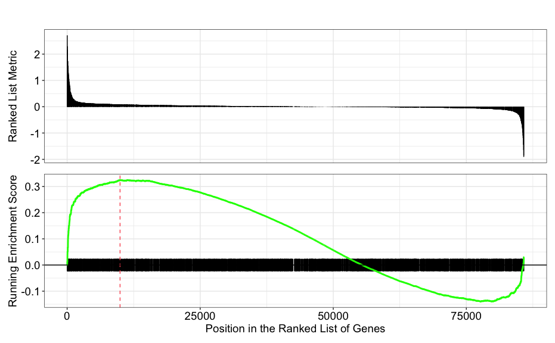

Contributors: Heather Wick, Upendra Bhattarai, Meeta Mistry

Approximate time: 

## Learning Objectives

* Annotate and visualize the differentially bound regions.
* Perform over-representation analysis using clusterProfiler on the significant genes from DiffBind.
* Discuss the Functional analysis approaches and the biological insights from the analysis.


## Overview

Functional enrichment analysis will determine whether some functions are enriched in the differentially bound sites. Here, we will map the differentially bound sites to a functional annotation database and visualize the enrichment. Functional enrichment analysis gives insights on the collective function of the group of genes rather than individuals.

This is the next step after we get a list of differentially bound sites in the comparison.
Functional enrihment analysis generally follows following three decision steps.

1. Use of different gene identifiers and gene descriptions for functional annotation (Entrezid, Uniprot, KEGG, etc.)
2. Over-Representation Analysis (ORA) vs Gene Set Enrichment Analysis.
3. Using R or Web-based tools.
4. Interpreting the results.

In this session, we will peform Over-representation analysis (ORA) using an R Bioconductor package called `clusterProfiler`.

# Over-representation analysis

Over-representation analysis is used to determine whether the biological functions or pathways represented in the list of interesting genes occur more than expected by chance (over-represented) compared to the biological functions or pathway in the complete list of genes. Most genes in the genome have some pre-existing annotation associated with it which has been compiled through a combination of manual curation and computational algorithms. There are a number of existing databases which define genes using a controlled vocabulary and then categorize genes into groups (gene sets) based on shared function, or involvement in a pathway, or presence in a specific cellular location etc. A very commonly used gene annotataion resource is the Gene Ontology (GO) database, and is what we will use in our workflow.

## Hypergeometric test
The statistical test that will determine whether something is actually over-represented is the Hypergeometric test.

Hypergeometric distribution is a probability distribution that describes the probability of some number of genes (k) being associated with "Functional category 1", for all genes in our gene list (n), compared to drawing some number of genes (M) associated with "Functional category 1" from a population of all of the genes in entire genome (N).

The p-value can be calculated as:

$$ P(X = k) = \frac{\binom{K}{k} \binom{N - K}{n - k}}{\binom{N}{n}} $$

This test will result in an adjusted p-value (after multiple test correction) for each category tested.

# Running ORA with clusterProfiler

Now lets take our significantly differentially bound sites and their nearest gene annotation to determine if there are any GO terms over-represented in the list of our gene of interest. 

First open a R script in our RStudio and load the GRange object saved with the result from DiffBind analysis.


```{r}
#Libraries to load if not already loaded
library(GenomicRanges)
library(ChIPseeker)
library(TxDb.Hsapiens.UCSC.hg19.knownGene)
library(clusterProfiler)

res_all <- readRDS("res_all.rds")

```

Annotate the with ChipSeeker
This GRange object contains the result output from the Diffbind analysis. It has the information about the sites those were analysed with genomic coordinates and the other statistics like Fold change, pvalue and FDR for each of those sites.
Before we proceed with the functional analysis, we need to annotate the site loci with the nearest gene name. To do that we will use chipSeeker.

```{r}
annot_res_all <- annotatePeak(res_all, tssRegion = c(-3000, 3000), TxDb = TxDb.Hsapiens.UCSC.hg38.knownGene, annoDb = "org.Hs.eg.db")
```

Note: You can plot the annotation using chipSeeker to see the distribution of genomic features in our result file.

```{r}
plotAnnoPie(annot_res_all)
plotAnnoBar(annot_res_all)
upsetplot(annot_res_all)
plotDistToTSS(annot_res_all)
```

To run ORA analysis we need a background dataset and a query dataset. In our case, we will use all the sites in our analysis as a background and significantly upregulated sites in cKO vs WT as a query set for the hypergeometric test.


Lets convert the annotated GRange object to a dataframe.
```{r}
annot_res_all_df <- as.data.frame(annot_res_all)
```

Create a background dataset for the hypergeometric testing.

```{r}
background_set <- as.character(annot_res_all_df$geneID)
```

Extract gene list for the significantly upregulated genes in cKO vs WT to prepare a query set for ORA.

```{r}
sigUP <- dplyr::filter(annot_res_all_df, FDR < 0.1, Fold > 0)
sigUp_genes <- as.character(sigUp$geneId)
```
Now we can perform ORA with Gene Ontology (GO) dataset as follows.
```{r}
go_ORA_Up <- enrichGO(gene = sigUp_genes,
                      universe = background_set,
                      keyType = "ENTREZID",
                      OrgDb = org.Hs.eg.db,
                      ont = "ALL",
                      pAdjustMethod = "BH",
                      qvalueCutoff = 0.05,
                      readable = TRUE)
```

Note: Note 1: The different organisms with annotation databases available to use with for the OrgDb argument can be found here.

Note 2: The keyType argument may be coded as keytype in different versions of clusterProfiler.

Note 3: The ont argument can accept either "BP" (Biological Process), "MF" (Molecular Function), and "CC" (Cellular Component) subontologies, or "ALL" for all three.

Lets save the ORA results

```{r}
go_ORA_Up_df <- data.frame(go_ORA_Up)
write.csv(go_ORA_Up_df, "results/GO_ORA_clusterProfiler_cKO_vs_WT_Upregulated.csv
```

# Exploring results from ORA analysis.

Let's take a look at what terms are identified as over-represented in the genes up-regulated in cold conditions.
```{r}
View(go_ORA_Up_df)
```
In the first few columns we see the GO identifier and the descriptive term name. In the next two columns that follow, we observe GeneRatio and BgRatio. These values allows us to compare the overlaps to the background.

BgRatio: M/N
The total number of genes in the GO term gene set (M), divided by the total number of genes in universe (N)

GeneRatio: k/n
The total number of genes in our sig DE gene set which overlap with the GO term gene set (k), divided by the total number of genes in our sig DE gene set that overlap with the universe gene set (n).

Other columns of interest are the p.adjust column (by which results are ordered by default), and the geneID column which lists the gene symbols of the overlapping genes.

<p align="center">

</p>

Exercise:
1. Carryout the ORA for the down regulated sites in cKO vs WT result.
2. Do you find any significantly over represented terms?

# Plotting the ORA results

There are multiple options to plot the ORA results through clusterProfiler. Lets explore few of them:

## Dotplot
It shows statistics associated with a user-selected top number (default=10) of significant terms. The color of the dots represent the p-adjusted values for these terms, and size of the dots corresponds to the total count of sig DE genes annotated with the GO term (count). This plot displays the enriched GO terms ordered by gene ratio, not p-adjusted value.

<p align="center">

</p>

## Enrichment plot
Enrichment map arranges enriched terms into a network, where nodes represents the enriched terms and edges representing gene overlaps between nodes. This way nodes with bigger number of overlapping genes tends to cluster closer, making it easy to identify functional modules. Before creating the plot, we will need to obtain the similarity between terms using the `pairwise_termsim()` function [instructions for emapplot](https://rdrr.io/github/GuangchuangYu/enrichplot/man/emapplot.html). In the enrichment plot, the color represents the p-values relative to the other displayed terms (brighter red is more significant), and the size of the terms represents the number of genes that are significant from our list.

```{r}
go_ORA_Up <- enrichplot::pairwise_termsim(go_ORA_Up)
emapplot(go_ORA_Up)
```

<p align="center">

</p>

# Gene Set Enrichment Analysis (GSEA)

GSEA follows a different statistical approach on functional enrichment of gene sets. Unlike ORA, which requires to subset the gene of interest using an arbitrary threshold, GSEA takes all the genes as input. The gene-level statistics from the dataset are aggregated to generate a single pathway-level statistic and statistical significance of each pathway is reported. This type of analysis can be particularly helpful if the differential expression analysis only outputs a small list of significant DE genes.

A commonly used example of an FCS method is GSEA [Subramanium A. et al, 2005](https://www.pnas.org/doi/10.1073/pnas.0506580102). Gene set enrichment analysis utilizes the gene-level statistics or log2 fold changes for all genes to look to see whether gene sets for particular biological pathways (e.g., derived from KEGG pathways, Gene Ontology terms, MSigDB, etc) are enriched among the large positive or negative fold changes.

<p align="center">

</p>

Image source: [Subramanium A. et al, 2005](https://www.pnas.org/doi/10.1073/pnas.0506580102)

This image describes the theory of GSEA, with the 'gene set S' showing the metric used (in our case, ranked log2 fold changes) to determine enrichment of genes in the gene set. There are four main steps that are being performed:

1. Rank genes:
  - Genes in a data set are ranked based on the given statistic, which in our case is the log2 fold changes.
2. Calculate enrichment scores for each gene set
  - This score reflects how often genes in the set appear at the top or bottom of the ranked list.
  - The score is calculated by walking down the list of log2 fold changes and increasing the running-sum statistic every time a gene in the gene set is encountered and decreasing it when genes are not part of the gene set.
  - Increase/decrease is determined by magnitude of fold change.
3. Estimate statistical significance
  - A permutation test is used to calculate a null distribution for the enrichment score. This produces a p-value that represents the probability of observing a given enrichment score.
4. Adjust for multiple hypothesis testing
  - Enrichment scores are normalized for the size of each gene set and a false discovery rate is calculated to prevent false positives.
    
## Running GSEA with MSigDB gene sets

The clusterProfiler package offers several functions to perform GSEA using different genes sets, including but not limited to GO, KEGG, and MSigDb. We will use the MSigDb gene sets in our example below. The Molecular Signatures Database (also known as MSigDB) is a collection of annotated gene sets.

We can use msigdbr_species() function to look at the information about species included in the dataset.

```{r}
msigdbr_species()
```

To look at what gene sets are available

```{r}
msigdbr_collections()
```
For our analysis we will select the human C5 collection. which is the collection of GO database. From the table, we only need two columns, Gene set name and the Gene symbol.

```{r}
m_t2g <- msigdbr(species = "Homo sapiens", category = "C5") %>%
  dplyr::select(gs_name, gene_symbol)
```

Now we need to extract fold chance and gene identifier. GSEA will use the fold changes obtained from the differential expression analysis for every gene to perform the analysis. We need to create an ordered and named vector for input to clusterProfiler.

```{r}
fold_change <- annot_res_all_df$Fold
names(fold_change) <- annot_res_all_df$SYMBOL
fold_change <- sort(fold_change, decreasing = TRUE)
```

Now lets run GSEA
```{r}
msig_GSEA <- GSEA(fold_change, TERM2GENE = m_t2g, verbose = FALSE)
msig_GSEA_results <- msig_GSEA@result

# write results to a file
write.csv(msig_GSEA_results, "results/gsea_msigdb_GO_cko_vs_wt.csv, quote=F)
```

NOTE: The permutations are performed using random reordering, so every time we run the function we will get slightly different results. If we would like to use the same permutations every time we run a function, then we use the set.seed() function prior to running. The input to set.seed() can be any number.

Take a look at the results table and reorder by NES (normalized enrichment score). What terms do you see positively enriched? Does this overlap with what we observed from ORA analysis?

```{r}
msig_GSEA_results %>% arrange(-NES) %>% View()
```

- The first few columns of the results table identify the gene set information.
- The following columns include the associated statistics.
- The last column will report which genes are part of the 'core enrichment'. These are the genes associated with the pathway which contributed to the observed enrichment score (i.e., in the extremes of the ranking).

### Dotplot

 ```{r}
dotplot(msig_GSEA, split=".sign") +facet_grid(.~.sign)
```

### GSEA visualization
Let's explore the GSEA plot of enrichment of one of the pathways in the ranked list using a built-in function from clusterProfiler. We can pick the top term

```{r}
gseaplot(msig_GSEA, geneSetID = 'GOBP_MUSCLE_STRUCTURE_DEVELOPMENT')
```


<p align="center">

</p>

In this plot, the lines in plot represent the genes in the gene set 'GOBP_MUSCLE_STRUCTURE_DEVELOPMENT', and where they occur among the log2 fold changes. The largest positive log2 fold changes are on the left-hand side of the plot, while the largest negative log2 fold changes are on the right. The top plot shows the magnitude of the log2 fold changes for each gene, while the bottom plot shows the running sum, with the enrichment score peaking at the red dotted line (which is among the positive log2 fold changes). This suggests the up-regulation of this function.


## Resources for functional analysis
In this lesson we reviewed two different approaches for functional analysis and demonstrated the with the use of the clusterProfiler package. Note that there are numerous other options out there, including the use of web-based tools. Below we list a few tools that we are familiar with:

g:Profiler - http://biit.cs.ut.ee/gprofiler/index.cgi
DAVID - https://david.ncifcrf.gov
clusterProfiler - http://bioconductor.org/packages/release/bioc/html/clusterProfiler.html
ReviGO (visualizing GO analysis, input is GO terms) - http://revigo.irb.hr/
WGCNA - https://horvath.genetics.ucla.edu/html/CoexpressionNetwork/Rpackages/WGCNA/ (no longer maintained)
GSEA - http://software.broadinstitute.org/gsea/index.jsp
SPIA - https://www.bioconductor.org/packages/release/bioc/html/SPIA.html
GAGE/Pathview - http://www.bioconductor.org/packages/release/bioc/html/gage.html


***

*This lesson has been developed by members of the teaching team at the [Harvard Chan Bioinformatics Core (HBC)](http://bioinformatics.sph.harvard.edu/). These are open access materials distributed under the terms of the [Creative Commons Attribution license](https://creativecommons.org/licenses/by/4.0/) (CC BY 4.0), which permits unrestricted use, distribution, and reproduction in any medium, provided the original author and source are credited.*
