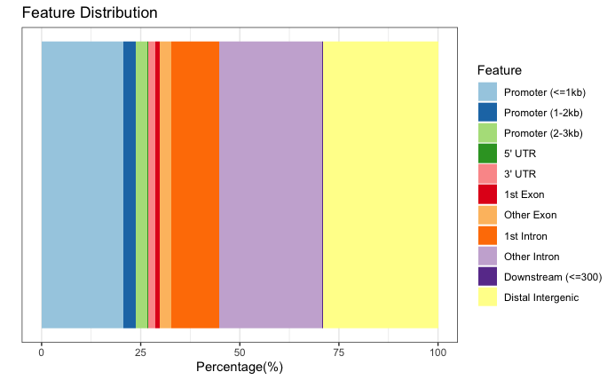
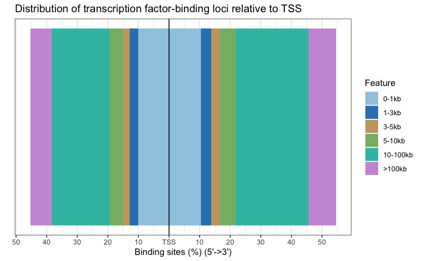
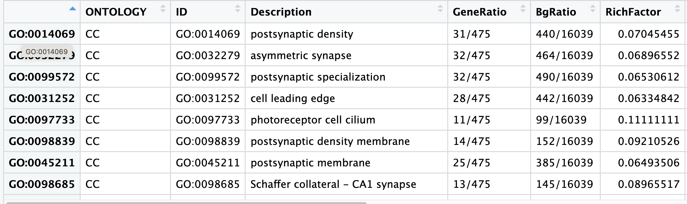
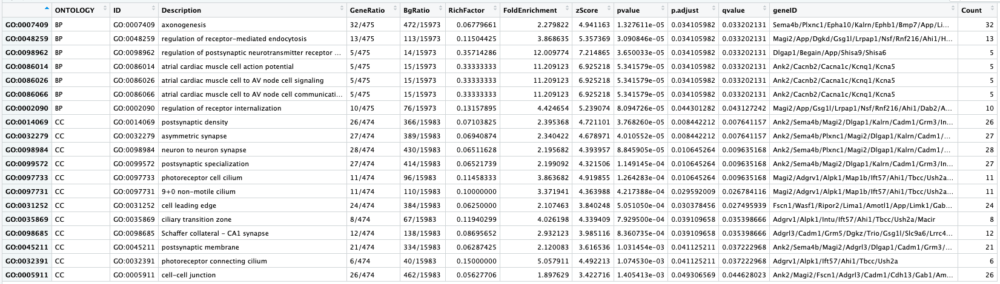
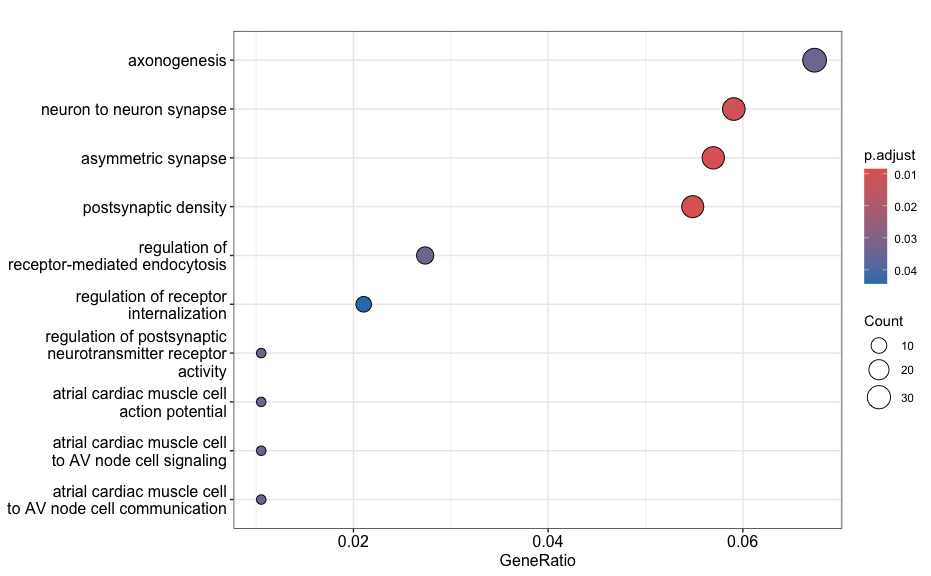
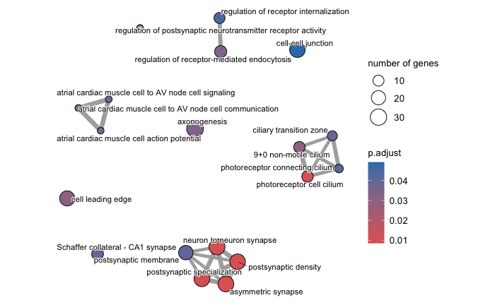
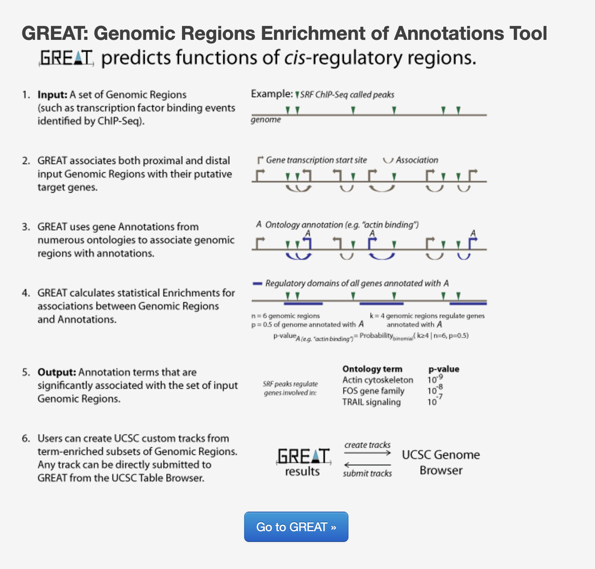

Contributors: Upendra Bhattarai, Meeta Mistry

Approximate time: 40 minutes

## Learning objectives

* Annotate and visualize the differentially bound regions
* Perform over-representation analysis using clusterProfiler on the target genes from DiffBind
* Discuss functional analysis approaches and the biological insights from the analysis

## Functional analysis of differentially enriched regions

At this point in the workflow we have a list of genomic regions that we know exhibit differences in enrichment between the WT and cKO samples. These coordinates do not give us much for biological context, and so a first step would be to **annotate these regions with nearest gene annotations** as we had done in a [previous lesson](04_peak_annotation_and_visualization.md). Once have target gene information, we can use that to perform functional enrichment analysis to help **determine whether particular biological processes or pathways are being dysregulated**. This analysis uses gene annotation databases to  provides insights into the collective function of a group of genes rather than focusing on individual genes.

## Annotation of differentially enriched regions

First, let's open an R script called `functional_analysis.R`. Inside we'll add a header and start with loading the required libraries. If you do not have the `res_deseq` or `txdb` objects in your environment you can go ahead and load them in too.

```{r}
# Functional analysis of DE regions

# Load libraries 
library(GenomicRanges)
library(ChIPseeker)
library(TxDb.Mmusculus.UCSC.mm10.knownGene)
library(clusterProfiler)

# Load result from DiffBind analysis if not present in your environment
res_deseq <- readRDS("all_res_deseq2.rds")

# Set the annotation database if not present in your environment
txdb <- TxDb.Mmusculus.UCSC.mm10.knownGene
```

The GRanges object `res_deseq` contains results from the Diffbind analysis, including genomic coordinates, fold change, p-values, and FDR for each analyzed site. Before functional analysis, we first need to annotate the genomic loci with their nearest gene names. We can do this using the `annotatePeak()` function in the ChIPseeker package.

```{r}
# Add annotations to our DiffBind results
annot_res_all <- annotatePeak(res_deseq,
                              tssRegion = c(-3000, 3000),
                              TxDb = TxDb.Mmusculus.UCSC.mm10.knownGene,
                              annoDb = "org.Mm.eg.db")
```

We can visualize the annotation to better understand the distribution of genomic features among these regions using some of the plots we have introduced previously in the Peak Annotation lesson. Since we are using all results here, the binding regions are a very close representation to the annotation observed for each individual sample, and so this result is not surprising.

Now that we have a gene annotation for each region, we can use these genes as input to some commonly used functional analysis tools!

### Bar plot
```{r}
# Barplot
plotAnnoBar(annot_res_all)
```
<p align="center">

</p>

### Distance to TSS
```{r}
# TSS distance plot
plotDistToTSS(annot_res_all)
```
<p align="center">

</p>

***

**Exercise:**

1. Subset the `annot_res_all` to keep only the results with FDR < 0.05 and save it to a variable called `annot_sig_all`. Now create the same annotation plots. Do you observe any difference?
2. Further subset the significant results by filtering on on fold change (`Fold`). Save the results into variables called `annot_sig_up` and `annot_sig_down`. Now create the same annotation plots. Do you observe any difference?

***

## Over-representation analysis

Over-Representation Analysis (ORA) determines whether the biological functions or pathways associated with a list of genes of interest are over-represented (i.e., occur more frequently than expected by chance) when compared to the complete list of genes. 

Most genes in the genome have pre-existing annotations compiled through a combination of manual curation and computational algorithms. Various databases use controlled vocabularies to define genes and categorize them into groups (gene sets) based on shared functions, pathways involved, cellular localization, and more. 

A widely-used gene annotation resource is the Gene Ontology (GO) database, which we will utilize in this workflow. A schematic describing ORA is displayed below.

<p align="center">

</p>

### Hypergeometric test
The statistical method used to determine whether a category is over-represented is the hypergeometric test.

The hypergeometric distribution describes the probability of observing some number of genes (k) associated with a specific functional category (e.g., "Functional category 1") in a list of of all of the genes (n), compared to the total number of genes (M) associated with that functional category in the entire genome with (N) genes.

The p-value is calculated using the formula:

$$ P(X = k) = \frac{\binom{K}{k} \binom{N - K}{n - k}}{\binom{N}{n}} $$

Where:

- k: Number of genes associated with the functional category in the gene list.
- n: Total number of genes in the gene list.
- M: Total number of genes associated with the functional category in the genome.
- N: Total number of genes in the genome.

The test produces a p-value for each category tested, and multiple testing correction is applied to adjust these p-values. This ensures statistical rigor when identifying significantly over-represented categories.

### Running ORA with clusterProfiler
Now, let's analyze our significantly differentially bound sites and their nearest gene annotations to determine if any GO terms are over-represented in our gene list of interest. To run ORA analysis, we will be using [clusterProfiler](https://bioconductor.org/packages/release/bioc/vignettes/clusterProfiler/inst/doc/clusterProfiler.html), an R package used for the statistical analysis and visualization of functional profiles for genes and gene clusters. This package is commonly used for functional analysis of differentially expressed genes in RNA-seq analysis. We highlight a few use cases in this lesson, but encourage you to peruse the vigenette in more detail.

We need a background set of genes and a query set of genes to run over-representation analysis. In our case, we will use the gene annotations from all the sites in our analysis as our background, and the significantly up-regulated sites in cKO vs WT as a query set for the hypergeometric test.

First, let's convert the annotated GRanges object to a dataframe, and then we can pull the gene ID column.

```{r}
# Create a dataframe from anno results
annot_res_all_df <- as.data.frame(annot_res_all)

# Get background gene set
background_set <- as.character(annot_res_all_df$SYMBOL)
```

Now we can extract gene lists for the significantly upregulated genes in cKO vs WT to prepare a query set.

```{r}
# Prepare gene set query for up-regulated genes
sigUp <- dplyr::filter(annot_res_all_df, FDR < 0.05, Fold > 0)
sigUp_genes <- as.character(sigUp$SYMBOL)
```

Finally, we can perform ORA with Gene Ontology (GO) dataset using the `enrichGO` function. Note that the gene IDs we input are gene symbols and so we specify that in the `keyType` argument.

```{r}
# Run over-representation analysis
go_ORA_Up <- enrichGO(gene = sigUp_genes,
                      universe = background_set,
                      keyType = "SYMBOL",
                      OrgDb = org.Mm.eg.db,
                      ont = "ALL",
                      pAdjustMethod = "BH",
                      qvalueCutoff = 0.05,
                      readable = TRUE)
```

> Note: The `ont` argument can accept either "BP" (Biological Process), "MF" (Molecular Function), or "CC" (Cellular Component) subontologies, or "ALL" for all three.

Let's convert the ORA result to a data frame and save it to file.

```{r}
# Save data frame to file
go_ORA_Up_df <- data.frame(go_ORA_Up)
write.csv(go_ORA_Up_df, "results/GO_ORA_clusterProfiler_cKO_vs_WT_Upregulated.csv
```

### Exploring results from ORA analysis
Let's take a look at what terms are identified as over-represented in the up-regulated genes in cKO vs WT.

```{r}
View(go_ORA_Up_df)
```

<p align="center">

</p>

**Entrez result?**

<p align="center">

</p>

In the first few columns we see the GO identifier and the descriptive term name. In the next two columns that follow, we observe GeneRatio and BgRatio. These values allows us to compare the overlaps to the background.

**BgRatio: M/N**
* The total number of genes in the GO term gene set (M), divided by the total number of genes in universe (N)

**GeneRatio: k/n**
* The total number of genes in our sig DE gene set which overlap with the GO term gene set (k), divided by the total number of genes in our sig DE gene set that overlap with the universe gene set (n).

Other columns of interest are the p.adjust column (by which results are ordered by default), and the geneID column, which lists the gene symbols of the target genes overlapping the particular gene set.

***

**Exercise:**

1. Perform the ORA for the down regulated sites in cKO vs WT results. Do you find any significantly over-represented terms?

***

### Plotting the ORA results

There are multiple options to plot the ORA results through clusterProfiler. Lets explore a few of them:

#### Dotplot
This plot visualizes the top GO terms based on gene ratio, not p-adjusted value. The dot size reflects the gene count and color represents the adjusted p-values.

```
# Dotplot
dotplot(go_ORA_Up)
```

<p align="center">

</p>

#### Enrichment plot
An enrichment map organizes enriched terms into a network where **nodes represent the enriched terms and edges signify gene overlaps between those terms**. Terms with a greater number of overlapping genes tend to cluster closer together, forming functional modules. This visualization makes it easier to **identify related biological themes or processes**.

Before generating the enrichment plot, the similarity between terms must be computed using the `pairwise_termsim()` function. For detailed instrucitons, refer to the [emapplot documentation](https://rdrr.io/github/GuangchuangYu/enrichplot/man/emapplot.html). 

In the enrichment plot, the node color indicates the p-value of the terms relative to the displayed ones. The size of the terms represent the number of genes associated with each term.

This visualization provides an intuitive way to explore enriched pathways and their interconnections. 

```{r}
# Enrich plot
go_ORA_Up <- enrichplot::pairwise_termsim(go_ORA_Up)
emapplot(go_ORA_Up)
```

<p align="center">

</p>

***

**Exercise:**

1. Create a dotplot and enrichplot from the ORA result generated earlier using the down regulated sites in cKO vs WT results. What overarching themes are observed from the enrichplot (if any)?
   
***

## Functional enrichment: Web based tools

There are also many web-based tool for enrichment analysis on genomic regions, and a popular one for ChIP-seq data is [GREAT](http://great.stanford.edu/public/html/) (Genomic Regions Enrichment of Annotations Tool). GREAT is used to **analyze the functional significance of cis-regulatory regions identified by localized measurements of DNA binding events** across an entire genome. The figure below gives an overview of the tool's functionality, but we recommend [referencing the paper](http://bejerano.stanford.edu/papers/GREAT.pdf) for more information. 

<p align="center">

</p>

GREAT incorporates annotations from 20 different ontologies and is an easy-to-use tool that generates annotation and downstream functional enrichement results for genomic coordinate files. The utility of GREAT is not limited to ChIP-seq, as it could also be applied to open chromatin, localized epigenomic markers and similar functional data sets, as well as comparative genomics sets.

In the interest of time we will not go into the details of using GREAT; however, if you are interested in testing it out, there are [demo datasets](http://great.stanford.edu/public/html/demo.php) on the GREAT website that you can use to test out the functionality of the tool. Additionally, you can take the BED files from this workshop and use them as input to compare and contrast results with what we have described in this lesson with clusterProfiler.

## Resources for functional analysis

In this lesson, we have reviewed functional analysis of the target genes obtained from a ChIP-seq analysis and demonstrated the use of clusterProfiler package. Note that there are numerous other options out there, including the use of web-based tools. Below we list a few tools that we are familiar with:

* gProfiler - http://biit.cs.ut.ee/gprofiler/index.cgi
* DAVID - https://david.ncifcrf.gov
* clusterProfiler - http://bioconductor.org/packages/release/bioc/html/clusterProfiler.html
* ReviGO (visualizing GO analysis, input is GO terms) - http://revigo.irb.hr/

***

*This lesson has been developed by members of the teaching team at the [Harvard Chan Bioinformatics Core (HBC)](http://bioinformatics.sph.harvard.edu/). These are open access materials distributed under the terms of the [Creative Commons Attribution license](https://creativecommons.org/licenses/by/4.0/) (CC BY 4.0), which permits unrestricted use, distribution, and reproduction in any medium, provided the original author and source are credited.*
