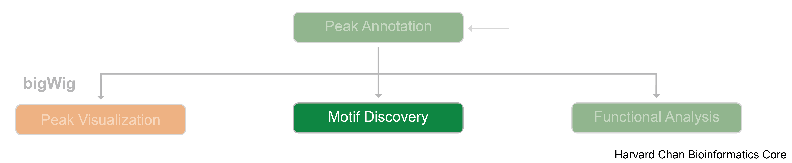
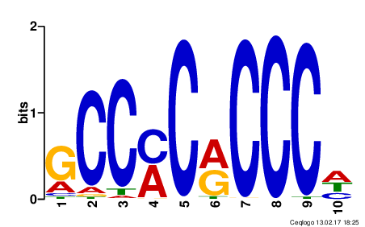

Contributors: Meeta Mistry, Will Gammerdinger

Approximate time: 40 minutes

## Learning Objectives

* Describe motifs and identify the general steps for a typical motif analysis 
* Recognize tools for motif analysis
* Evaluate motif enrichment in H3K27Ac binding regions 

## Motif analysis

After identifying regions of interest in the genome, there are various avenues to explore. In this workshop so far, we have demonstrated visualization of those regions using the read alignment data and we have annoated regions to identify nearest gene annotations and gain some biological context with functional analysis approaches. In this lesson, we discuss **approaches for interrogating the actual sequence data corresponding to our regions/peaks** of interest to evaluate enrichment of motif sequences.

**Motifs are typically short, conserved sequences** that have a specific biological significance, such as being binding sites for transcription factors (TFs), or other proteins that regulate gene expression. Motifs are often represented as **Position-specific Weight Matrices (PWM)**, which is a matrix of 4 x _m_ where _m_ is the motif length. Every position in the matrix represents the probability of each nucleotide at each index position of the motif. An example of the Klf4 motif from the JASPAR CORE database is displayed below.

### Tools for motif analysis
There are a vast number of tools avaiable for motif finding. A 2014 study from [Tran N.TL. and Huang C.](https://biologydirect.biomedcentral.com/articles/10.1186/1745-6150-9-4) reviews nine motif finding Web tools for detecting binding site motifs in ChIP-Seq data. Web-based tools are helpful as they provide a graphical user interface making it easy for the user to upload data and perform analysis. Many command-line tools also exist, as outlined in this benchmarking study in 2021 by [Castellana S. et al](https://academic.oup.com/bib/article/22/6/bbab303/6341664) however, installation and the requirement of minimal technical skills can identify as a limitation to some.

Reagrdless of which tool you decide to use, the general steps involved will typically go as described below:

1. Begin with gathering the sequences where there is supected presence of repeating motifs. 
2. Next, the data set is scanned to look for sequences that appear frequently and are recurring in a way that is not just by random chance. 
3. Each potential pattern is evaluated based on how common it is and it's significance value.
4. Often the initial pattern search will result in many motifs, in which case some filtering is applied (too common, too rare, too similar to each other, etc)

Once motifs have been discovered from the data, a common next step is to look for **enrichment of known motifs** by accessing **public databases** like [JASPAR](https://jaspar.elixir.no/) which is the largest open bioinformatics resource of TFBSs in the form of PWMs for eukaryotic genomes. Other commonly accessed resources include: [HOCOMOCO](https://hocomoco11.autosome.org/) which contains binding models for mouse and human transcription factors and [TRANSFAC](https://genexplain.com/transfac-2-0/), a database of TFs, associated DNA motifs in eukaryotic genomes, and analysis tools.

## The MEME Suite
In this workshop we will be using [MEME (Multiple EM for Motif Elicitation)](https://meme-suite.org/meme/index.html) for motif disocovery and motif enrichment. It is a web-based tool which has been shown to perform well in comparative studies using [simulated data](https://academic.oup.com/bib/article/22/6/bbab303/6341664) and in benchmarking studies with [real ChIP-seq data](https://biologydirect.biomedcentral.com/articles/10.1186/1745-6150-9-4). 

The web interface of MEME is easy to use, but there is a also a stand-alone version if you prefer using it via the command-line tool. There is also a Bioconductor implementation called the [memes package](https://www.bioconductor.org/packages/release/bioc/html/memes.html) providing a seamless R interface to a selection of popular MEME Suite tools. In addition to the analysis we perform in this workshop, there are various additional utility functions that we will not be covering but we encourage you to explore.

***

*This lesson has been developed by members of the teaching team at the [Harvard Chan Bioinformatics Core (HBC)](http://bioinformatics.sph.harvard.edu/). These are open access materials distributed under the terms of the [Creative Commons Attribution license](https://creativecommons.org/licenses/by/4.0/) (CC BY 4.0), which permits unrestricted use, distribution, and reproduction in any medium, provided the original author and source are credited.*
