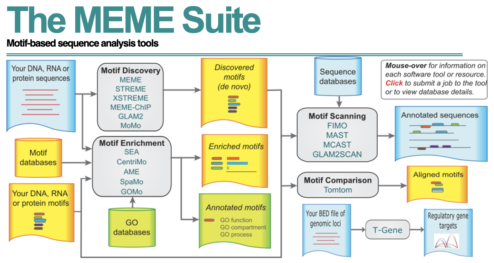
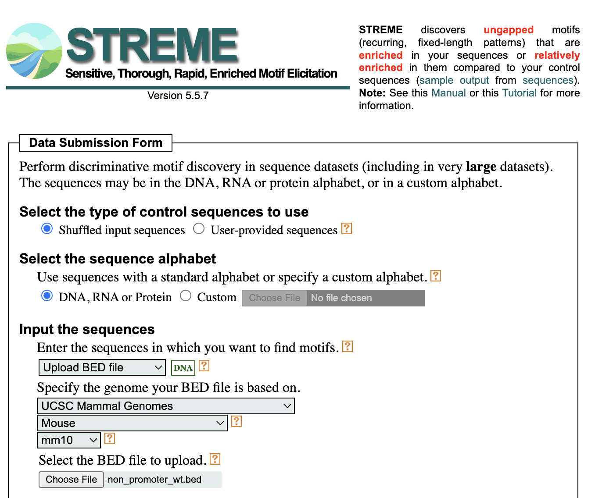
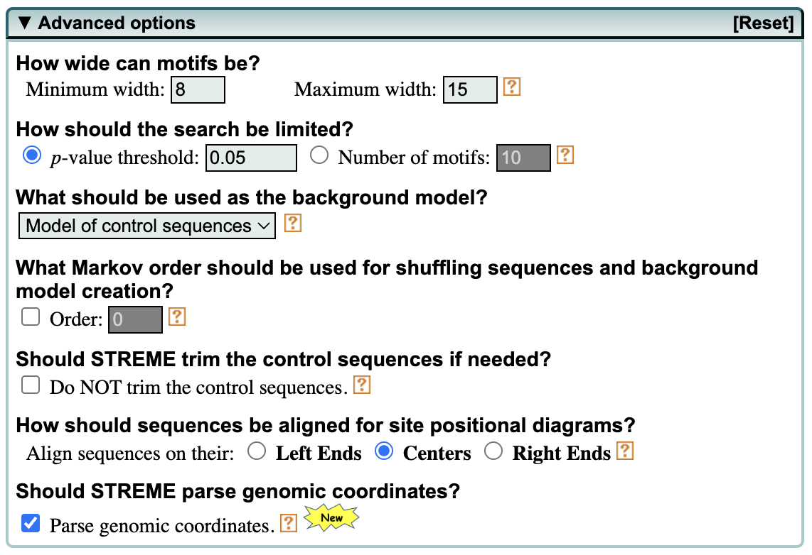
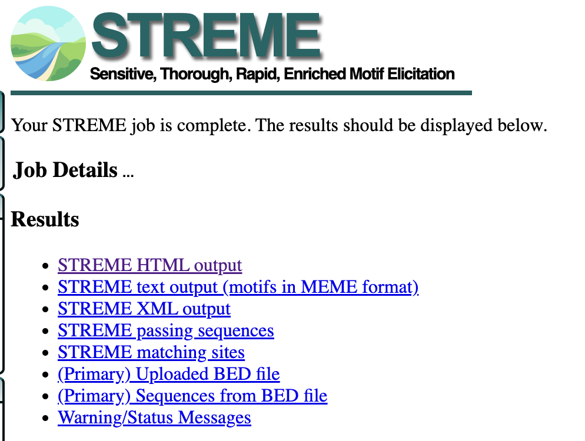
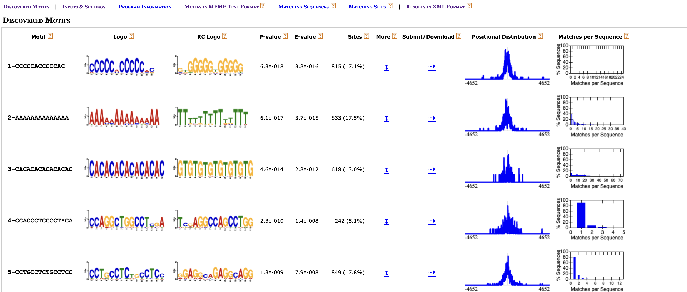

Contributors: Meeta Mistry, Will Gammerdinger

Approximate time: 40 minutes

## Learning Objectives

* Describe motifs and identify the general steps for a typical motif analysis 
* Recognize tools for motif analysis
* Evaluate motif enrichment in H3K27Ac binding regions 

## Motif analysis

After identifying regions of interest in the genome, there are various avenues to explore. In this workshop so far, we have demonstrated visualization of those regions using the read alignment data and we have annoated regions to identify nearest gene annotations and gain some biological context with functional analysis approaches. In this lesson, we discuss **approaches for interrogating the actual sequence data corresponding to our regions/peaks** of interest to evaluate enrichment of motif sequences.


<p align="center">

</p>


**Motifs are typically short, conserved sequences** that have a specific biological significance, such as being binding sites for transcription factors (TFs), or other proteins that regulate gene expression. Motifs are often represented as **Position-specific Weight Matrices (PWM)**, which is a matrix of 4 x _m_ where _m_ is the motif length. Every position in the matrix represents the probability of each nucleotide at each index position of the motif. An example of the Klf4 motif from the JASPAR CORE database is displayed below.


<p align="center">

</p>


### Tools for motif analysis
There are a vast number of tools avaiable for motif finding. A 2014 study from [Tran N.TL. and Huang C.](https://biologydirect.biomedcentral.com/articles/10.1186/1745-6150-9-4) reviews nine motif finding Web tools for detecting binding site motifs in ChIP-Seq data. Web-based tools are helpful as they provide a graphical user interface making it easy for the user to upload data and perform analysis. Many command-line tools also exist, as outlined in this benchmarking study in 2021 by [Castellana S. et al](https://academic.oup.com/bib/article/22/6/bbab303/6341664) however, installation and the requirement of minimal technical skills can identify as a limitation to some.

Reagrdless of which tool you decide to use, the general steps involved will typically go as described below:

1. Begin with gathering the sequences where there is supected presence of repeating motifs. 
2. Next, the data set is scanned to look for sequences that appear frequently and are recurring in a way that is not just by random chance. 
3. Each potential pattern is evaluated based on how common it is and it's significance value.
4. Often the initial pattern search will result in many motifs, in which case some filtering is applied (too common, too rare, too similar to each other, etc)

Once motifs have been discovered from the data, a common next step is to look for **enrichment of known motifs** by accessing **public databases** like [JASPAR](https://jaspar.elixir.no/) which is the largest open bioinformatics resource of TFBSs in the form of PWMs for eukaryotic genomes. Other commonly accessed resources include: [HOCOMOCO](https://hocomoco11.autosome.org/) which contains binding models for mouse and human transcription factors and [TRANSFAC](https://genexplain.com/transfac-2-0/), a database of TFs, associated DNA motifs in eukaryotic genomes, and analysis tools.


## The MEME Suite
In this workshop we will be using [MEME (Multiple EM for Motif Elicitation)](https://meme-suite.org/meme/index.html) for motif disocovery and motif enrichment. It is a web-based tool which has been shown to perform well in comparative studies using [simulated data](https://academic.oup.com/bib/article/22/6/bbab303/6341664) and in benchmarking studies with [real ChIP-seq data](https://biologydirect.biomedcentral.com/articles/10.1186/1745-6150-9-4). MEME is a tool which discovers novel, ungapped motifs (recurring, fixed-length patterns) in your sequences (sample output from sequences). MEME splits variable-length patterns into two or more separate motifs. STREME, is a very similar tool recommended for larger datasets (more than 50 sequences). **Since we have many sequences, STREME is the better option for us**.

<p align="center">

</p>

The web interface of MEME is easy to use, but there is a also a stand-alone version if you prefer using it via the command-line tool. There is also a Bioconductor implementation called the [memes package](https://www.bioconductor.org/packages/release/bioc/html/memes.html) providing a seamless R interface to a selection of popular MEME Suite tools. In addition to the analysis we perform in this workshop, there are various additional utility functions that we will not be covering but we encourage you to explore.

### Prepare the data 
STREME will accept as accept **BED files or sequence files as input**, which must be in fasta format. The data we will use as input will be a consensus set from the WT replicates. To generate the consensus set, we will access the `olaps_wt` variable created in a previous lesson. You should have this object in your environment.

<details>
<summary><b>Click here if you are unable to locate `olaps_wt` in your environment</b></summary>
<br>Run the code provided below to create the object `olaps_wt`:<br><br>

<pre>
sample_files <- list.files(path = "./data/macs2/narrowPeak/", full.names = T)

# Reassign vars so that they are now GRanges instead of dataframes
for(r in 1:length(sample_files)){
  obj <- ChIPpeakAnno::toGRanges(sample_files[r], format="narrowPeak", header=FALSE)  
  assign(vars[r], obj)
}

# Find overlapping peaks of WT samples
olaps_wt <- findOverlapsOfPeaks(WT_H3K27ac_ChIPseq_REP1,
                                WT_H3K27ac_ChIPseq_REP2,
                                WT_H3K27ac_ChIPseq_REP3, connectedPeaks = "merge")
</pre><br>
<hr />
</details>

Let's begin by extracting the peaks which overlap across the replicates. Stored in the object are `mergedPeaks`, this corresponds to 	
an object of GRanges consisting of all merged overlapping peaks. Another option is `peaksInMergedPeaks`	which is an object of GRanges consisting of all peaks in each samples involved in the overlapping peaks. Since MEME/STREME suggests **removing duplicate sequences**, we will go with `mergedPeaks`. The only issue here is that merging might create some fairly large sized regions. MEME/STREME recommends **the input sequence’s length should be ≤ 1,000 bp and as short as possible**, as such we will filter the regions.

```
# Get merged peaks for WT
wt_consensus <- olaps_wt$mergedPeaks

# Filter to keep only regions 1000bp or smaller
wt_consensus <- wt_consensus[width(wt_consensus) <= 1000]

# Remove non standard sequences as it will cause errors when retrieving the FASTA sequences from the reference (i.e. chr1_GL456211_random)
wt_consensus <- keepStandardChromosomes(wt_consensus, pruning.mode="coarse")

```

Since we are specifically **interested in enhancer regions**, we will annotate the consensus set and further filter to only retain peaks that occur outside of promoter regions. We will **create a minimal BED file** with coordinates to use as input to STREME.

```
# Annotate consensus reiogns 
annot_wt_consensus <- annotatePeak(wt_consensus, tssRegion = c(-3000, 3000),
                                   TxDb = TxDb.Mmusculus.UCSC.mm10.knownGene,
                                   annoDb = "org.Mm.eg.db")

# GRanges to dataframe
df <- annot_wt_consensus@anno %>% data.frame()

# Find regions annotated as "Promoter" and remove them
promoter_regions <- grep("Promoter", df$annotation)
non_promoter_df <- df[-(promoter_regions), ]

# Write minimal BED file
write_tsv(non_promoter_df[, 1:3], file = "results/non_promoter_wt.bed", 
          col_names = F, quote = "none")


```

### Running STREME 
To run STREME, navigate to the MEME Suite web browser by [clicking on this link](https://meme-suite.org/meme/). On the left hand side, locate the tools listed under "Motif Discovery". Here, you will **click on STREME**, which will take you to the submission form depicted in the screenshot below. You will need to make the following selections:

1. **"Shuffled input sequences"**
     * STREME looks for motifs that are enriched in your sequences relative to a control set of sequences. This selection will create the control set by shuffling each of your input sequences, conserving k-mer frequencies, where k=3.
     * The alternative is to provide a file of control sequences (be sure they have the same length distribution as the input)
2. **DNA, RNA or Protein** sequence alphabet
3. From the dropdown select **Upload the BED file**
     * Select UCSC Mammal Genomes
     * Select Mouse
     * Select mm10
     * Navigate and locate the `non_promoter_wt.bed` file we just created
4. Enter your email if you would like email updates

<p align="center">

</p>

#### Advanced options
If you click on Advanced Options you will see a host of selections we could make. They are described below, but note that **we will be using default parameters.**

<p align="center">

</p>


* The user can specify the minimum and maximum width for motifs.
* The number of sites for each motif can be provided, if there is prior knowledge about the number of occurrences that the motif has in the dataset.
* The p-value threshold can be modified to be more or less stringent.
* The background model normalizes for biased distribution of letters and groups of letters in your sequences. A 0-order model adjusts for single letter biases, a 1-order model adjusts for dimer biases (e.g., GC content in DNA sequences), etc. By default STREME uses m=2 for DNA and RNA sequences.
* Should the user choose to NOT trim the control sequences, this will cause STREME to use the (less accurate) Binomial test (instead of Fisher's exact).
* Option to align sequences to the right or left. For visualizing motif distributions, center alignment is ideal for ChIP-seq and similar data.


### STREME results
Once the tool is done running you will see a bullet point list of results generated, with each hyperlinked. The MEME suite tools provide three different output formats: HTML, XML, and text. **We will focus on the HTML report**. 

<p align="center">

</p>

If you were not able to generate a result, [click here to download the HTML report]]().  For each motif, MEME outputs the p-value, E-value, the number of sites found, the motif’s logo (and reverse complement), and genomic coordinates for sites where the motifs were found. MEME also provides a Submit/Download option in HTML output for forwarding one or all motifs to other MEME programs for further analysis or downloading the the motif or logo.

<p align="center">

</p>


The motifs bound by TFs are most likely within the valleys of your H3K27ac signal. This hypothesis has been tested (article) and a program called EpiSAFARI was developed to identify peaks within valleys . You can certainly do motif analysis on the peak set you have but it wouldn't make must biological sense. I also want to point out that this is true for H3K27ac but may not be true for other histone modifications.


Interestingly, we observed that the H3K27ac-associated motifs seem to form negative feedbacks on acetylation. The possible feedback mechanisms are derived from the motifs’ occurrence in both the promoters and enhancers closest to the histone modification enzymes. For example, HDAC genes’ promoters all contain H3K27ac-related motifs. Motif H3K27ac_4280 CCTCCTCCC, found in 39 cells/tissues (P value 2.72 × 10−3), appears in the promoters of HDAC1/HDAC2 (Fig. 5B) and numerous other deacetylases. HDAC1/2 are responsible for lysine deacetylation of the core histone proteins (H2A, H2B, H3, H4) as annotated in the UniProt database and is specifically documented to deacetylate H3K9ac in the GREAT annotation (Fig. 5B). This may suggest a negative feedback loop of histone acetylation: the H3K27ac motifs are responsible for establishing/maintaining the H3K27ac signal in the promoters of HDACs, which suggests transcribing HDACs; the transcribed HDACs, in turn, deacetylate H3K9ac and/or H3K27ac marks in the genome.


***

*This lesson has been developed by members of the teaching team at the [Harvard Chan Bioinformatics Core (HBC)](http://bioinformatics.sph.harvard.edu/). These are open access materials distributed under the terms of the [Creative Commons Attribution license](https://creativecommons.org/licenses/by/4.0/) (CC BY 4.0), which permits unrestricted use, distribution, and reproduction in any medium, provided the original author and source are credited.*
